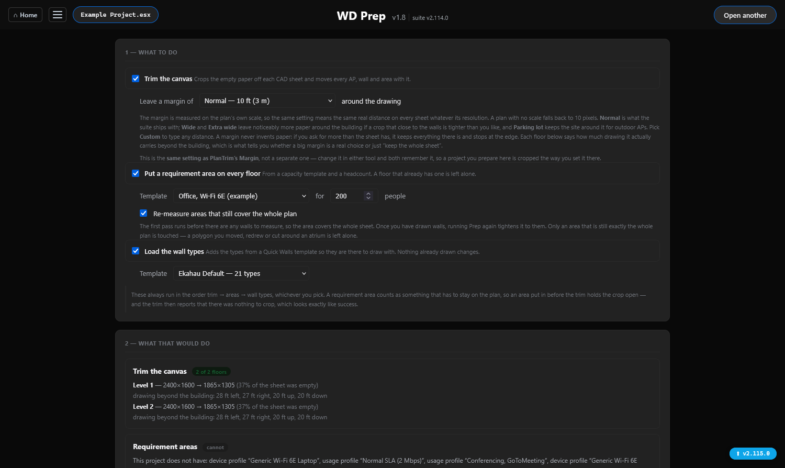
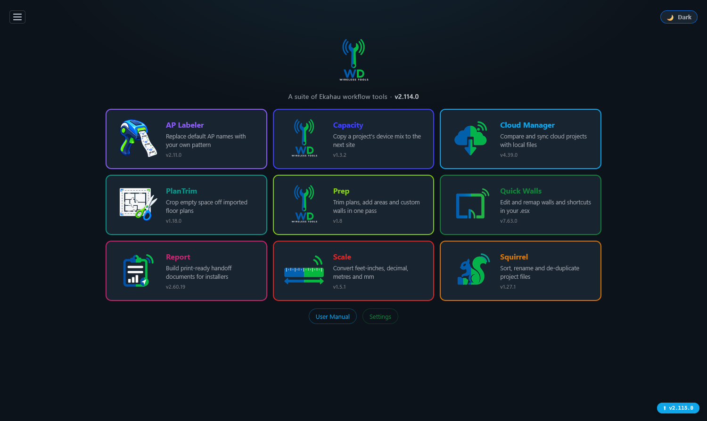
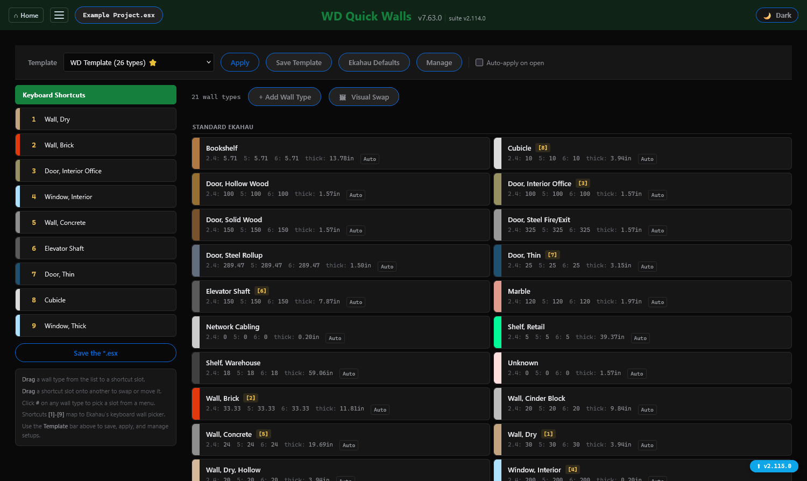
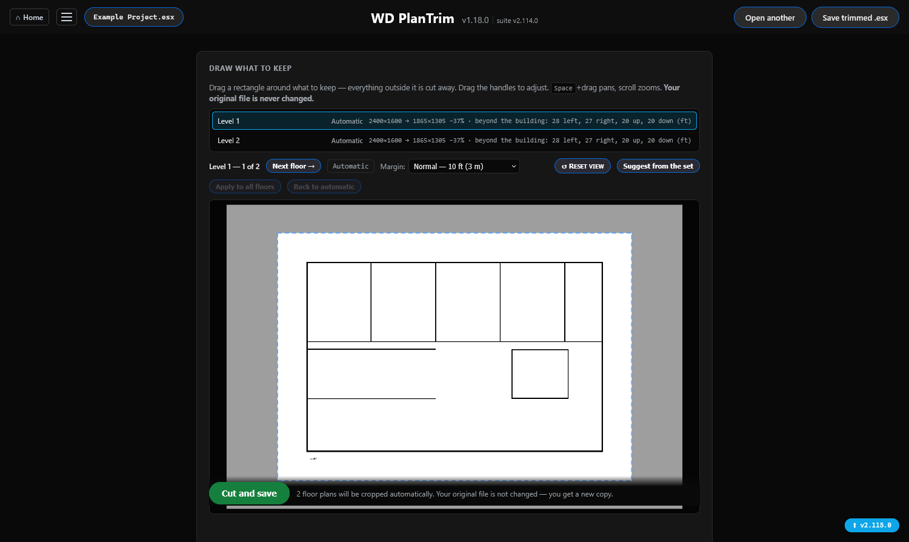
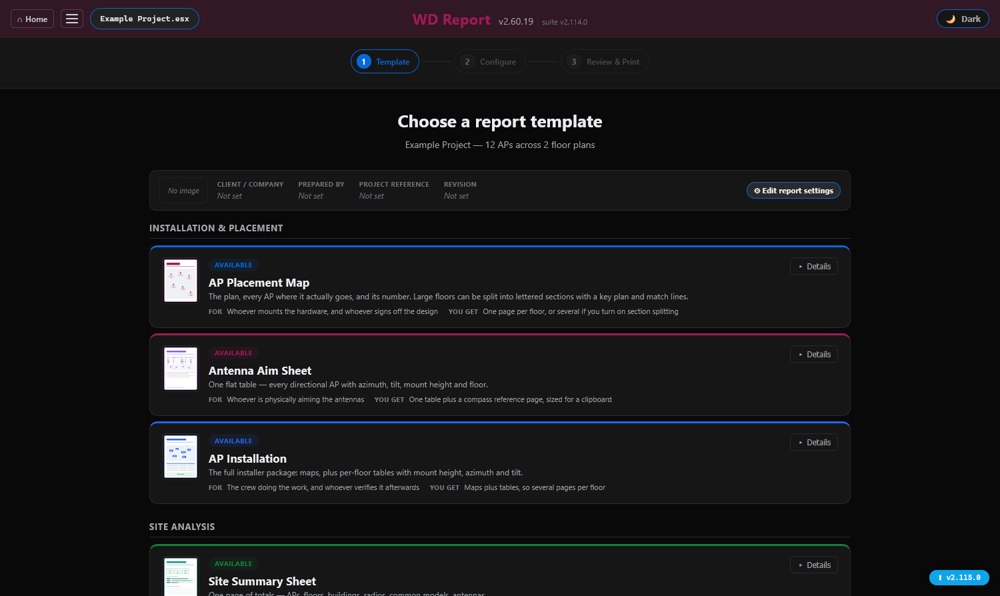
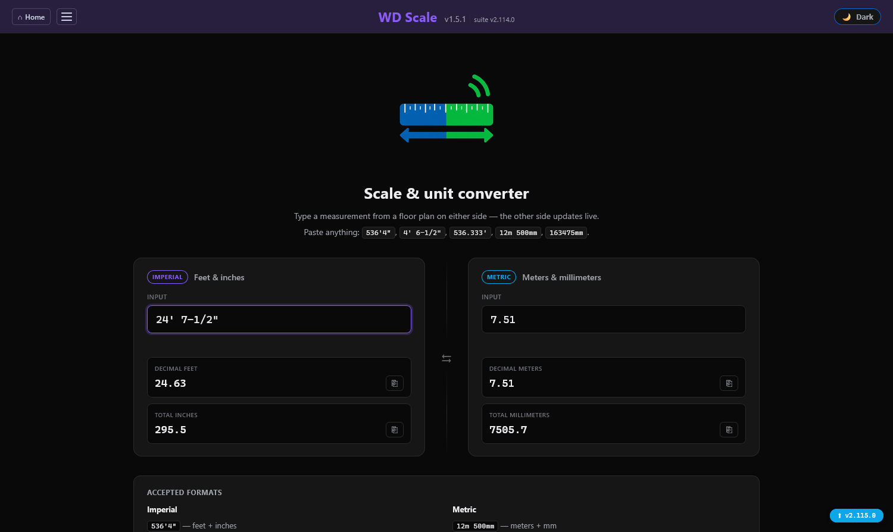

<div align="center">


# WD Wireless Tools

## User Guide

**Practical guidance for the complete Ekahau workflow suite — one guide, a
chapter per tool.**


[Home](../README.md) · [Project Page](https://weirdave.github.io/WD-Wireless-Tools/) · [Latest Release](https://github.com/WeirDave/WD-Wireless-Tools/releases/latest) · [Get Help](https://github.com/WeirDave/WD-Wireless-Tools/issues)

</div>

<table>
<tr>
<td width="20%" align="center"><br><b>Cloud Manager</b></td>
<td width="20%" align="center"><br><b>Quick Walls</b></td>
<td width="20%" align="center"><br><b>Squirrel</b></td>
<td width="20%" align="center"><br><b>Scale</b></td>
<td width="20%" align="center"><br><b>Report</b></td>
</tr>
</table>

---

## Contents

**The job, in order**

- [Start Here](#start-here)
- [A site from start to finish](#a-site-from-start-to-finish)

**The tools**

- [Home and Navigation](#home-and-navigation)
- [Cloud Manager](#cloud-manager)
- [Quick Walls](#quick-walls)
- [Prep](#prep)
- [PlanTrim](#plantrim)
- [Report](#report)
- [AP Labeler](#ap-labeler)
- [Capacity](#capacity)
- [Scale](#scale)
- [Squirrel](#squirrel)

**Everything else**

- [Things that catch people out](#things-that-catch-people-out)
- [Suite Settings](#suite-settings)
- [Install and Launch](#install-and-launch)
- [Update or Uninstall](#update-or-uninstall)
- [Data, Privacy, and Security](#data-privacy-and-security)
- [Troubleshooting](#troubleshooting)
- [Getting Help](#getting-help)

---

## Start Here

WD Wireless Tools is a set of nine tools for the work that surrounds an Ekahau
survey — the file handling, the plan preparation, the naming, the paperwork.
It runs on your own machine and opens in your normal browser. Nothing is
uploaded anywhere, and the only thing that ever talks to the internet is Cloud
Manager, which talks to Ekahau Cloud because that is its job.

**If you are new here, read [A site from start to finish](#a-site-from-start-to-finish).**
It follows one job through every tool in the order you actually use them. The
per-tool sections after it are reference — go to them when you need a specific
answer.

### I need to…

| If you need to… | Use | Where it sits in a job |
|---|---|---|
| Set up the folders for a new site | [Squirrel](#squirrel) | First, before anything else |
| Convert a measurement off a drawing | [Scale](#scale) | While setting the scale in Ekahau |
| Crop empty space off a floor plan | [PlanTrim](#plantrim) | After the plans are in |
| Trim, add areas and add wall types in one pass | [Prep](#prep) | After the plans are in |
| Add or remap wall types, or set drawing shortcuts | [Quick Walls](#quick-walls) | Before you draw walls |
| Copy a device mix from one project to another | [Capacity](#capacity) | While setting requirements |
| Rename every AP to your own scheme | [AP Labeler](#ap-labeler) | After the APs are placed |
| Compare and sync local projects with Ekahau Cloud | [Cloud Manager](#cloud-manager) | Whenever the cloud is involved |
| Produce installer-ready documents | [Report](#report) | Last, once the design is done |

> **Before a bulk operation on real work:** every tool that changes files shows
> you a preview first. **Nothing keeps a copy of a file before overwriting it**
> — see [What happens to a file that gets replaced](#what-happens-to-a-file-that-gets-replaced)
> for why, and for what stands in its place. Read the preview. That is what it
> is for.

---

## A site from start to finish

This is one job, in order, with the tool used at each step. Nothing here is
mandatory — skip what does not apply — but this is the sequence the suite was
built around, and the tools hand off to each other in this order.

### 1. Make the folders — Squirrel

A new site starts with somewhere to put it. **Squirrel → ▸ Tools → "· Create
Project Folder"** builds the folder and its subfolders from your naming
template, so every site is laid out the same way and the later tools know where
things live.

If material has already piled up loose — plans, images, a report someone
emailed — point Squirrel at the folder and let it sort. See
[Squirrel](#squirrel).

### 2. Get the floor plan into Ekahau

This part happens in Ekahau, not here. Import the drawing and create the
building and floors.

**Your drawings will probably need redrawing, and that is expected.** CAD files
arrive with layers that do not separate cleanly — walls on the same layer as
furniture, or everything on one layer. The practical approach is to bring the
drawing in as a background image and draw the walls over it by hand. Step 6 is
where that happens, and [Quick Walls](#quick-walls) exists to make it quick.

### 3. Set the scale — Scale

Ekahau needs one known distance to scale the plan. The drawing gives you that
distance in whatever format the architect used — `24' 7-1/2"`, `7.5m`, a bare
number.

[Scale](#scale) converts between all of those. Type what the drawing says, copy
the value in the unit Ekahau wants.

**Get this right before anything else.** Every wall thickness, every area, every
distance the design depends on comes from this one number. A plan scaled wrong
is not a plan with a small error in it; it is a plan where nothing is where the
software thinks it is.

### 4. Save the project locally

Save the `.esx` into the folder Squirrel made. Keep it local for now — the
cloud round trip comes later, and doing it now costs you a step.

### 5. Prepare the plans — Prep

[Prep](#prep) does three jobs in one pass, on one open and one save:

- **trims** the empty space off every floor plan,
- **adds requirement areas** from a capacity template, and
- **adds your custom wall types** so they are there before you start drawing.

It writes a new file beside the original, named `<name> (prepared).esx`, and
leaves the original alone.



*Prep says what each step would do before it does it — and says plainly when a step *cannot* run, and why.*


**The steps run in a fixed order and the order is not arbitrary.** Trimming has
to happen before areas are added, because an area drawn on the full sheet
becomes part of what the trimmer has to keep, and the crop it prevents is
reported as a clean skip. Prep enforces the order and refuses to run one that
would misbehave.

If you only want the cropping, [PlanTrim](#plantrim) does that alone and gives
you per-floor control over each crop box.

### 6. Draw the walls — Quick Walls, then Ekahau

Open the prepared file in [Quick Walls](#quick-walls) and apply your wall
template. That puts the wall types you use into the project and assigns each one
a number key.

Then draw in Ekahau. With the template applied, keys **1**–**9** select your
wall types directly, which is the difference between drawing a building and
hunting through a menu for every wall.

If a project already has walls drawn with the wrong types, **Visual Swap**
remaps them in bulk rather than one at a time.

### 7. Place the APs and run the design

Ekahau again. Place access points, set the requirements, run the predictive
design.

If the requirements come from a building you have already thought about,
[Capacity](#capacity) copies that device mix across instead of you re-entering
it.

### 8. Save up to Ekahau Cloud

Upload the project from Ekahau.

### 9. Pull the cloud copy back down — Cloud Manager

**Do this, and do not skip it.** When Ekahau uploads a project it stamps an
identifier onto the cloud copy. From that moment the cloud copy is the
authoritative one, and your local file — the one you have been working in — is
subtly not the same project any more.

If you carry on working in the local file, the next upload creates a *second*
cloud project rather than updating the first, and you end up reconciling two.

So: [Cloud Manager](#cloud-manager) → find the project → **Cloud → Local**, and
work from what comes down.

Your local file is replaced by the copy Ekahau is holding, and **no second
copy is kept — the cloud one is it**. It is still up there afterwards, so
pulling again puts you back where you were. See
[What happens to a file that gets replaced](#what-happens-to-a-file-that-gets-replaced).

### 10. Run the report — Report

[Report](#report) turns the finished project into the paperwork: AP placement
maps, an installation sheet, a bill of materials, antenna aim sheets.

Pick a template, configure it once, and the settings are remembered for the next
report of that type. Print to PDF from the browser's own print dialog using the
**Print / Save PDF** button on the page.

### Where the other tools fit

- **[AP Labeler](#ap-labeler)** — after the APs are placed and before the
  report, so the names on the drawings are the names the installer will put on
  the hardware.
- **[Cloud Manager](#cloud-manager)** — any time. Most of its work is
  housekeeping across many sites rather than a step in one job.

---

## Home and Navigation

The home page shows all nine tools as tiles, each with a one-line description of
what it does. Hovering a tile shows the same description as a tooltip. Click a
tile to open the tool.

**The menu is the same on every page.** The hamburger button at the top left
opens it, and it has three blocks:

- **Navigation** — Home first, then every tool in alphabetical order. Every tool
  is reachable from every page, so you never have to go back to Home to get
  somewhere else.
- **Tools** — Suite Settings.
- **Help** — **User Guide** (this document, opening at the chapter for the tool
  you are in), **About & Updates**, **Copy Diagnostics**, and **Report a Bug on
  GitHub**.

> **There used to be two.** A **User Guide** item opened a separate page for
> four of the tools, beside a **User Manual** item opening this document — two
> near-identical names, and only four tools covered. There is one guide now,
> this one, with a chapter per tool. The old `/guide…` addresses still work and
> land on the right chapter, so a bookmark is not broken.

Each page shows its own version number next to the title. **That is the tool's
version, not the suite's, and they are different numbers** — suite 2.114.0 ships
Quick Walls 7.63.0. When you are checking whether you have a fix, check which of
the two a release note is talking about.

The theme toggle is in the top bar of every page and remembers your choice.
Browser Back works normally throughout.



*The home page. Every tile says what the tool does, and each shows that tool's own version.*


---

## Cloud Manager

**What it is for:** keeping what is in Ekahau Cloud and what is on your disk
in agreement, across every site at once.

It compares cloud projects with local `.esx` files, tells you which side is
newer, and gives you preview-driven actions to fix the difference. Nothing it
does happens without showing you first.

**In a job it matters at one moment in particular:** after you upload, the cloud
copy becomes the authoritative one, and you pull it back down before carrying
on. See [step 9](#9-pull-the-cloud-copy-back-down-cloud-manager).

### First-time setup

1. Sign into Ekahau Cloud in a normal Chrome, Edge, or Firefox window.
2. Open **Cloud Manager** from the suite home.
3. If prompted, select **Log in to Ekahau Cloud**, complete the login in the browser tab, and return to Cloud Manager.
4. Choose the local parent folder containing your Ekahau project folders.

Safari, Brave, Arc, and Private/Incognito windows are not supported for automatic session discovery.

### Understand the main view

**Two ways to look at the same data**, chosen with **Tree** and **Flat** at the
top of the list:

- **Tree** groups by site, the way Ekahau Cloud organises things. Use it when you
  are thinking about a site. **Expand all sites** and **Collapse all sites** work
  on the whole tree.
- **Flat** is one row per project, no grouping. Use it when you are looking for
  one thing by name.

**What a row tells you**

- **Cloud rows** are projects your signed-in Ekahau account can see.
- **Local rows** are `.esx` files under the folder you chose.
- A matched pair shows both sides together, with the differences between the two
  names marked character by character, so "Building A" and "Building  A" are
  visibly different rather than mysteriously unmatched.
- Labels on a row say what kind of project it is — **Design**, **Measured** or
  **Hybrid** — and whether it is **external** (shared with you rather than
  yours).
- **≈** jumps from a row to its duplicate cluster, where near-identical files are
  grouped with the newest and largest identified.

### Who you are seeing — the Owner filter

The **Owner** toggle in the toolbar switches between **All**, **Mine** and
**Others**. It lasts until you reload the page and nothing in the toolbar is
written to disk.

What the list *opens* on is a separate, saved setting: **Suite Settings →
Cloud → Default view**. It ships as **All**.

These are deliberately two different things. A per-browser memory of the filter
is how one machine came to show three sites and another twenty — so any filter
narrower than All prints a line above the list saying what is hidden and whether
that is your saved default or just this visit, an empty list names the filter
that emptied it, and a sign-in that returns no user identity turns the filter
off and says why.

### Deleting from the cloud — what the dialog tells you

Deleting a cloud project asks twice: once to confirm, and once more behind a
box where you type **DELETE**. That second dialog is the last thing you see
before it happens, and it now **names what it is about to destroy**.

You get the **project name**, the **site it sits in**, **when it was last
modified**, and — if anyone else has access — **who will lose it**. That is
enough to tell apart two projects with the same name in different sites, which
is the situation where checking actually matters and the one where the greyed
out list behind the dialog is no help.

Selecting several and deleting them together lists them all rather than saying
"3 cloud project(s)".

**File size is deliberately not shown.** Cloud projects are stored
uncompressed and local `.esx` files are compressed, so the same project can
read five to ten times larger in the cloud. In a dialog whose only job is "is
this the one I mean?", a number that disagrees with the file on your disk by a
factor of eight would do more harm than good.

**There is no trash.** A cloud delete cannot be undone and the project is gone
for everyone it was shared with. Your local copy, if you have one, is not
touched — and a local file you delete can always be downloaded again if the
cloud copy still exists, which is why only the cloud side asks twice.

### Finding what you never shared

The **Not Shared** card on the dashboard row narrows the list to **projects you
own that nobody else has access to**. Click it to filter, click it again to
turn it off — it works like the other cards, and combines with them and with
the Owner filter.

The number on the card is the count, and it is the point of the card: it tells
you at a glance whether there is anything sitting finished and unsent.

**What counts as not shared.** Exactly one thing: you own it, and nobody other
than you can see it. Three cases that are easy to get wrong, and how they are
treated:

- A project **someone else owns and shared with you** is shared — that is how
  you can see it at all — so it never appears here. It is also not something
  you could have forgotten to share.
- A project of yours shared **only with your own address** counts as not
  shared, because nobody else has access.
- A file that is **only on your computer** is not listed. That is not unshared,
  it is not uploaded, and the **Local-Only** card already answers it.

Sharing with your Sharing Group counts as shared, because every member of the
group is given access individually.

**The card only appears when it has something to say** — when the count is
zero, or when the listing came back without telling us who you are (in which
case "yours" is unanswerable and no filter would be honest). If the filter is
on and empties the list, the list says so and offers the way back.

### Narrowing the list

The chips under the toolbar filter the list, and each shows its own count so you
can see how much there is before you click. They answer the questions you
actually arrive with:

| Chip | Shows |
|---|---|
| **out of sync** | pairs where the two sides differ |
| **name mismatches** | pairs that match as projects but not by name |
| **name matches** | pairs whose names agree |
| **unpaired** | rows with nothing on the other side |
| **Cloud only** / **Local only** | one side exists, the other does not |
| **not shared** | your projects nobody else can see |
| **external** | projects shared *with* you |
| **No site** | cloud projects not filed under a site |
| **Design** / **Measured** / **Hybrid** | by project type |
| **Duplicate clusters** and the cluster chips | groups of near-identical files |

Click a chip to apply it, click it again to clear it. The **×** clears
everything at once.

Separately, the **Owner** toggle — **All**, **Mine**, **Others** — decides whose
projects you are looking at. It resets on reload; what the list *opens* on is
**Settings → Default view**. Any filter narrower than **All** says so above the
list, in words, so an empty list never looks like an empty cloud account.

### Comparing two folders

**Compare** puts the contents of two selected folders side by side, so you can
see what one has that the other does not before deciding which to keep. It is
the honest answer to "are these the same project twice, or two different
projects?" — which file sizes and dates alone cannot settle.

### Renaming, and the three names a project has

A project has a file name, a project name stored **inside** the `.esx`, and a
cloud name. Renaming the file on disk changes only the first of those.

- **Rename** a matched row and tick **Also rename the matching copy** to keep the
  pair together.
- **Fix names inside files** sets the project name stored inside each selected
  `.esx` to match its cloud project. This is what clears a "name difference" on a
  pair that is genuinely the same project. Each file is rewritten in place — built
  in a temporary file and renamed over the top, so it is either entirely the old
  one or entirely the new one and never half of either. No second copy is kept.
- **Cloud → Local** and **Local → Cloud** copy names between matched rows in the
  direction you choose.

See also [A project has three different names](#a-project-has-three-different-names).

### How matching works

Every Ekahau project has a hidden ID stamped inside its `.esx` when it is first
created, and that ID stays with it through every edit, rename, upload and
download. When the same hidden ID turns up both on your computer and in Ekahau
Cloud, the two are the same project — proven, not guessed.

Where the IDs cannot answer — a project created locally and never uploaded, or
two files with unrelated histories — matching falls back to the names. An exact
name match is very reliable; a shared site code plus a similar name is likely;
similar names alone is a guess, and the row says so.

Every paired row carries a badge in the middle gutter. Hover it for the reason
in plain words.

| Badge | What it means |
| --- | --- |
| **★ You matched** | You linked these yourself with 🔗 Link. Overrides everything else — click the badge to unlink |
| **✓ Same file** | The same hidden project ID inside both files. One project stored in two places |
| **✓ Name matches** | Identical filenames but no ID link. Very likely the same project, not proven |
| **~ Same site** | The same site code, such as `SITE1`, plus similar names. Probably the same project |
| **? Similar name** | Some words in common. A best guess, worth a look before syncing |

**Size is deliberately not used for matching, and not shown on file rows.**
Ekahau Cloud stores `.esx` files uncompressed while your computer compresses
them, so a cloud file six times larger than your local copy is usually the same
project. Size still appears in the folder-peek popup and on the Duplicates tab,
where you are comparing files of the same kind.

**The date beside each file is when the project was last edited inside Ekahau**,
not when the file was copied to your computer. Two copies showing the same date
and time are the same version. Because it is read from inside the file, copying,
OneDrive sync and renaming do not reset it.

#### Held back — pairs that were not matched automatically

Sometimes two files look related — same site code, overlapping words — but a
hard difference stops them being paired: a different building number (Bldg 3 vs
Bldg 5), a different street number, a different survey phase (Baseline vs
Cleanroom). Those land in a **Held Back** section at the bottom of the list with
the reason spelled out, and two buttons:

- **Link anyway** pairs them and remembers that decision.
- **Not a match** says the hold was right, and the pair is never suggested
  again.

#### When it gets a pairing wrong

- **A pair it missed** — click 🔗 on either unpaired file and pick the
  counterpart. Remembered from then on.
- **A pair it should not have made** — click ≠ on the row. Never suggested
  again.
- **Held back when you know better** — **Link anyway** on the held-back row.

The **ⓘ How matching works** chip beside the search box gives a shorter version
of all this inside the app.

#### Orphan projects

A cloud project belonging to no site cannot nest under a folder, so those are
listed together at the bottom under **Orphan Projects**. The ↪ button on an
orphan row moves it into a site.

### Which side is newer

A matched pair whose two copies differ in age carries a badge:

- **⇩ Cloud newer · download** — the cloud copy was edited more recently. Click
  the badge to bring it down over your local file. **No second copy is kept —
  the cloud one is it**, and it is still there afterwards, so downloading again
  puts you back where you were. See
  [What happens to a file that gets replaced](#what-happens-to-a-file-that-gets-replaced).
- **⇧ Local newer · replace cloud** — your copy is the newer one. Click it to
  send it up. Your file is uploaded as a new cloud project and checked first;
  the old cloud project is deleted only once that has succeeded, so a failed
  upload deletes nothing and a failed delete leaves two copies and tells you
  which one is good. **A cloud delete cannot be undone**, which is why the
  order is that way round.

Both directions work in bulk as well as on the row. Tick the files and use
**Cloud → Local** or **Local → Cloud** in the selection bar, or press
**⇅ Sync everything** and each file goes whichever way its dates say. The plan
is shown before anything runs, and any file being sent up is listed beside the
name of the cloud project it will replace.

Neither direction is offered for a pair the tool only *guessed* at — a shared
site code, or similar wording. Replacing either copy on a guess is how the
wrong project gets lost. The row says so and offers **Confirm this pair**,
which records that the two really are the same project and makes both
directions available; you can undo that from the badge in the middle column.
A pair carrying Ekahau's own id, or one you confirmed yourself, needs no
confirmation and moves without a dialog.

### When both sides have changed

Two dates cannot tell you whether *both* copies were edited since they last
agreed. They only say which is newer, and the newer one being newer is exactly
what you would see either way.

So the tool keeps a record, on this machine, of what a pair looked like the
last time it made the two sides identical — written whenever you pull a copy
down or replace a cloud project. With that, four answers fall out instead of
two:

| cloud moved? | local moved? | what it says |
| --- | --- | --- |
| no | no | in sync |
| yes | no | cloud changed — safe to pull |
| no | yes | local changed — safe to push |
| yes | yes | **diverged** |

A **diverged** pair is left out of **⇅ Sync everything** entirely, and the
confirmation names it and says that copying either way would discard somebody's
work. **Nothing resolves a divergence for you**, deliberately: merging two
`.esx` files is not something this tool can do, and picking a side silently is
the one outcome worth refusing. Use **Check what differs** on the row to see
what actually changed, then decide.

The record is per installation and is keyed on Ekahau's project id, so it
survives a rename on either side. A pair the tool has never synced reads as
*unknown* rather than as agreeing.

### Sync everything

**⇅ Sync everything** needs no selection, which is the point. It works out for
each file which side is newer and does that, or nothing when the two already
match, and shows the whole plan before it runs. It never replaces a newer file
with an older one.

The plan is three lists you tick separately — files coming down, files going
up, and cloud projects you have no local copy of — because they are not the
same risk. Downloading a project you do not have cannot lose anything; sending
a file up deletes the cloud project it replaces. Anything going up is listed
against the cloud project it will replace, and a pair matched on its name
rather than on Ekahau's id arrives **unticked**, so you read the name before it
moves rather than after.

When it finishes it says where local and cloud stand, including anything left
unticked and anything still needing its pair confirmed.

### Move projects into a site

Select any number of projects — on either the **Projects** tab or among the
nested files on the **Sites** tab — and choose **Move to site…**. The picker
confirms a destination per row, auto-filled where the site is recognisable, and
each move is queued as its own card with its own retry. A project whose local
and cloud copies are matched moves **both** sides, so the pair survives the
move.

### Merge several folders into one

Tick the local folders and use **Merge folders into one…** under **Move,
share, mark, overwrite** in the selection bar. Pick the folder everything
should end up in, read the file list, then confirm — nothing moves until you
do. The **Merge** action on a single row is unchanged and still there.

The file list is grouped by the folder each file came from, and every file has
a tick you can clear to leave it where it is. Where a file already exists in
the destination, the rule at the top of the dialog decides: keep the newer,
keep both (the older gets a date stamp), or skip.

**Where two of the folders you picked carry the same file, the list says so
before anything moves** — marked *also in "…", which moves first*. Merging
the folders one at a time cannot show you this, because at that moment neither
copy is in the destination yet and both look clean. Under *keep newer* such a
pair keeps **both** copies, because there is no file to compare against.

A folder that cannot be merged — missing, or the destination itself — is named
and left out rather than stopping the run, and a folder that fails part way
through is named in the result.

### Mark a project External, or mark it as yours

The **External** count and filter work from the owner recorded on the project.
That answers whose account it sits in, which is not always the same question as
whose work it is — a project can arrive with no owner at all, and when the
account comes back without a signed-in user nothing looks external.

Tick the projects and use **Mark as External…** or **Mark as mine…** under
**Move, share, mark, overwrite**. A marked row carries a **Marked External** or
**Marked mine** badge in the middle column; click the badge to take the mark
off. The counts, the filters and the row striping all follow it.

**Nothing is written to Ekahau Cloud or to any file on disk.** The mark is a
note this installation keeps about how you read the list, which is why it works
on a project somebody else owns.

### Share a project with people

**Menu → Manage Sharing** on a project, then the **Share with someone** box.

**Add several people at once.** Separate addresses with a **comma, a semicolon
or a space**, or paste a list — any of those, mixed in any combination. A list
copied out of Outlook works, including the `Name <address>` form; the names are
dropped and the addresses kept. Each address becomes its own removable tag, so
correcting a typo means clicking the × on that one rather than editing a long
line of text. Backspace in an empty box takes back the last one.

Choose the role once in the dropdown beside the box — it applies to everyone
you add in that go. It defaults to **View only**, and external addresses always
arrive as View only regardless, because Ekahau limits write access to people
inside your organisation.

**One bad address does not throw away the good ones.** Anything that is not a
valid address is outlined in red and left in place for you to fix. Everyone
else still goes through, and the result is reported **per person** — so if one
address bounces you are told which one, and the people it worked for are
genuinely shared. Any address that failed stays in the box so you can correct
it and try again.

**It remembers who you have shared with.** Start typing and matching addresses
appear beneath the box; arrow keys and Enter pick one. A **Recent** row under
the box offers the last few directly. To drop someone from that list, click the
× beside their name in the Recent row — it removes them from the suggestions
only and changes nothing about who has access to anything.

Only addresses that a share actually succeeded for are remembered, so a typo
is never offered back to you.

**This list stays on your computer.** It lives with your other settings, in
`~/.wd_wireless_tools/share_recipients.json` — on Windows
`%USERPROFILE%\.wd_wireless_tools\share_recipients.json`, on macOS
`/Users/<you>/.wd_wireless_tools/share_recipients.json` — and is never sent
anywhere. It is included in **Settings → Export settings**, so rebuilding a
machine does not mean rebuilding the list from memory.

### Buttons that are greyed out

The toolbar's bulk buttons switch on and off with what you have selected.
**Click a greyed-out one and it tells you what to select** — hovering says the
same thing. A dimmed "Compare" answers "Select 2+ local folders to compare"; a
dimmed "Share…" explains that Ekahau only lets a project's owner add shares.

### Perform an operation

1. Filter or search until the intended projects are visible.
2. Select the relevant rows.
3. Choose the upload, download, rename, move, merge, or delete action.
4. Read the preview and confirm the exact source, destination, and number of affected items.
5. Start the operation and review its completion status.

Use **Show in Explorer/Finder** to verify a local file directly before acting on it.

> **Cloud actions are real actions.** A clean preview is your last checkpoint before a rename, move, overwrite, or deletion reaches the selected files or tenant.

**Deleting anything on the cloud side asks twice**, and the second time you type
`DELETE` before the button will enable. Local deletes do not, and the difference
is deliberate: a local file you can download again, a cloud project you cannot.
That applies to a single row and to a bulk delete alike. Selecting one side of a
matched pair deletes only that side.

### Login storage

Cloud Manager stores an encrypted copy of the active Cloud session under `~/.wd_wireless_tools/`. Its encryption key is stored separately in Windows Credential Manager or macOS Keychain. Use **Menu → Forget Cloud Login** to remove the saved session and key.

### Keyboard and mouse

| Key or action | What it does |
| --- | --- |
| `F5` | Refresh — re-fetch the cloud sites and re-scan the local folder |
| `F2` | Rename the selected site or folder |
| `Delete` | Delete the selected site or folder, with a confirmation |
| Double-click a row | Open the comparison for that project, when both sides exist |
| Click a column header | Sort the list by that column |

> **Keep your naming consistent between cloud and local.** Where the hidden ID
> cannot answer, matching falls back to the name — so `Site-Alpha` in the cloud
> pairs with `Site-Alpha.esx` on disk.

### Implementation note

The `EkahauAPI` client in `tools/cloud_manager.py` includes reverse-engineered request flows required for operations performed by the Ekahau web application, including presigned uploads and client-side `.esx` download assembly. This is application code. A local `.claude/` directory is development-tool configuration and is not required or distributed.

---

## Quick Walls

**What it is for:** putting your own wall types — and your own number keys —
into a project, so that drawing a building is nine keystrokes rather than a
menu hunt.

It edits wall types inside an `.esx` on your machine. Nothing is uploaded, and
the original file is never modified — you always save a copy.

**In a job** it runs after [Prep](#prep) and before you draw: see
[step 6](#6-draw-the-walls-quick-walls-then-ekahau).



*The template bar sits above the wall list. Each type shows its colour, its thickness and the number key that draws it.*

### Remap walls

1. **Open** — drop an `.esx` onto the editor, or click to browse.
2. **Edit** — drag wall types onto shortcut slots, edit their properties, add or
   remove types.
3. **Save** — **Save .esx** writes your changes into a *copy* of the project.
4. **Reload** — open that copy in Ekahau AI Pro, and your shortcuts are ready.

### The shortcut panel

The left column is slots `1` through `9`, matching Ekahau's own wall-type
keyboard shortcuts.

- **Drag** a wall type card from the list onto a slot to assign it.
- Or use the key button on any wall type card to pick a slot from a menu. It
  reads **Set key** when the type has no shortcut and **Key 3** when it has
  slot 3, so you can see which types are bound without opening anything.
- Click **×** on a slot to clear it.
- One wall type per slot — assigning to an occupied slot replaces what was
  there.

Shortcuts are stored in the `.esx` itself, so they travel with the project.

> Put your most-used types on the low numbers. `1`–`3` are the easiest to reach
> while you are drawing.

### The wall type list

Every wall type in the project, sorted alphabetically. Each card shows the name,
a colour swatch, the RF attenuation for 2.4 / 5 / 6 GHz, and the thickness.

| Button | What it does |
| --- | --- |
| **Set key** / **Key 3** | Assign, change or clear this type's Ekahau keyboard shortcut. The label is the current slot, or **Set key** when there is none |
| **Edit** | Edit the type — name, colour, thickness, height, propagation |
| **Clone** | Opens the editor pre-filled from this type, with `(Copy)` on the name and no keyboard shortcut. Nothing is added until you press **Add** |
| **Delete** | Delete the type from the project |
| **+ Add Wall Type** | A blank form, for when you have exact values from a datasheet |

**Cloning is usually the fastest route:** start from a type whose numbers you
already trust and adjust from there, rather than filling in a blank form.

### What a wall type holds

**Name** — the label shown in Ekahau's wall picker and on the plan (*Concrete,
Heavy*, *Interior Office*). Match your own conventions so the same material has
the same name across projects.

**Colour** — how Ekahau draws walls of this type. Pick something distinct; a
well-chosen palette is what lets you eyeball a plan during a survey.

**Thickness** — the real-world thickness. Ekahau stores it in metres; Quick
Walls lets you type **inches** or **metres** using the `in` / `m` pill beside
the label, and remembers which you chose (it starts on imperial in US locales).
It is not cosmetic: Ekahau combines thickness with the attenuation figures to
model loss, so a 6-inch concrete wall and a 3-inch one behave differently.

**Propagation, per band** — how radio behaves at 2.4, 5 and 6 GHz:

- **Attenuation** — signal lost in dB passing through. Higher is more loss, and
  this is the number that matters most for coverage.
- **Reflection coefficient** — how much bounces back, 0 to 1. Metal is high;
  drywall barely reflects.
- **Diffraction coefficient** — how much bends around the edges. This is why
  signal gets around corners.

All three match Ekahau's own schema exactly, so a type saved here behaves
identically to one authored in Ekahau AI Pro.

### Wall heights

A wall type can be given a height, so a partial-height obstruction is modelled
as one rather than as a barrier from the slab to the roof. Open a wall type and
set **Height**:

- **Auto — floor to ceiling** is the default and is a real answer, not an unset
  one. Right for walls. The card shows an *Auto* badge.
- **Stops short of the ceiling** takes a number, in **feet** when the units
  toggle is imperial and metres otherwise, and the card then shows it (*8.2 ft*).
  Right for anything that stands on the floor and stops: shelving, racking,
  cubicles, pods, counters.

A type with no height set at all is Auto. There is no third state.

**The difference is not cosmetic.** A warehouse shelf modelled floor-to-ceiling
blocks signal that in reality passes straight over the top of it, and that moves
AP counts rather than nudging a heat map.

The panel says how many drawn segments the change affects, because **height
belongs to the wall type, not to an individual segment** — changing it changes
every wall already drawn with that type.

> **The shipped template only sets a height where the name says one.**
> `Walls, Steel 12ft` is 12 ft and `Warehouse Rack Wall - 16ft` is 16 ft, and
> both are exact conversions of the feet in the name rather than estimates.
> Every other type ships on Auto, including `Warehouse Rack Wall`, `Cubicle` and
> `Bookshelf` — a guessed height changes every project that opens the template,
> silently, in a direction nobody chose.

### When a name and the file disagree

When a project is open, Quick Walls checks the types actually drawn on the plan
for one thing: a type whose *name* states a height the file does not carry —
*Warehouse Rack Wall - 16ft* with no height set. If it finds any, a panel above
the wall list names them.

**Being on Auto is never flagged.** Auto is what Ekahau ships for shelving and
racking and it is the right default; an explicit height is the exception you set
deliberately. A freshly imported project is not questioned about the state it
arrived in.

What is worth a line is the contradiction. If the name says 16 ft and no height
is set, one of the two is wrong — either the height was never applied, or the
name is left over from something else. Each row names the type, how many
segments use it and its attenuation, and offers three answers:

- **Set to _n_ ft** writes the height the name already gives.
- **Edit…** opens the type so you can enter your own.
- **Leave as is** keeps it on Auto and stops asking for as long as the project
  is open. Nothing is written — Auto is already what it says.

Nothing reaches disk either way until you save, like every other change here.
Only types you have actually drawn with are listed, and the panel disappears
when there is nothing to ask about.

### Templates

A template is a complete set of wall types plus their shortcut assignments, so
the same setup can be put on every project.

| Control | What it does |
| --- | --- |
| **Template dropdown** | Choose a saved template to preview or apply |
| **Apply** | Adds the template's types to the project. Nothing is removed |
| **Save Template** | Saves the current types and shortcuts as a new template |
| **Ekahau Defaults** (button) | Replaces your wall types with Ekahau's factory set. Names what it will remove and asks first |
| **Manage** | Import or export templates as `.json`, for sharing |
| **Auto-apply on open** | Applies the last-used template automatically when a file is opened |

**Apply adds; it never deletes.** Every type in the template is added to the
project. A type the project already has is updated to the template's version,
keeping the identity it already had, so walls already drawn with it are
unaffected. Anything the template says nothing about is left alone.

> **Changed in v2.100.0.** Apply used to replace the whole list, which deleted
> any type the template had no counterpart for — and walls drawn with that type
> were left pointing at something no longer in the file. Measured across 70
> local projects with walls drawn, the old behaviour would have stranded walls
> in 11 of them, every time on a shelving type. On an older build, that is still
> what Apply does.

**A template updates Ekahau's own types too**, and that is how a house colour
reaches a project — every Ekahau project already contains the standard set, so a
template that skipped them could never change anything you can see.

> **Ekahau Defaults is the one that removes things.** The **button** beside the
> template bar is the deliberate way back to factory: it replaces your wall
> types with Ekahau's own, names what it is about to remove, and asks first. Use
> it to start over — not to add the defaults. For that, apply *Ekahau Defaults*
> from the **dropdown**, which adds what is missing and removes nothing. That is
> also how you put a single standard type back after changing one.

#### WD Template

The starred **WD Template** in the dropdown is one wireless engineer's own
setup, not a universal recommendation. It adds the types Ekahau does not ship —
framery pods, retail and warehouse shelving, cable trays, rack walls at two
heights — and recolours three of Ekahau's own.

> **The three recolours are deliberate.** **Elevator Shaft** is green, **Door,
> Steel Fire/Exit** orange and **Window, Thick** a deeper blue, because Ekahau's
> greys for those three are hard to tell apart on a plan. They were removed in
> v2.100.5 by mistake and restored in v2.100.19 from the wall types inside a
> real project that still carried them. If you would rather keep Ekahau's own
> colours, edit the three types and save the template again.

#### Where templates live, and sharing them

**Manage** opens Import / Export. Export a template and send the `.json` to
share it.

Templates live in two places, and the split matters:

- **Templates you create or edit** are written to
  `~/.wd_wireless_tools/templates/` — your home folder, outside the app. So
  updating the suite never touches them, and they are the same whichever browser
  you open the tools in.
- **Templates shipped with the app**, including **WD Template**, sit in
  `templates/` inside the install folder and are read-only. Editing one creates
  your own copy in the home folder, which then shadows the shipped one by name.

> **Do not put your own files in the install folder.** User templates used to
> live there, and a customised copy of a shipped template made `git pull` refuse
> to update the app at all — the update would have overwritten your edits, so it
> stopped instead. That is why anything you author goes to your home folder now.

### Saving your work

**Save .esx** in the template bar writes your changes into a copy of the project
file, and a system dialog lets you choose the name and location. The original is
never modified.

> Use a naming convention like `SiteName_v2.esx` so the original is always there
> to fall back on.

### Keyboard reference

| Key | Action, inside Ekahau |
| --- | --- |
| `1`–`9` | Draw the wall type assigned to that slot |
| `Esc` | Cancel the wall you are drawing |

---

## Prep

Prep does the setup work on a freshly imported project in one pass over the file, instead of three trips through three tools. Drop the `.esx` on it, choose which of the three things to do, check what it says it will do, and download the prepared copy.

- **Trim the canvas** — crops the empty paper off each CAD sheet and moves every AP, wall and area with it. The same work PlanTrim does.
- **Put a requirement area on every floor** — from a capacity template and a headcount, using the templates saved in WD Capacity.
- **Load the wall types** — adds the types from a Quick Walls template so they are there to draw with.

Each step is optional, each is previewed per floor before anything is written, and your project file is never written to.

The button is **Prepare and download**, under the preview. It is unavailable
until there is something to do, and the line beside it says which of the two
reasons applies — *"Pick at least one thing to do."* with nothing ticked, or
*"This project is already prepared — there is nothing left to do."* when every
step reports nothing to change. In that second case the preview still lists each
floor and why it was skipped, so a project that needs no work reads as finished
rather than as broken.

### Two ways to open a project, and they are not the same

**Drop it, or click to browse,** and the file is uploaded to the local server for the preview and again for the run. The prepared copy comes back as a download.

**Open from disk…** uses a file dialog instead, and Prep then reads the project where it already sits — nothing is uploaded at all. On a project of a couple of hundred megabytes that is the difference between a preview that keeps up with you and one that does not. The prepared copy is written **beside the original**, named `<name> (prepared).esx`, and Prep offers to show you the folder — because the next thing you do is open it in Ekahau.

Either way your original is never written to. The prepared copy is a new file, so keeping or discarding it stays your decision.

> **If the file dialog cannot open, Prep says so and gives you the browser's
> own picker instead.** The button reads *Opening…* while the dialog is up — it
> is allowed three minutes — and if it never appears you get a message naming
> the reason and the ordinary browse dialog, so the click still gets you in.
> Cancelling the dialog does nothing, which is the intended answer. Quick Walls
> behaves the same way. Before v2.100.9 a dialog that failed to open was
> reported as a cancel, so the button did nothing at all and said nothing.

> **Preparing again asks before replacing a prepared file that is already there.** A second run re-derives everything from the original, which is untouched and so still has all the work to do — so it would write that file again. By then it may be the file you opened in Ekahau and have been drawing in for an hour. Nothing inside the archive distinguishes *output Prep made* from *output you have since worked in*, so you are asked rather than assumed at.

Prep only knows where a project came from when you opened it through the dialog: a dropped file gives the browser no folder to report.

### The steps always run in the same order

Trim, then requirement areas, then wall types — whichever ones you pick, and whatever order you tick them in.

This is not a preference. A requirement area counts as something that has to stay on the plan, so an area put in before the trim holds the crop open. On a plan with no walls drawn yet the area covers the whole sheet, so it holds the crop open to the full sheet — and the trim then reports that there was nothing to crop. Nothing errors, the file opens, every floor is there, and the plan is simply the size it always was. The order is enforced in the code so this cannot happen.

### Running it again

Prep is meant to be run more than once. Run it on the fresh import, draw your walls in Ekahau, and run it again.

- Wall types already in the project are left alone. Replacing one would change the attenuation of every wall already drawn with it.
- A floor that has already been trimmed is skipped.
- A floor that already has a requirement area is left alone.

The exception is the whole reason to run it a second time. The first pass has no walls to measure, so the requirement area covers the entire plan. Once you have drawn walls, running Prep again tightens the area to them.

> **Only an area that still covers exactly the whole plan is replaced.** If you moved a corner, redrew it, or cut it around an atrium, it is your work and Prep never touches it. Untick **Re-measure areas that still cover the whole plan** to turn even that off.

### If a step cannot run

Prep refuses rather than guessing, and nothing is written when it does. The most common case is a capacity template that does not carry definitions for profiles the target project has never seen — it names each missing profile, and the fix is to re-capture the template from its source project, or add those profiles in Ekahau first.

---

## PlanTrim

**What it is for:** cropping the dead space off floor plans inside an `.esx`.

Architectural drawings come with title blocks, borders, notes and a great deal
of white paper around the building. In Ekahau that means you zoom past empty
space all day, the file is larger than it needs to be, and heat maps render
across acres of nothing.

Think of it as scissors on a large sheet: you decide what to keep and everything
outside that rectangle is cut away. The part that matters is what happens to
what is already drawn on the plan. Access points, walls, areas, notes, survey
routes and reference points all have coordinates measured from the corner of the
sheet — move the corner and every one of them has to move with it, or your APs
end up in the car park. PlanTrim rebases all of them in the same operation.

**It leaves the scale alone.** `metersPerUnit` — how many metres one pixel is
worth — is carried through untouched, and if that cannot be done the floor is
refused rather than written out with a scale that has quietly shifted.

> **Your original file is never modified.** Nothing is written until you press
> save, and what you get then is a new copy. Cropping on screen is a preview of
> what that copy will contain.

### Trimming a project

1. **Open the `.esx`** — drop it on the page or click to browse. Every floor
   plan in it is read and measured.
2. **Read the floor list** — each floor gets a row saying what will happen to it
   and how much it saves. Automatic is proposed for every floor.
3. **Adjust what you want to** — happy with automatic, do nothing. Otherwise
   draw a rectangle and press **Crop to this box**.
4. **Cut and save** — the wide button under the plan writes the new copy, and
   you choose where it goes.



*Each floor lists what the crop would do before you commit to it — here, 37% of each sheet is empty paper.*

### The floor list

The strip above the plan is the whole state of the job: one row per floor plan,
named the way the project names it, with the row you are working on highlighted.
Click any row to jump to that floor — nothing is locked and there is no order to
follow.

| What a row says | What it means |
| --- | --- |
| **Automatic** | PlanTrim found the drawing inside the sheet and will crop to it. The sizes and the percentage saved are the real numbers for that floor. |
| **Your box** | You drew a rectangle and cropped to it. Those are your numbers, not the detector's. |
| **Nothing to do** | The drawing already fills the sheet, so there is no margin worth cutting. The floor is copied through unchanged. |
| **Cannot crop** | Something makes a crop unsafe — a geo-anchored plan, for example, whose coordinates are tied to the world rather than to the sheet. The reason is on the row. |
| **· your box was not used** | You drew a rectangle on that floor and did not press Crop. A rectangle you have not cropped does nothing, and the row says so rather than letting you think it counted. |

**Floor 02 — 2 of 3** under the list says which floor you are on and how far
through you are. **Next floor →** steps to the next and greys out on the last.

Each row also says **how much drawing lies beyond the building**, in feet, in
each of the four directions. That is a fact about the sheet rather than about
the crop, so it does not move when you change the margin. It is there so you can
tell whether a large margin is a real choice on this drawing: if the sheet only
carries 80 ft of site beyond the building, every margin above 80 keeps exactly
the same thing.

### Margin — how much to leave around the building

The **Margin** dropdown in the bar above the plan decides how far out from the
drawing the automatic crop stops. Every setting is a real-world distance
measured on the plan's own scale, so the same choice means the same distance on
the ground whatever resolution the sheet was exported at.

| Setting | Keeps | For |
| --- | --- | --- |
| **Tight** | 3 ft (0.9 m) | Cropping hard to the building envelope |
| **Normal** | 10 ft (3 m) | The default — room for survey paths along the exterior walls |
| **Wide** | 20 ft (6.1 m) | Seeing some of the RF bleed outside the walls |
| **Extra wide** | 35 ft (10.7 m) | Generous exterior coverage |
| **Parking lot** | 200 ft (61 m) | Keeping the parking and the approaches, where APs cover outdoors |
| **Custom…** | Whatever you type, in feet | When none of the five is the number you want. It is remembered |

**A margin never invents paper.** Ask for more than the sheet has and it keeps
everything there is and stops at the edge, so you cannot end up with blank
canvas that was not in the drawing. If the margin ends up covering the whole
sheet, the floor simply reports *Nothing to do*.

**This is the same setting Prep uses** (Prep → *What to do* → *Leave a margin
of*). Change it in either tool and both follow, so a project you prepare in Prep
is cropped the way you set it here.

> **Changed in v2.103.17.** These used to be 3, 6 and 10 *metres* displayed in
> feet, which read as 10, 20 and 33 ft — and **Tight** was not a distance at all
> but a flat ten pixels, so it meant something different on every drawing. They
> are round numbers of feet now and every one converts through the plan's scale.

### Drawing your own rectangle

Automatic is a starting point, not a verdict. When you want a specific part of
the sheet — one wing, a single conference room, the racking and nothing else —
draw it.

1. **Drag on the plan** to draw a rectangle. Everything outside it will be cut
   away.
2. **Adjust it.** Drag any corner, or grab anywhere along an edge to move just
   that side. The pointer says what it is about to do: a diagonal arrow on a
   corner, a horizontal or vertical arrow on a side, a move cursor inside the
   box, and a crosshair on empty canvas where a drag would start a new
   rectangle.
3. **Press ✂ Crop to this box.** The view reframes onto what you kept, and that
   picture is the confirmation.

> **A rectangle you do not crop is ignored.** Drawing is a proposal; Crop is the
> decision. Draw a box, change your mind and walk away and nothing happens to
> that floor — it stays on whatever it said before, and the row reminds you the
> box was not used.

| Control | What it does |
| --- | --- |
| **✂ Crop to this box** | Commits the rectangle you drew. Appears only when there is one waiting |
| **Edit box** | Puts the handles back on the same rectangle so you can adjust it. A crop is never a one-way door |
| **Back to automatic** | Throws the rectangle away and hands the floor back to detection |
| **↺ Reset view** | Re-frames the plan. Changes nothing about the crop — it is for when you have panned or zoomed somewhere unhelpful |
| **Apply to all floors** | Uses this floor's rectangle on every other floor *of the same sheet size*, and carries the decision with it. Differently-sized sheets are skipped and counted, because the same pixel numbers mean a different place on a different size |
| **Suggest from the set** | Compares the sheets in the project against each other and proposes a rectangle. It fills the editor — it never applies itself, and you can drag what it proposes |

Space-drag pans the plan and the scroll wheel zooms, the same as every other
canvas in the suite.

> **Boxes are remembered.** Crop some floors, close the project, come back later
> and those floors are still cropped — the rectangles are saved against the
> project, outside the `.esx`. Rectangles you never cropped are not saved,
> because they were never decisions.

### Finishing

The wide button under the plan changes with the work left to do. While any floor
is still set to automatic it reads **Cut and save**, and the note beside it
counts what will happen. Once every crop on the table is a box you drew
yourself it reads **Save trimmed .esx** instead — the cutting decisions are all
made and the only thing left is writing the file. The button in the top right
does the same job from anywhere on the page.

### Vector plans — DWG and PDF imports

A DWG or PDF brought into Ekahau usually lands as a vector (SVG) floor plan,
often with a raster copy of the same drawing alongside it for rendering.
PlanTrim handles both:

- The vector plan is cropped by moving its window onto the drawing rather than
  by cutting pixels, so it stays sharp at any zoom, exactly as it was.
- The raster companion is cropped to the same region. The two are usually
  different pixel sizes, so the crop is scaled per axis to match and both end up
  showing the same part of the building.

Vector plans draw on the canvas like any other, so you can box them by eye the
same way.

### What travels with the crop

| Carried and rebased | Left exactly alone |
| --- | --- |
| Access points, wall points and segments, interferers, notes and their pins, areas, attenuation areas, exclusion areas, reference points, survey route points | `metersPerUnit` (the scale), your original file, and any floor plan reported as *Nothing to do* or *Cannot crop* |

### When a floor is skipped

If the content already fills the sheet there is nothing to crop, and PlanTrim
says so rather than writing an identical file.

> **If a floor you expected to crop is skipped**, check whether it has a
> requirement area covering the whole plan. An area counts as content, so it
> holds the crop open to the full sheet. This is why [Prep](#prep) trims before
> it adds areas, and why the order is enforced rather than suggested.

---

## Report

**What it is for:** turning a finished design into the paperwork somebody else
works from — the installer on site, or whoever raises the purchase order.

It reads an `.esx` and produces print-ready documents: placement maps,
installation sheets, a bill of materials, antenna aim sheets. It is the last
step in a job.



*Step 1 is choosing what you are producing. Each card says who the sheet is for and roughly how many pages it runs to.*


### Build a report

1. Select **Open from disk** to browse for an `.esx`, or drop one onto the page.
2. Choose a report template.
3. Configure sections, AP filters, label style, units, and template-specific options.
4. Add a logo when the document requires customer or company branding.
5. Review every generated page.
6. Use the browser print dialog to print or save the result as PDF.

**The saved file name is the report, then the site.** It comes out as
`Report - <template> - <site>`, for example
`Report - AP Placement Map - Northwind Traders - Building 4 - 1200 Fake Rd`.
The leading word says what the file is before it says which report. The site is
the name of the **folder the `.esx` was in** — that folder is usually the job
itself (client, building, address) while the file inside it is named after the
site or the discipline, so the folder is the one worth printing.

A revision, when one is typed in Report settings, goes on the end:
`Report - AP Placement Map - Northwind Traders - Building 4 - v2.0`. Turn it
off with
**Include the revision in the file name** in Report settings, which also shows
the exact name it will offer, with and without.

Opening from disk knows the folder outright. A dragged-and-dropped file carries
only its own name, so the file is looked up under **Settings → General → Local
project folder** and the folder it is found in is used — only on a single match
of both the name and the byte size, so two projects sharing a name are never
guessed between. When that cannot answer, the `.esx` file name is used instead
and Report settings says which of the reasons it was. If the folder name says
nothing about the job — `Downloads`, `Desktop`, `New Folder` — it is skipped in
favour of the file name.

### Available report templates

Each card says who the sheet is for and how many pages you get, because that is
what separates templates that otherwise look alike.

- **AP Placement Map** — the plan, every AP where it actually goes, and its
  number. Large floors can be split into lettered sections with a key plan and
  match lines. For whoever mounts the hardware and whoever signs off the design.
  One page per floor, or several with section splitting on.
- **AP Installation** — every AP plotted on floor-plan overlays, with direction
  cones for directional antennas. Per-floor tables show AP name, vendor, model,
  floor and building, and add mount, height, azimuth, tilt and antenna columns
  automatically when directional APs are present. Omni, directional and mixed
  buildings all in one report. Optional antenna specs reference and naming
  audit.
- **Antenna Aim Sheet** — one flat table for a clipboard: every directional AP
  with azimuth, tilt, mount height and floor. Compact mini-maps below the table
  give an at-a-glance sanity check per floor. Optional sign-off columns turn the
  sheet into an as-built.
- **Coverage Cell Boundary** — each AP's coverage cell drawn on the plan, so the
  AP count explains itself. For clients and budget holders. One overlay per
  floor.
- **Site Summary Sheet** — a one-page executive overview: AP, floor and building
  counts, radio band breakdown, top AP models, antennas in use.
- **Bill of Materials** — AP quantities grouped by vendor and model, antenna
  quantities grouped by antenna type, with an "external antennas only" filter
  for a procurement handoff.
- **Interference / Rogue Devices** — iPhone, Android and MiFi hotspots and
  wide-channel rogue Wi-Fi picked up during the survey, scored by severity and
  mapped by floor.

The Change / Audit Report appears as **Coming soon** and cannot yet be selected.

> **Changed:** *Predictive Design / AP Placement* no longer exists as a separate
> template. Its only real difference from the AP Placement Map was whether large
> floors were split into sections, which is now a checkbox on the map itself.
> Choosing it now opens the AP Placement Map, and any options you had saved
> against it are carried over. You gain per-page orientation, the Key Plan and
> match lines, none of which the old template had.

### Choosing which APs appear

The **APs to include** card on the Configure step narrows the report to the APs
you actually want in it. Search by name, switch individual APs off, or group
them:

| Group by | What you get |
| --- | --- |
| **None** | A flat alphabetical list |
| **Colour** | The colour labels you assigned in Ekahau — useful for zones or phases |
| **Floor** | One collapsible group per floor plan |
| **Building** | One group per building, on a multi-building site |
| **Model** | One group per vendor and model, which is the one procurement wants |

Two report-level switches decide which APs are eligible before any of that:

- **Include directional APs** — APs whose antenna type has a specific azimuth.
  On by default.
- **Include omni APs** — APs with only omni antennas. Off by default on the aim
  and placement reports, because those sheets are about aiming. Turn it on to
  include ceiling omnis, which get a placeholder in the azimuth cell.

### Cover page and logo

Any report can start with a cover page carrying your logo, the site name, the AP
count and the date. Add the image once with **Choose image…** in Report
settings.

**The logo belongs to the install, not to the browser.** It is kept in
`~/.wd_wireless_tools/report/`, so clearing site data or moving between Chrome,
Edge and Firefox does not lose it, and neither update path can reach it. It was
once held in browser storage, which is why an older copy of this manual said so.

### Settings that stay set

Every checkbox, radio and dropdown in the report sidebar is remembered, per
template. Configure a report the way you want it and press **Save these as my
defaults** — the next report of that type opens that way.

Changing an option without pressing that button affects only the report in front
of you. The card under the options always says which state you are in, and
**Use shipped defaults** puts a template back to how it arrived.

Client, prepared-by, project reference and revision are shared across every
template rather than saved per template, and live in Report settings.

**Units default to feet** and are remembered for you, not per report. There is
no longer a "show both units" option — a length is shown once, in the unit you
chose. An `.esx` always stores metres internally; this only changes how the
report is written.

### Large floors

A floor too big to read on one sheet can be split into lettered sections. Turn on
**Split large floor plans into zoomed sections**.

- **Section size** controls how much ground one sheet covers, from *More detail —
  smaller sections* through to *Fewest pages — largest sections*. It is
  remembered for you. **Standard** is what the tool has always produced.
- Every section page carries a **Key Plan** — the whole floor in miniature, all
  sections lettered, the one you are looking at filled in.
- **Match lines** mark each edge where the drawing continues, labelled with the
  section that carries on, so a run of racking can be followed page to page.
  **The label sits in the margin, outside the drawing**, because a label printed
  across the plan covers exactly the APs somebody is trying to read. It is set
  in points rather than as a fraction of the drawing, so it is the same legible
  size whatever the floor measures.
- **Configure grid…** opens the plan so you can set rows and columns by hand and
  position the area to be covered. Sections containing no APs are drawn dashed —
  they never become sheets.

### Column grid references

A section page of a warehouse shows an AP floating in empty slab with nothing
to locate it against. Crews locate everything off the column grid — lettered one
way, numbered the other, bubbled on the drawing — so a grid reference is the
coordinate system the person on the ladder already has.

**Where it is.** **Column grid reference**, a checkbox in the options panel of
the **Configure** step, on the **Antenna Aim Sheet** and **AP Installation**
reports. **Off by default.** Directly beneath it is **Set up column grid…**,
whose button reads *Not set up* until a floor is calibrated and then counts them
— *"2 of 3 floors"*.

Turning the checkbox on adds a **Grid** column to the AP table, giving each
access point its nearest intersection: `C-4`. The column only appears when at
least one floor has been set up, so ticking it on a project with no grid
changes nothing rather than adding a column of dashes.

**Setting a floor up is two clicks and two labels.** Nothing is read off the
drawing — finding the bubbles automatically would need OCR, and a mis-read
bubble produces a confidently wrong reference that nobody on site can catch.

1. Press **Set up column grid…** and pick the floor.
2. Press **1. Click an intersection**, click any point on the plan where a
   lettered line crosses a numbered one, and type what the drawing calls it.
   `A-1`, `A1` and `a 1` are all read the same way.
3. Press **2. Click another** and do the same, as far from the first as you can.
   It must differ in **both** directions — a different letter *and* a different
   number — or there is nothing to measure the spacing against, and the panel
   says so.
4. **Check the grid it draws over the plan.** If it does not sit on the columns
   in the drawing, switch **Letters run** between *Across the plan* and *Down
   the plan*. Two points cannot say which way the letters go, so that switch is
   the answer rather than a guess.
5. **Save this floor.** Each floor is separate — a mezzanine rarely shares the
   slab's column lines.

Scroll to zoom and hold `Space` and drag to pan, the same as every other plan
canvas in the suite.

**When to leave it off.** This assumes one regular grid running square to the
sheet, which is what a structural bay is. It cannot model an interrupted bay, a
rotated or skewed grid, or a building carrying two grids with their own
sequences — and in all three the grid drawn over the plan visibly will not fit.
Press **Turn off for this floor**. APs there show a dash and other floors are
unaffected. A reference that is quietly wrong is worse than none.

**An AP with no grid reference shows a dash**, which happens on an uncalibrated
floor, for an AP that was never placed on a plan, and for one outside the
lettered area — in a yard, say. It is never guessed at.

The calibration is kept in `~/.wd_wireless_tools/report/grids.json`, keyed by
the project's own id and the floor's, so renaming either does not lose it. It is
**not** written into the `.esx`: Ekahau has no member for it, so a round trip
through the cloud would drop it silently.

### AP labels

Markers on the floor-plan overview and the **#** column of every AP table use
each AP's own name from the `.esx`, never an invented row number. So marker
"42" on the plan and row "42" in the table are always the *same* AP, and both
point back at whatever you called it in Ekahau.

**How the label is chosen:**

| An AP name like… | shows as |
| --- | --- |
| `SITE1-B1-01-01-AP42` | **42** — a trailing AP designator is detected and shortened |
| `AP-07a` | **07a** — the same rule, letter suffixes included |
| `Conference-Room-Alpha` | **Conference-Room-Alpha** — no `APnn` suffix, so the full name is used |
| `00:11:22:33:44:55` | **00:11:22:33:44:55** — the same. Label text scales down so a long name still fits the marker |

Reports that draw floor-plan markers carry **Short number labels on the plan**
in the sidebar, on by default. Turn it off to force the full AP name onto every
marker whatever the naming pattern — worth doing when your names look like
`APnn` but the digits are not the part that identifies anything, as in a scheme
that encodes the building and floor.

Each floor's overview carries a legend line underneath saying which mode is
active, so whoever is holding the printed PDF can tell.

### AP notes

Notes you record against an access point in Ekahau — mounting caveats, access
problems, anything typed onto the AP — can be printed as their own page.

In **any report**, in the options panel of the **Configure** step, set
**"AP notes pages"**. It is the last control in that panel, directly below
*Compass reference page*, and it offers three choices:

| Choice | What you get |
| --- | --- |
| **Auto** (the default) | The pages appear when the project has notes on its APs, and not otherwise |
| **Always include** | The same, since a floor with no notes contributes no page |
| **Never include** | No notes pages, whatever the project contains |

Your choice is remembered once you press **Save these as my defaults**.

> **Set it to Never on a document you are handing over.** Site notes are often
> your own working annotations — mounting caveats, access problems, things you
> wrote for yourself — and they are not always meant for a client or an
> installer. That is the whole reason this is a separate control rather than
> something tied to another setting.

You get one page per floor, headed **AP Notes**, listing each access point that
has notes and the text of each one. An AP can carry more than one note and all of
them are listed.

> **Text is printed; photographs are not.** A note can have a picture attached.
> Those notes are still listed, with any text they carry, and marked *"Image
> attached — not shown in this report"* — so nothing is silently dropped, but the
> image itself is not printed and there is no option to print it.

The page appears only when at least one access point on that floor actually has
notes, so turning the option on for a project without any changes nothing.

**The notes pages are the last thing in the document**, after the compass
reference page and any label key. That is deliberate rather than incidental: the
section has no fixed length — a survey that photographs every AP would produce a
page per access point — so nothing you might look up by position is allowed to
sit behind it.

### Page orientation

Each page can be set to **Auto**, **Portrait** or **Landscape** using the control
above it, and the choice is remembered. Auto turns a page only when turning it
prints the map meaningfully larger, so a plan that gains little stays upright.

**Mixing portrait and landscape in one document works in Firefox, Chrome and
Edge.** All three have been measured printing a document whose pages ask for
different sheets, and all three give each page the sheet it asked for. You do
not need to make a report uniform to get it to print correctly.

If pages ever do come out clipped at the right-hand edge, that is the symptom of
a page laid out for one orientation printed on a sheet of the other. Press
**Match all pages** on any page to put the whole report one way round, which is
always correct — and worth reporting, because on these three browsers it should
not happen.

### Print cleanly

Press **Print / Save PDF** on the Review step. The print stylesheet already
forces the four things people usually have to fix by hand:

- backgrounds and colours on, so your logo and the marker cones actually print;
- the sidebar, header and navigation hidden;
- page breaks at section boundaries, so a floor is never sliced in half;
- table headers repeated on every page a table continues onto.

> **If the cover and the marker cones print blank**, your browser's print dialog
> has stripped the backgrounds. Look for *More settings → Background graphics*
> and turn it on.

Then, before it goes to an installer or a customer:

- Confirm the expected paper size and orientation in the browser print dialog.
- Inspect page breaks, map readability, and table wrapping in the preview.
- Save to PDF and read the PDF itself, not the preview.

---

## AP Labeler

AP Labeler replaces Ekahau's default "Simulated AP-xxx" names with a structured naming pattern you define, then downloads a labeled `.esx` ready to open in Ekahau. Your original file is read but never modified.

### Name pattern

Choose one of three modes:

- **Structured** — build a name from composable segments. Each segment is one of:
  - **Text** — a fixed label (site code, building, department, wing).
  - **Floor** — auto-detected from the `.esx` file. Leave the field empty to use the auto value, or type a custom override.
  - **Counter** — a sequential number with a tag prefix (e.g. `AP`), a configurable start number, and 0–5 leading zeros.
  
  A global **Separator between segments** dropdown sets the character placed between each segment (dash, underscore, dot, space, or none). Add, remove, and reorder segments to match your site's naming convention.

  **The segments arrive filled in.** If the APs in the project are already named
  to a scheme, the file is read and the segments are built from it — site code,
  building, AP prefix, number width and separator — so adding one AP and
  renumbering does not mean retyping a convention the file already states.
  Change anything you disagree with; nothing is committed until you download.

  **What the Floor segment auto-detects.** In order of preference: the floor
  number Ekahau recorded for that floor, then a number found in the floor's own
  name (`01 - Ground`, `Level 2`, `3rd floor`), then the floor's position in the
  list. Hover the box to see which value was picked; type in it to override.

  > Before **v2.99.8** this read only the first of those three, which Ekahau
  > fills in only for floors attached to a building. A project without one had
  > every floor auto-detect as `00`, and with **Per Floor** scope that produced
  > the same set of names on every floor. If you labelled a multi-floor project
  > on an earlier build, check it for repeated names.

- **Simple** — prefix + separator + sequential number with configurable leading zeros and start number.
- **MAC** — names derived from each AP's MAC address.

### Scope

- **All APs** — one continuous sequence across the entire project.
- **Per Floor** — restart numbering on each floor.

### Ordering

Ordering decides the sequence numbers are handed out in, so changing it changes
every name the tool produces.

> **Read this if you have a saved naming template or a numbering scheme you
> expect to match a previous survey.** Two things about ordering are not what
> they were in early versions:
>
> - **Nearest Neighbor is the default.** It walks from each AP to whichever one
>   is closest, the way you would if you were pacing the building. On a real
>   floor plan that follows rooms and corridors rather than the page.
> - **Zigzag Rows means a true zigzag.** It sweeps row by row from the top,
>   reversing direction on every other row, so the walk never jumps back across
>   the building at the end of a row. It used to behave differently.
>
> If you renamed a site under an earlier version and need a new survey to match
> it, check the preview against the existing names before downloading rather
> than assuming the same option gives the same sequence.

The full list:

| Ordering | What it does |
|---|---|
| **Nearest Neighbor** *(default)* | Walks to the closest remaining AP each time |
| **Zigzag Rows** | Rows top to bottom, every other row reversed |
| Rows, Left → Right | Row by row, always left to right |
| Rows, Right → Left | Row by row, always right to left |
| Columns, Top → Bottom | Column by column, downward |
| Columns, Bottom → Top | Column by column, upward |
| Clockwise | Around the plan, clockwise from the top |
| Counter-clockwise | Around the plan, anticlockwise from the top |
| **By Colour Groups** | All of one Ekahau colour, then all of the next |
| Manual (click order) | You click each AP on the plan in the order you want |

The preview shows the resulting names over the floor plan, so the ordering can be
judged by looking at it before anything is downloaded.

### By Colour Groups

Picking **By Colour Groups** numbers every AP of one colour before moving to the
next, using the colour you marked each AP with in Ekahau. Within a colour the
APs are still walked by proximity, so a group is numbered in the order you would
walk it.

Two extra controls appear when it is chosen:

- **The colour sequence list**, under the ordering dropdown. It lists every
  colour actually present in the project, by the name Ekahau uses for it —
  Clear, Yellow, Orange, Red, Pink, Violet, Blue, Gray, Green, Brown, Mint —
  with a count of how many APs carry it. It starts alphabetical. **Drag a row to
  move it**, the same gesture as the wall-type slots in Quick Walls; the number
  beside each row is the order it will be numbered in. An AP with no colour set
  in Ekahau appears as **Clear** and is numbered like any other group.

- **Two tabs above it** decide how colour and floor interleave:
  - **Finish each floor** — floor 1's blues, greens and greys, then floor 2's
    blues, greens and greys.
  - **Colour through building** — every blue on every floor, then every green on
    every floor.

  Choosing **Colour through building** switches **Scope** to **All APs** and
  says so. The two cannot both be true: carrying one colour up through the
  building has already spent the per-floor counter by the time it comes back
  down for the next colour.

### Manual (click order)

Every AP on the floor is drawn, ringed in its own Ekahau colour, so "start with
the blue ones" can be done by eye. Click one to give it the next number. Three
things take a number back:

- **right-click anywhere on the plan**,
- **Ctrl+Z**, or
- **click the numbered marker itself** (its tooltip says so).

**Undo** and **Clear all** buttons above the preview do the same thing. APs you
have not clicked keep their current names and show a `–` in the preview's
number column.

### Preview and download

The preview table shows the first five current→new name mappings with a toggle to expand. Once satisfied, click **Download labeled .esx** to save the renamed file.

Above the table, a line shows what every name on the floor has in common before
and after, so the part that is actually changing is the part you read. The table
itself omits that shared stem from both columns.

**If any two APs would end up with the same name**, an amber line appears above
the preview naming them and suggesting the two fixes — add a **Floor** segment,
or set **Scope** to **All APs** so the counter keeps going instead of restarting
on each floor. It is a warning, not a block: the Download button stays
available, because a name you chose deliberately is your decision. Ekahau will
accept duplicate names, and you will not be able to tell those APs apart
afterwards.

### Templates

Save and load naming patterns as templates. Templates are stored server-side in `~/.wd_wireless_tools/` and persist across sessions and machines.

---

## Capacity

Capacity reads the device mix out of a project you have already set up in
Ekahau and applies those ratios to another building. It exists so the thinking
you did once — how many devices a person carries, of which kinds, doing what —
does not have to be re-entered on every site.

**What it stores is ratios, not counts.** A project designed for 500 people
carrying 1,500 devices is stored as "three devices per person, split like so".
Applied to a 200-person building it writes 600. Headcount is the only number you
type.

### Capture a template

Open an `.esx` that is already set up the way you want. Capacity reads the
requirement areas and lists what it found: each device profile, each usage
profile, and the device count against it. Rows are shown exactly as authored —
two rows can name the same device and usage profile and still mean different
things, so they are never merged.

Type how many people that project was designed for, check the per-person column
matches what you intended, name the template and save it. Templates live in
`~/.wd_wireless_tools/capacity/`, outside the install folder, so an update never
touches them.

### Apply a template

Open the project you want to set up, pick a template, type the headcount, and
press **Apply and download**. Nothing is written to the file you opened — a new
copy is built and downloaded, so replacing the original stays your decision.

The preview says what will happen to each floor before you press anything:

| What it says | What it will do |
| --- | --- |
| **your area — adding N capacity items** | An area you drew is filled in. Your outline is not changed; only the devices are written into it |
| **create an area from the walls you drew** | No area on that floor, so one is created from the extent of the walls (or the APs, or the page, in that order) |
| **skip — this area already has N capacity items** | Left alone. Those are numbers you set, and overwriting them is the one destructive case |

Tick **Replace requirement areas that already exist** to overwrite that last
case. Even then your outline is kept — no area is ever deleted, in any of the
three situations.

### Profiles

A template names device and usage profiles by name, because Ekahau gives every
project its own internal identifiers and a template's identifiers mean nothing
in another file. Names are matched exactly first, then on the stem before a
comma or a bracket — so a template saying `Normal SLA` finds `Normal SLA
(2 Mbps)`, which is the same profile under a different Ekahau release.

Where a name genuinely could mean two profiles it stops and names both rather
than guessing. Ekahau ships both `Conferencing, GoToMeeting` and `Conferencing,
Lync/Skype`, so a template row saying only `Conferencing` is ambiguous and is
reported as such.

A template captured from a project carries the profile definitions with it, so
it can create a profile the target project does not have. The example template
shipped with the suite names only Ekahau stock profiles, so it applies to a new
project without creating anything.

---

## Scale

**What it is for:** turning a measurement written on a drawing into the number
Ekahau wants, without doing fraction arithmetic in your head.

Architects write distances as `24' 7-1/2"`. Ekahau wants a decimal. Scale
converts between feet-and-inches, decimal feet, inches, metres and millimetres,
all at once and in both directions.

1. Type a value into either side — imperial or metric.
2. Every other unit updates as you type.
3. Click the copy button beside the one you want.

**Formats it understands**

| You type | It reads as |
|---|---|
| `4' 6-1/2"` | 4 feet 6½ inches |
| `4' 6 1/2"` | the same |
| `1/2"` | half an inch |
| `7.5` on the imperial side | 7.5 feet |
| `7.5` on the metric side | 7.5 metres |

A bare number is feet on the imperial side and metres on the metric side, so
check which box you are typing into.



*Type what the drawing says on either side; every other unit follows.*


> **This is the step that is worth being slow about.** The scale is the one
> number every later measurement inherits. If it is wrong, the walls are the
> wrong thickness, the areas are the wrong size, and the survey will disagree
> with the prediction for reasons nobody will find quickly.

---

## Squirrel

**What it is for:** the file handling. Making the folders for a new site,
sorting loose material into them, and renaming things in bulk when a naming
convention changes.

It is the first tool in a job and the one you come back to whenever a folder has
turned into a pile. It moves and renames files; it does not open or change the
contents of an `.esx`.

### Organize a folder

1. **Pick a folder** — **Browse** for a root folder holding site subfolders, or
   a single folder of loose files. You can also type a path straight in
   (`C:\Sites\ProjectAlpha`).
2. **Scan** — every subfolder is scanned, each file classified by extension, and
   a preview of the proposed moves is built.
3. **Review** — check the preview and adjust any destination that is wrong.
4. **Organize** — the files move into their destination subfolders.
5. **Read the summary** — how many moved, how many were skipped, and anything
   that errored.

**Point it at a root folder holding several site folders** and it processes each
one independently, which is the usual way to use it.

### The preview

Every file found is listed with its proposed destination, grouped by the folder
it is in. Coloured **summary chips** across the top count the breakdown: how
many are headed for `\images`, `\floorplans` and `\reports`, and how many will
be skipped because they are already organised or excluded.

**Default classification:**

| Destination | File types |
| --- | --- |
| `\images` | `.png`, `.jpg`, `.jpeg`, `.gif`, `.bmp`, `.tiff`, `.svg` |
| `\floorplans` | `.dwg`, `.dxf`, and PDFs with no report keyword in the name |
| `\reports` | `.docx`, `.xlsx`, `.pptx`, `.csv`, and PDFs with a report keyword |

**PDFs are sorted by what the filename says.** A name containing *report*,
*audit*, *coverage*, *summary* or *validation* goes to `\reports`; every other
PDF goes to `\floorplans`. If one lands in the wrong place, change it in the
preview — or change the keyword rules in **Suite Settings → Squirrel**, which is
where the extensions and keywords all live.

> **`.esx` files are never moved.** The project file stays exactly where it is —
> it is the project, not material belonging to one — and it never appears in the
> move preview.

Files already sitting inside a destination subfolder are skipped automatically.

### Changing where something goes

Every row carries a destination dropdown: `\images`, `\floorplans`, `\reports`,
or **Skip** to leave the file alone.

For more than one at a time, **click a row to select it and `Shift`-click
another to take the whole range**, then press a bulk destination button to set
all of them at once. That is much the fastest way to reclassify a batch — select
the first, `Shift`-click the last, hit the button.

### What happens when you press Organize

1. The destination subfolders are created if they do not already exist.
2. Each file is moved to its assigned destination.
3. Anything marked **Skip**, or already in the right place, is left alone.
4. A summary reports what moved, what was skipped, and what errored.

> **Files are moved, not copied.** The originals are no longer where they were,
> so be happy with the preview first.

**Undo puts everything back.** After an organize run, Undo restores every file
to where it came from, and the menu says how many moves are available to undo.

> Start with a small representative folder if you are introducing new naming
> rules. Once the preview is right, apply the same rules to the larger
> collection.

### Rename

**Squirrel → ▸ Tools → "· Rename…"** renames folders or files in bulk. Three
tabs, each with its own preview and its own Undo:

- **Folders** — build a folder name from a format string using tokens like
  `{site_code} - {site_name}`. Values come from a CSV you load, or you type them.
- **Files** — the same idea for filenames, with `{original}` available for the
  part you want to keep.
- **Rules** — no format string; strip a prefix or suffix, apply a regex,
  normalise the separator, or force a case.

Nothing happens until the preview looks right: **Apply Rename** stays greyed out
until the preview contains at least one item that would actually change, and the
preview names anything it would skip — already correct, unmatched, or a
collision with a name that already exists.

Your format strings and rules are remembered and come back the next time you
open the page.

> **They did not, before v2.100.x.** The page saved them to an endpoint that
> did not exist, and the reply was never checked — so every setting on this page
> was silently discarded the moment you left it, while the page went on loading
> them back on arrival, which is what made it look like it remembered. The
> renames themselves were always performed correctly; only the settings were
> lost.

---

## Things that catch people out

Short answers to the things that have actually cost someone an afternoon.

### A project has three different names

They are independent, and only one of them is visible in your file browser:

1. **The file name** — `Building A.esx` on disk.
2. **The project name stored inside the file** — what Ekahau shows when you open
   it, and what Cloud Manager matches on.
3. **The cloud project name** — what Ekahau Cloud calls it.

**Renaming the file does not change the name inside it.** That is why a file can
match a cloud project and still be reported as a name difference. Cloud
Manager's **Fix names inside files** sets the internal name to match the cloud
project, backing each file up first. **Cloud → Local** and **Local → Cloud**
copy names in the direction you choose.

When you rename a matched file, tick **Also rename the matching copy** and the
pair stays together.

### Uploading to the cloud makes the cloud copy the authoritative one

Ekahau stamps an identifier on a project when it uploads. After that, the cloud
copy is the real one and your local file is not quite the same project.

If you keep working locally and upload again, you get a **second** cloud project
instead of an update to the first.

**So after any upload, pull the cloud copy back down and work from that.**
Cloud Manager → **Cloud → Local**.

### Dragging a file in gives the tool no path

Browsers do not tell a page where a dropped file came from — only its name and
contents. So a tool that received a file by drag-and-drop cannot save next to
the original, cannot reveal its folder, and cannot remember which project it
was.

Where that matters, the tool offers **Open from disk…** instead, which asks the
operating system and gets a real path. Prep in particular behaves differently
between the two, and says which one it is using. If you want the prepared copy
written beside the original, use **Open from disk…**.

### A requirement area can stop a plan being trimmed

Anything anchored to a floor counts as content the crop has to keep, and a
requirement area is anchored to the floor. An area covering the whole sheet
therefore holds the crop open to the whole sheet, and the floor is reported as
skipped because the content already fills it.

Trim first, add areas second. [Prep](#prep) enforces this.

### The suite version and the tool version are different numbers

Every page shows its own tool's version. The suite has its own, which is the one
in a release title. Suite 2.114.0 ships Quick Walls 7.63.0 — neither number is
wrong, they are counting different things. A release note says which it means.

### Applying a wall template changes types the project already has

That is the point of it — it is how your colours and your number keys reach a
project that was started from Ekahau's defaults. It **adds** what is missing and
**updates** what is already there, matching by name. It never deletes a wall
type, because walls already drawn with one would be left pointing at nothing.

### A number key can only draw one wall type

If a template puts a wall type on a key another type already holds, the template
wins and the older binding is dropped. Otherwise two types would claim the same
key and Ekahau would draw whichever it found first.

### Where your settings and templates live

`~/.wd_wireless_tools/`, which is:

| Platform | Folder |
| --- | --- |
| Windows | `%USERPROFILE%\.wd_wireless_tools\` — usually `C:\Users\<you>\.wd_wireless_tools\` |
| macOS | `/Users/<you>/.wd_wireless_tools/` |
| Linux | `/home/<you>/.wd_wireless_tools/` |

Settings, wall templates, capacity templates, logs and backups are all under
there, **outside the install folder**, so updating or reinstalling the suite
cannot touch them. The suite asks the operating system where your home folder
is rather than assuming a drive letter, so it is the same place on each.

---

## Suite Settings

**Menu → Suite Settings**, or `/settings`. Everything here follows *you* rather
than the document: it is saved once, on this machine, in
`~/.wd_wireless_tools/settings.json`, and is the same whichever browser you open
the suite in.

Two things are worth knowing before the list.

**A setting has exactly one home.** Some live on the Settings page, some on the
tool they belong to, some in a modal — but never in two places. That rule exists
because two of them once lived in two stores at the same time: the Settings page
showed a value that was not the one in force, and saving there did nothing at
all. Where a setting is edited somewhere other than the Settings page, the table
below says so.

**Panel widths, collapsed sections and dismissed tips are not here.** Those stay
in the browser deliberately — syncing a collapsed panel between machines would
be a regression, not a feature.

**Every setting is listed on the Settings page, whether or not it is changed
there.** Each tool's section ends with a **What is saved** list: every setting
that tool has, the value it holds right now, and — for the ones whose control
is on the tool rather than on this page — which tool to go to. Values are
written the way the control writes them: **Keep newer (by timestamp)** rather
than `newer`, **30 seconds** rather than `30000`. A value the suite does not
recognise is shown exactly as it is stored rather than hidden. The tools with
no controls on the Settings page at all are grouped under **PlanTrim, Rename
and the rest**, so nothing is invisible. The list is built from the same
register the suite uses internally, so a setting cannot exist without
appearing there.

**And one thing that looks like a setting and is not: Cloud Manager's Owner
buttons.** The **All / Mine / Others** buttons in its toolbar change what you
are looking at *now*. They are not saved, and reloading the page — or
restarting the suite after an update — puts the list back on whatever
**Settings → Default view** says. If you want a view to stick, set it there;
the toolbar is for a look, not a preference.

### Suite

| Setting | Where | What it does |
| --- | --- | --- |
| **Local project folder** | Settings | The folder the suite treats as home for your `.esx` files |

### Cloud Manager

| Setting | Where | What it does |
| --- | --- | --- |
| **Merge conflict rule** | Settings | What happens when a download finds a file of the same name already there. Four choices: ask each time, keep newer, keep both, skip |
| **Live auto-refresh interval** | Settings | How often the listing re-reads the cloud while you watch it |
| **Default view (All / Mine / Others)** | Settings | Which owner filter the Files list *opens* on. Ships as **Mine** |

All three are on the Settings page now. Cloud Manager's own gear button opens
that page at the Cloud Manager section rather than a second copy of these
controls — it used to hold its own, and the two disagreed about which merge
rules existed, so a rule set in one place could be replaced by saving the
other.

### Quick Walls

| Setting | Where | What it does |
| --- | --- | --- |
| **Units (inches / metres)** | Quick Walls | Thickness is entered in inches or metres. Heights are always in feet when this is imperial |
| **Default wall template** | Settings | Which template **Auto-apply on open** puts into a project, and which one the Quick Walls picker starts on. Ships as **None** |
| **Auto-apply the default template on open** | Quick Walls | Applies that template as soon as a project is opened, without asking |
| **Open the source folder after saving** | Settings | Reveals the folder in Explorer or Finder once a save finishes |

**Default wall template** is set on the Settings page, in the **Quick Walls**
section, from a list of the templates you have saved. **None** is one of the
choices and means no template is applied on its own.

Until version 2.151.0 it was not chosen anywhere. It silently became whichever
template you last pressed **Apply** on, so applying **Ekahau Default** once to
start a project's wall list over made Ekahau Default the template every project
opened afterwards was given, with nothing on screen saying so. Pressing
**Apply** no longer changes it. Whatever it had become is kept, so behaviour
does not change on upgrade — check it once if **Auto-apply on open** is
something you use.

If the saved template is later deleted, the setting keeps its name and both
screens say it no longer exists, rather than quietly switching to another one.

The other template controls stay on the **Template** bar above the wall list in
Quick Walls: the picker, **Apply**, **Save Template**, **Manage**, and the
**Auto-apply on open** tick box. They stay there because the choice is made
while looking at the template it applies. Beside that tick box, the bar names
the template it will apply and links to the Settings page.

### Report

| Setting | Where | What it does |
| --- | --- | --- |
| **Client / company**, **Prepared by**, **Project reference**, **Revision** | Settings | Printed on the cover and in the footer. These are the values every report starts from |
| **Include the revision in the saved file name** | Settings | Whether the saved PDF is named `Report - Type - v2.0 - Site` or `Report - Type - Site`. On by default |
| **Measurement units** | Settings | How lengths are written. The `.esx` always stores metres; this changes only the report. Ships as **Feet** |
| **Section size on large floors** | Settings | How much ground one section sheet covers when a large floor is split. Ships as **Standard** |

The first five are in the **Report** section of the Settings page. They used to
be in a window inside Report itself; a single report can still be given its own
Client, Prepared by, Project reference or Revision in the **Configure** step,
and doing that changes that report only.

What is still edited in Report is the **cover image** and the file-name
preview, both under **Cover image…** above the report list — the preview names
the project that is open, which the Settings page cannot know. The **⚙ Report
settings…** button beside it opens the Settings page at the Report section.

**Measurement units** and **Section size on large floors** are in the
**Report** section of the Settings page, below the four above. They are the
starting point for every report, and Report's **Configure** step can still be
set to something else for one report.

Until version 2.152.0 changing either in **Configure** silently changed the
setting as well, so switching a single report to metres made metres the
starting point for every report after it. It does not any more. Whatever the
setting had become is kept, so nothing changes on upgrade.

**Save these as my defaults** in a report's options panel does not include
these two. It saves the options that belong to that kind of report; units and
section size follow you, so there is one copy of each and it is on the Settings
page.

Everything else in a report's options panel is remembered **per report type**
when you press **Save these as my defaults** — see *Settings that stay set*.

### Squirrel

All on the Settings page, and all about how a folder is sorted:

| Setting | What it does |
| --- | --- |
| **Default subfolders**, **Subfolder names** | Which folders are created and what they are called |
| **Custom destinations** | Send a chosen file type somewhere of your own |
| **Image / Floor-plan / Report extensions** | Which file extensions count as which kind of thing |
| **Report keywords**, **JSON report keywords** | Words in a filename that mark it as a report |
| **Folders to skip** | Folders left untouched when organising |
| **New site folder template** | The shape of a newly created site folder |
| **Squirrel rename rules** | Held on the Rename page itself |

### PlanTrim

| Setting | Where | What it does |
| --- | --- | --- |
| **Trim margin** | PlanTrim | How much room is left around the building when a floor plan is cropped. Prep's trim step reads and writes the same setting |
| **Trim margin, custom distance** | PlanTrim | The distance used when the margin is set to a custom one rather than a preset |

Both are chosen in PlanTrim, on the plan you are trimming, and both are listed
under **PlanTrim, Rename and the rest** on the Settings page.

### Rename

Saved naming formats and the site directory you import are held on the Rename
page, because they are built while looking at the files being renamed. How many
are saved is shown on the Settings page, and both files leave with a settings
backup.

### AP Labeler

Its naming defaults, templates, colour sequence and floor-walking order are kept
with the tool rather than on the Settings page, because they are edited while
looking at the plan they apply to. The Settings page lists how many are saved.

---

## Install and Launch

### Requirements

- Windows or macOS
- Python 3.10 or newer for the complete desktop suite
- Chrome, Edge, or Firefox signed into Ekahau Cloud for Cloud Manager

Python is required for every tool in the suite.

### Install the desktop suite

1. Open the [latest GitHub release](https://github.com/WeirDave/WD-Wireless-Tools/releases/latest).
2. Under **Assets**, download `WD-Wireless-Tools-vX.X.X.zip`. Do not choose GitHub's automatically generated “Source code” archives.
3. Extract the ZIP to a permanent folder.
4. On Windows, double-click `Start WD Wireless Tools.bat`. On macOS, double-click `Start WD Wireless Tools.command`.

The launcher installs any missing Python packages on first run, starts the local service, and opens [http://localhost:8675](http://localhost:8675). Keep the terminal window open while using the suite.

> **macOS first launch:** if Gatekeeper blocks `Start WD Wireless Tools.command`, right-click the file, choose **Open**, and confirm **Open** once more.

### Launch manually

```bash
pip install -r requirements.txt
python server.py
```

---

## Update or Uninstall

### Update

Open **Menu → About**. If a newer release exists, the panel shows the version you are on, the version available, and an **Update now** button.

1. Click **Update now**. Progress appears in the panel and in the launcher terminal window.
2. When it finishes, the panel reports the change—for example `Updated v2.5.0 → v2.6.0`.
3. Click **Restart to finish**. The suite restarts in a fresh terminal window and reloads on the new version.

**What it compares you against is shown in the panel**, because the answer
differs by install and getting it wrong looks like a broken update check:

- **tracking releases** — a git install on no particular branch. You are
  compared against the newest published release, which is what most people want.
- **tracking `<branch>`** — a git install following a branch. You are compared
  against that branch, so "up to date" means up to date with the branch, not
  with the newest release. Someone on `main` can be *ahead* of the newest
  release and still be told there is nothing to update, which is correct and
  reads as a fault if the panel does not say so. It does.
- **installed from a ZIP** — no repository to compare, so the newest release is
  the only answer available.

The suite chooses the mechanism for you based on how it was installed:

| Install | What happens |
| --- | --- |
| Cloned with git | Fetches and checks out the newest release tag. Fast, and the previous version stays available in git. |
| Installed from a ZIP | Downloads the release asset, verifies its SHA-256, copies the current folder aside, then installs. The copy is removed once the install succeeds; if the install fails partway, it is kept beside the install folder as `<folder>.previous-vX.X.X-<date>` and the error names it. |
| A development checkout | A **Pull now** button that fast-forwards your branch, plus the exact `git` command to run by hand. |

#### If you are running from a development checkout

A clone that also carries `tests/`, `scripts/`, `.github/` and `CLAUDE.md` is a
working copy, not an installation. Updating it the normal way would check out a
release tag over whatever you have in progress and leave the repository on a
detached HEAD, so **that** update is blocked on purpose.

**Press "Pull now".** It runs `git pull --ff-only` — it moves the branch you
are on forward and will not merge, check anything out, or rebase. When it is
done, **Restart to finish** loads the new code.

It refuses, and changes nothing, in four cases:

| What it finds | What it says |
|---|---|
| Uncommitted changes to tracked files | Names them, up to five — commit or stash them first |
| A detached HEAD | There is no branch to move; check one out |
| Commits of yours that aren't on GitHub | How many, that your work is safe, and to push or rebase from a terminal |
| No `.git` folder | There is nothing to pull |

A pull that brings commits without a version bump reports **"Pulled 3 commits —
still on v2.99.8"**. That is normal: the version number only moves when a
release bumps it.

Under **Or run it yourself**, About also prints the command with your own
install folder already in it, and a **Copy** button beside it:

```
git -C "<your install folder>" pull
```

Or simply `git pull` if you are already in that folder. Everything else in the
panel — the version you are on, the version available, the release notes —
works exactly as it does for any other install.

> This is the answer if the in-app updater has never seemed to do anything for
> you. Before **v2.99.7** this case said only "update it with git", which names
> a tool rather than a command, and there was no button at all until
> **v2.99.9**.

**Other ways to update** in the same panel covers the rest: switching a ZIP install over to git updates, copying the PowerShell command, or downloading the ZIP by hand. These open on their own if an update fails, along with a plain-language explanation of what went wrong.

#### If something goes wrong: the log file

**Menu → About → Diagnostics** shows the full path of the log file, with a
**Copy path** button next to it. The same path is printed in the black terminal
window when the suite starts, just under the address.

Everything that goes wrong is written there — including errors that only ever
appeared in the terminal window and used to vanish the moment it was closed.
Each entry is timestamped, and every launch writes a line saying which version
started, so a file you send answers "which build was this" on its own.

**It is kept across restarts, and the last seven days are retained.** Starting
the suite never wipes it, which matters because the natural reaction to an
error is to restart and see whether it happens again. Yesterday's entries are
filed under yesterday's date beside the live file.

**It cannot exceed 10 MB in total**, and in practice it is far smaller than
that: on a healthy install it grows by about **90 bytes per launch** and
nothing else — browsing every tool in the suite adds nothing at all. It only
grows when something actually goes wrong, which is the point of it.

If you hit something odd, that file is the thing to send. It stays on your own
computer: nothing is uploaded, and it is not part of any release.

#### Switching a ZIP install to git updates

If you installed from a ZIP, **Menu → About → Other ways to update → Switch to git updates** converts the folder in place. You do not need to reinstall or move anything.

The button shows exactly what will happen before you confirm:

- The folder becomes a tracked checkout of the repository.
- **You stay on the version you have now.** Converting and updating are separate steps, so switching never changes your code out from under you. Use **Update now** afterwards when you want the newer version.
- The folder is copied aside while it switches. The copy is removed once the switch succeeds, and kept if it fails.
- Settings and templates are untouched — they live outside the folder.

Files you added yourself that aren't part of the app (a stray `.esx`, your own notes) are left alone.

On Windows, if git isn't installed the button reads **Switch to git updates (installs Git first)** and installs it with `winget` as part of the same step. If that can't work — no `winget` on older Windows 10 builds, no network, or a policy that blocks installs — the panel says so plainly and you stay on the ZIP method, which keeps working. On macOS the panel points you at `xcode-select --install` or `brew install git` rather than installing anything itself.

You can also update from a terminal, which is the right approach if the suite will not start:

```powershell
irm https://raw.githubusercontent.com/WeirDave/WD-Wireless-Tools/main/install.ps1 | iex
```

```bash
curl -fsSL https://raw.githubusercontent.com/WeirDave/WD-Wireless-Tools/main/install.sh | bash
```

#### What updating never touches

Wall templates, suite settings, Squirrel configuration, and your saved Cloud session live in `~/.wd_wireless_tools/`, outside the application folder. Updates replace only the application itself.

If you customized a wall template that ships with the suite, your edited copy is preserved automatically as a personal template the first time you update, and the panel tells you it did so. Personal templates always take precedence over the shipped ones; **Reset to built-in** in Quick Walls restores the shipped version.

### When an update will not run

**Menu → About → Diagnostics** shows the log file's path with a button to reveal
it, and **Copy Diagnostics** puts your versions, install type and that path on
the clipboard ready to paste into a bug report.

The log lives at `~/.wd_wireless_tools/logs/wd-wireless-tools.log` — on Windows,
`%USERPROFILE%\.wd_wireless_tools\logs\`. It **appends** and keeps the last
seven days, so restarting to see whether a fault repeats does not destroy the
record of the first time it happened. Every launch writes a line saying which
version started, so the first question is already answered.

On a work network, note that a corporate proxy commonly allows git over HTTPS to
github.com while blocking `api.github.com`. The update check is built to survive
that — it asks git first and treats the API as optional — so `git pull` working
in a terminal while the in-app check fails is a network policy, not a broken
install.

### Uninstall

1. Use **Menu → Forget Cloud Login** if a session has been saved.
2. Stop the application by closing its terminal or pressing `Ctrl+C`.
3. Delete the extracted application folder.
4. For a completely clean removal, delete `~/.wd_wireless_tools/`.

---

## Data, Privacy, and Security

- Quick Walls and Report parse `.esx` files locally in the browser with JSZip.
- AP Labeler, PlanTrim, Capacity and Prep parse `.esx` files locally on the desktop server.
- Scale performs its conversions locally.
- The application contains no telemetry.
- Squirrel and Cloud Manager access only folders you choose.
- Cloud Manager contacts Ekahau Cloud only for actions you initiate against your account and tenant.
- Saved Cloud-session data is encrypted, with the key stored in the operating-system credential vault.
- **Menu → Forget Cloud Login** removes the saved Cloud session and its key.

There is no server-side file-processing service anywhere in the suite. Files are opened, changed and saved on your own machine.

### What happens to a file that gets replaced

**Nothing in this suite keeps a copy of a file before overwriting it, and that
is deliberate.** There is no backups folder, no retention setting and no
`.previous-` copy. If you have a `backups` folder inside your project folder it
is from a version before 2.141.0 — it is yours to keep or delete. Nothing writes
to it any more, and the local scan still ignores it, so the projects inside are
not matched against Ekahau Cloud, counted as duplicates, or listed anywhere.

Two things stand in its place, and between them they cover the reason a backup
would have existed.

**Every tool that derives a project writes it under a new name.** Prep, Quick
Walls, PlanTrim and Capacity all ask where the result goes, so your original is
still sitting there under its own name and there is nothing to restore. If you
want to overwrite, you pick the old file yourself, which is a decision you can
see.

**Cloud Manager is the one place that replaces a file you already have, and
there the other copy is Ekahau's.** **⇩ Cloud newer · download** replaces your
local file with the project the cloud is holding, and that cloud project is
still there afterwards — download it again and you are back where you were. A
copy on your disk would be a copy of a copy.

**The two directions are guarded differently, on purpose.** Replacing a *cloud*
project deletes the old one, and a cloud delete does not come back. So that
direction names the project it will delete, asks first, and is offered only on a
pairing the tool can prove.

The writes themselves are atomic: the new file is built alongside and then
renamed over the top, so a file is either entirely the old one or entirely the
new one and never half of either. That stops a write going wrong, which is
better than keeping a copy in case it does.

*Updating copies the install folder aside while it runs and removes the copy
once it succeeds; a copy is only left behind when an update fails partway —
see [Update or Uninstall](#update-or-uninstall).*

### Opening settings without losing your place

**Settings open in a panel over whatever tool you are in.** Choose **Suite
Settings** from the menu — or the gear in Cloud Manager, or **⚙ Report
settings…** above the report list — and the panel opens on that tool's own
section. Close it with **Close**, the Escape key, or by clicking outside it,
and you are exactly where you were: the project still open, the report still
configured, nothing to set up again.

Before version 2.164.0 these were ordinary links. Going to Settings from Report
with a project open and the **Configure** step filled in unloaded the page, and
pressing Back returned to the drop zone — the project had to be opened again
and the report configured again, because a file you drag in lives in the page
rather than on disk.

A setting changed in the panel takes effect in the tool behind it as soon as
you save; there is nothing to reload.

**The User Guide opens the same way**, at the chapter for the tool you are in,
for the same reason — looking something up mid-job should not cost you the job.

Going to a *different tool* from the menu still navigates, because that is
leaving rather than stepping aside.

### Where your settings live

Everything you configure is kept in one folder, outside the program:

```
%USERPROFILE%\.wd_wireless_tools\
```

On a typical Windows install that is `C:\Users\<you>\.wd_wireless_tools\`. On
macOS and Linux it is `~/.wd_wireless_tools/`. Paste the line above into the
Explorer address bar and press Enter to open it.

**It is deliberately not inside the program folder, and that is what makes it
survive.** Updating, reinstalling, switching from the ZIP download to a git
checkout, or deleting the install folder and putting a new one in its place —
none of them touch this directory. The program is replaced; your settings are
not in the program.

| What is in there | What it holds |
|---|---|
| `settings.json` | Every preference on the Settings page, and the ones kept with their own tool |
| `templates\` | Your wall templates — **including the Quick Walls keyboard shortcuts**, which are a field on each wall type |
| `capacity\` | Your capacity templates |
| `report\` | Your report cover image |
| `plantrim-boxes.json` | PlanTrim's saved crop boxes |
| `organizer_config.json` | Squirrel's folder settings |
| `site_directory.json` | The site directory you imported for renaming |
| `rename_profiles.json` | Your saved rename formats |
| `not_matches.json`, `manual_matches.json` | Cloud Manager pairs you linked, and ones you marked "not a match" |
| `share_recipients.json` | People you have shared cloud projects with |
| `logs\` | The application log, seven days of it |
| `cookies.enc` | Your Ekahau Cloud sign-in, encrypted. Never exported |
| `acorn_state\` | Where you got to in each project. Machine state, not a preference |

**Two things are worth knowing.** Editing `settings.json` by hand while the
suite is running will be overwritten the next time anything saves — use the
Settings page. And the folder starts with a dot, so Explorer may not show it
until you type the path directly.

**To take a copy of all of it,** use **Settings → Backup & restore** rather
than copying the folder: the export is one readable file, it leaves your
sign-in out, and it can be imported onto another machine. That is the next
section.

### Backing up your settings

Everything you have configured can be saved to one file and restored from it.

**Where:** **Settings → Backup & restore**. It is its own section, below Quick
Walls. Two buttons, and a line above them saying when you last took a copy —
*"Last exported 12 days ago"* — so you can tell at a glance whether the backup
is worth anything.

#### Export

**⇩ Export to a file…** writes `wd-wireless-tools-settings-<date>.json` to your
downloads folder. It is meant to be read: open it and your own values are in
there as plain JSON, with a schema version and the time it was taken.

| In the file | Note |
|---|---|
| Every setting on the Settings page | |
| Your **wall templates** | **This is where your Quick Walls keyboard shortcuts live** — the shortcut number is a field on each wall type, not a store of its own |
| Your capacity templates | |
| Squirrel's rename rules and folder settings | |
| PlanTrim's saved crop boxes | |
| Cloud Manager's match decisions | The pairs you linked, and the ones you marked "not a match" |
| Your imported **site directory** | The CSV of sites you use for renaming |
| Your saved **rename formats** | The naming profiles built from that directory |
| Your report details and cover image | |

**Not in the file:** your saved Ekahau Cloud login, and the per-project state
recording where you got to in each file. A credential does not belong in a
backup, and that state is not a preference.

#### What a restore deliberately does not bring back

Panel widths, which sections you left folded, and tips you have dismissed stay
with the browser you set them in. They *are* written into the file, so you can
open it and see everything — but importing skips them, and says how many it
skipped.

That is on purpose. Those values describe a window, not a person: carrying the
work machine's sidebar width onto the laptop would be a nuisance rather than a
rescue. Two exceptions do come back, because they follow you rather than the
window — **dark/light** and your **Ekahau sharing group**.

#### Import

**⇧ Import from a file…** restores one, and shows you what would change before
it writes anything:

- a line per value, with the old beside the new;
- anything already identical is counted rather than listed;
- **a folder path from another machine is called out by name** and checked
  against this disk, because your home project folder is not where the work
  machine keeps them;
- an export from a newer version is read as far as it can be, and anything
  unrecognised is listed rather than dropped.

**Import these changes** stays greyed out when the file would change nothing.

Before it writes, your current settings are copied aside as
`settings.backup-<date>.json`, next to `settings.json` in
`~/.wd_wireless_tools/`.

#### The two things this is for

1. **Getting back what you had.** If something overwrites your settings, the
   file puts them back — including the wall templates your keyboard shortcuts
   and wall colours live in.
2. **Moving between machines.** Export on the one at home, import on the one at
   work. Skip the project-folder path when it warns you; everything else
   travels.

#### Automatic copies

Two moments write a copy without being asked, because both can lose settings:

| When | Where |
|---|---|
| Before an **update** | `~/.wd_wireless_tools/settings-backups/` |
| Before an **import** | beside `settings.json`, as `settings.backup-<date>.json` |

**Three are kept**, and older ones are pruned automatically when a new one is
written. There is no setting for it and no way to turn it off: these are the
only automatic copies the suite still takes, and they are the exception
described in
[What happens to a file that gets replaced](#what-happens-to-a-file-that-gets-replaced).
Settings cannot use the write-under-a-new-name rule that covers your projects —
an import has to land on `settings.json` itself, and there is no second copy of
that anywhere.

The copy taken immediately before an import is always kept, whatever else is
pruned, because it is the undo for something you just asked for.

An automatic copy does not reset the "Last exported" line. That line is about
backups *you* took, and a file the suite wrote to protect itself is not one you
know about.

---

## Troubleshooting

### Python is not recognized

Install Python 3.10 or newer. On Windows, enable **Add Python to PATH** during installation, then close and reopen the terminal.

### Windows SmartScreen blocks the launcher

Choose **More info → Run anyway** after confirming that you downloaded the asset from this repository's release page.

### macOS cannot verify the launcher

Right-click `Start WD Wireless Tools.command`, select **Open**, and confirm **Open**. This is normally needed only on first launch.

### Port 8675 is already in use

Another copy may already be running. Close it, or choose another port:

```bat
set PORT=8676 && "Start WD Wireless Tools.bat"
```

```bash
PORT=8676 bash "Start WD Wireless Tools.command"
```

### Cloud Manager cannot find a session

- Confirm you are signed into [Ekahau Cloud](https://cloud.ekahau.com/) in Chrome, Edge, or Firefox.
- Use a normal browser window, not Private or Incognito mode.
- Close and reopen the browser if its cookie database is locked.
- Return to Cloud Manager and retry the login check.

### The browser did not open

Open [http://localhost:8675](http://localhost:8675) manually while the launcher terminal remains open.

### A custom wall template is missing

Custom templates are saved under `~/.wd_wireless_tools/templates/`. If one has disappeared, check that folder — updating the suite never writes to it. Templates saved by an older browser-only build stayed in that browser's local storage and are not carried across.

---

## Getting Help

Use the guide built into the relevant tool first. For a reproducible bug or focused feature request, [open a GitHub issue](https://github.com/WeirDave/WD-Wireless-Tools/issues/new) and include:

- the suite and tool version;
- Windows or macOS version, and your browser and its version;
- the steps that reproduce the problem;
- the expected result; and
- the actual result or exact error text.

Do not attach client `.esx` files, credentials, Cloud-session data, or confidential screenshots to a public issue.

---

<div align="center">

**Built for wireless engineers, by a wireless engineer.**

[Return to the project home](../README.md)

</div>

---
