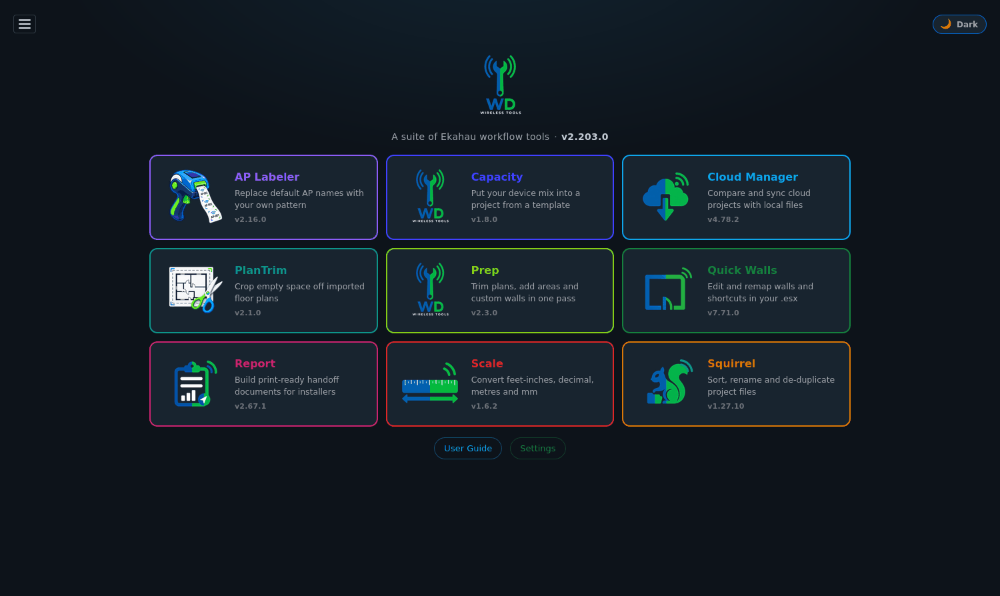
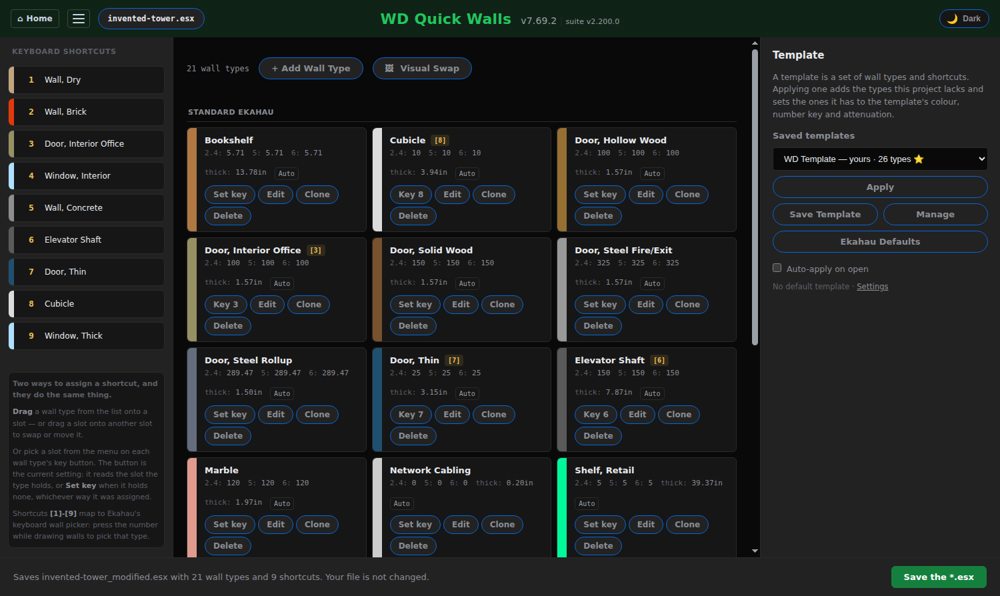
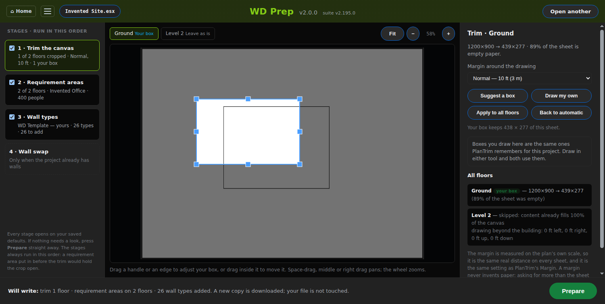
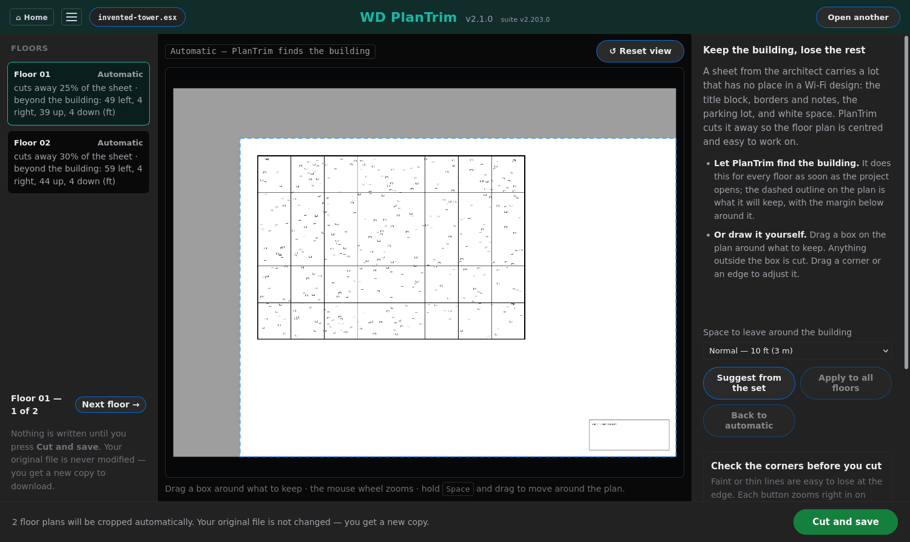
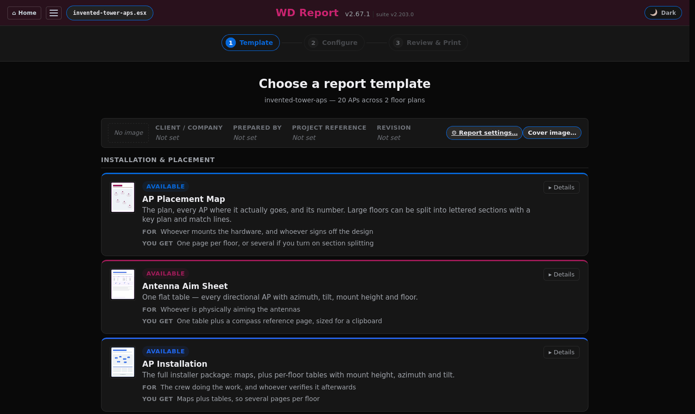
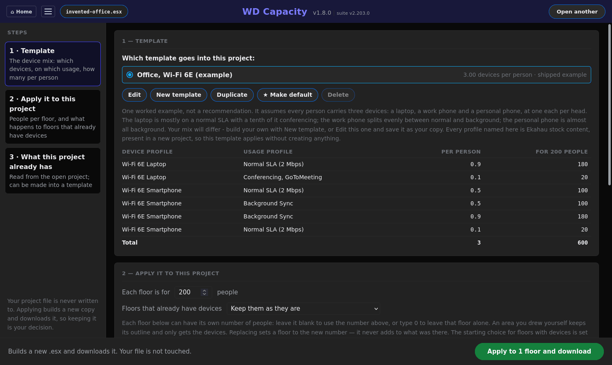
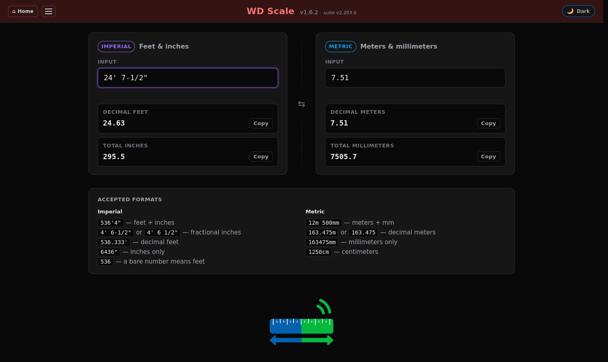

<div align="center">


# WD Wireless Tools

## User Guide

**Practical guidance for the complete Ekahau workflow suite — one guide, a
chapter per tool.**


[Home](../README.md) · [Project Page](https://weirdave.github.io/WD-Wireless-Tools/) · [Latest Release](https://github.com/WeirDave/WD-Wireless-Tools/releases/latest) · [Get Help](https://github.com/WeirDave/WD-Wireless-Tools/issues)

</div>

<table>
<tr>
<td width="20%" align="center"><br><b>Cloud Manager</b></td>
<td width="20%" align="center"><br><b>Quick Walls</b></td>
<td width="20%" align="center"><br><b>Squirrel</b></td>
<td width="20%" align="center"><br><b>Scale</b></td>
<td width="20%" align="center"><br><b>Report</b></td>
</tr>
</table>

---

## Contents

**The job, in order**

- [Start Here](#start-here)
- [A site from start to finish](#a-site-from-start-to-finish)

**The tools**

- [Home and Navigation](#home-and-navigation)
- [Cloud Manager](#cloud-manager)
- [Quick Walls](#quick-walls)
- [Prep](#prep)
- [PlanTrim](#plantrim)
- [Report](#report)
- [AP Labeler](#ap-labeler)
- [Capacity](#capacity)
- [Scale](#scale)
- [Squirrel](#squirrel)

**Everything else**

- [Things that catch people out](#things-that-catch-people-out)
- [Suite Settings](#suite-settings)
- [Install and Launch](#install-and-launch)
- [Update or Uninstall](#update-or-uninstall)
- [Data, Privacy, and Security](#data-privacy-and-security)
- [Troubleshooting](#troubleshooting)
- [Getting Help](#getting-help)

---

## Start Here

WD Wireless Tools is nine tools for the work around an Ekahau design: setting
up folders, preparing floor plans, wall types, capacity, AP names, syncing with
Ekahau Cloud, and the paperwork at the end. It runs on your own computer and
opens in your normal browser. Your projects are not uploaded anywhere. The only
tool that talks to the internet is Cloud Manager, because its job is talking to
Ekahau Cloud.

**New here?** Read [A site from start to finish](#a-site-from-start-to-finish).
It follows one job through the tools in the order you use them. Each tool's
chapter after that starts with a **Quick start** — the everyday job in a few
steps — followed by the details for when you need them.

### Which tool do I need?

| I need to… | Tool | When in the job |
|---|---|---|
| Set up the folders for a new site, or sort a messy one | [Squirrel](#squirrel) | First |
| Convert a measurement off a drawing | [Scale](#scale) | While scaling the plan in Ekahau |
| Trim plans, add capacity areas and add wall types in one go | [Prep](#prep) | Once the plans are in Ekahau |
| Only trim the empty paper off floor plans | [PlanTrim](#plantrim) | Once the plans are in Ekahau |
| Get my wall types and number keys into a project | [Quick Walls](#quick-walls) | Before drawing walls |
| Put a device mix into a project from a template | [Capacity](#capacity) | While setting requirements |
| Rename every AP to my naming scheme | [AP Labeler](#ap-labeler) | After placing APs |
| Compare and sync my local projects with Ekahau Cloud | [Cloud Manager](#cloud-manager) | Any time the cloud is involved |
| Produce placement maps, install sheets and a parts list | [Report](#report) | Last |

### Three things worth knowing first

- **Your original file is never changed.** Every tool that edits a project
  writes a new copy with a new name (for example `site-a (prepared).esx`) and
  leaves the one you opened alone.
- **Nothing keeps a spare copy of a file it replaces.** Where a file is
  replaced — Cloud Manager pulling a newer copy down from the cloud is the main
  case — the other copy is the one Ekahau Cloud still holds. See
  [What happens to a file that gets replaced](#what-happens-to-a-file-that-gets-replaced).
- **Every bulk change shows you what it will do first.** Read that preview.
  That is what it is for.

---

## A site from start to finish

One job, in order, with the tool for each step. Skip what does not apply.

### 1. Make the folders — Squirrel

Open [Squirrel](#squirrel) and press **Create Folder…** on the **Create
Project Folder** card. It builds the site folder and its subfolders (images,
floor plans, reports) from your naming template, so every site is laid out the
same way.

If files have already piled up loose in a folder, use **Select Folder…** on
the **Organize Files** card and Squirrel sorts them into those subfolders.

### 2. Get the floor plans into Ekahau

This part happens in Ekahau. Import the drawings and create the building and
floors.

Expect to draw the walls yourself. CAD files rarely separate walls from
furniture cleanly, so the reliable approach is to use the drawing as a
background and draw over it. Step 6 is where that happens.

### 3. Set the scale — Scale

Ekahau needs one known distance to scale each plan. The drawing gives it in
whatever form the architect used — `24' 7-1/2"`, `7.5m`, `295.5"`.
[Scale](#scale) converts between all of them: type what the drawing says and
copy the number in the unit Ekahau wants.

**Get this right first.** Every wall thickness, area and distance in the design
depends on that one number.

### 4. Save the project locally

Save the `.esx` into the site folder Squirrel made. Keep it local for now; the
cloud comes later.

### 5. Prepare the plans — Prep

[Prep](#prep) does three jobs with one open and one save:

- **trims** the empty paper off every floor plan,
- **adds requirement areas** from a capacity template and a headcount, and
- **adds your wall types** so they are there before you draw.

It saves `<name> (prepared).esx` and leaves your original alone. Trimming
always runs first, because an area drawn over the whole sheet would stop the
sheet being trimmed.

Only want the trimming? [PlanTrim](#plantrim) does that alone, with more
control. A box drawn in either tool is used by both.

### 6. Draw the walls — Quick Walls, then Ekahau

Open the project in [Quick Walls](#quick-walls) and apply your wall template.
That puts your wall types into the project and gives each one a number key.

Then draw in Ekahau: keys **1**–**9** pick your wall types directly instead
of hunting through a menu for each wall. If walls were already drawn with the
wrong types, **Visual Swap** in Quick Walls changes them in bulk.

### 7. Place the APs and run the design

Back in Ekahau: place access points, set requirements, run the design. If the
device mix should match a template, [Capacity](#capacity) puts it in for you.

Before the report, [AP Labeler](#ap-labeler) renames every AP to your scheme,
so the names on the drawings are the names the installer puts on the
hardware.

### 8. Save up to Ekahau Cloud

Upload the project from Ekahau.

### 9. Pull the cloud copy back down — Cloud Manager

**Do not skip this.** When Ekahau uploads a project it gives the cloud copy
its own identity. From then on the cloud copy is the real one, and the local
file you were working in is no longer quite the same project. Keep working in
it and the next upload creates a *second* cloud project instead of updating
the first.

So open [Cloud Manager](#cloud-manager), find the project, press
**Cloud → Local**, and carry on from what comes down. Your local file is
replaced by the copy Ekahau holds; no spare copy is kept, because the cloud one
is still there.

### 10. Run the report — Report

[Report](#report) turns the finished project into paperwork: AP placement
maps, installation sheets, antenna aim sheets, a site summary and more. Pick a
template, set it up once (it remembers), then press **Print / Save PDF**.

---

## Home and Navigation

The Home page shows the nine tools as tiles, each in its own colour with a
one-line description and its version. Click a tile to open the tool. Under the
tiles are **User Guide** (this guide) and **Settings**.

**Every page has the same menu**, behind the ☰ button at the top left:

- **Navigation** — Home, then every tool, so you can go straight from one tool
  to another.
- **Tools** — **Suite Settings**.
- **Help & Support** — **User Guide** (opens this guide at the chapter for the
  tool you are in), **About & Updates** (versions and the update button),
  **Copy Diagnostics** (version details to paste into a bug report) and
  **Report a Bug on GitHub**.

**Each tool shows two version numbers** in its title bar: the tool's own (for
example Report v2.67.1) and, smaller, the suite's (suite v2.203.0). They are
different numbers. Release notes name both, so check which one a note is
talking about.

The **Dark / Light** button at the top right switches the theme on every page
and remembers your choice. The browser's Back button works normally.




*Every tile says what the tool does and shows that tool's version.*

---

## Cloud Manager

Cloud Manager keeps Ekahau Cloud and the `.esx` files on your disk in step,
across every site at once. It lists each cloud project beside its local file,
says which side is newer, and moves the newer copy across when you ask.

Two things in it cannot be undone: deleting a cloud project, and replacing a
cloud project with your local file. Both are covered below. Read those
sections before you use them for the first time.

### Quick start

1. Open **Cloud Manager** from Home. If you are not signed in, press
   **Log in to Ekahau Cloud**, sign in in the browser tab that opens, and come
   back. Cloud Manager picks the session up on its own.
2. The first time, press **Choose Folder** and pick the folder that holds your
   site folders (each with `.esx` files inside), then **Continue**.
3. Read the list: cloud on the left, local on the right, one row per pair.
   A row that needs something has a band underneath it saying what and
   offering the action.
4. Press **⇅ Sync everything**. Read the plan, untick anything you are unsure
   of, and press the **Sync** button at the bottom.
5. To do one file only, use the button in the band under its row, such as
   **Cloud newer · download** or **Local newer · replace cloud**.

### Signing in and the folder

Cloud Manager does not ask for your Ekahau password. It reuses the session
from a browser you are already signed in with: Chrome, Edge, Firefox or Opera.
Private or Incognito windows do not work, and neither do other browsers.

To point it at a different local folder, use **Folder** at the top right, or
**Change Local Folder** in the menu. **Skip for now** on the first screen
lets you look at the cloud side without a folder.

### Reading the list

The **Files** tab has two views:

- **Tree** groups everything by site, the way Ekahau Cloud does. Use it to
  work through one site at a time. **Expand all** and **Collapse all** sit at
  the left of the A–Z letter row.
- **Flat** is one alphabetical list of projects, whatever site each is in.
  Use it when you are looking for one project by name.

**Duplicate Projects** is a separate tab for files whose names normalise to
the same thing, with buttons to keep one copy and delete the rest
(see Deleting, below).

How the Tree opens is a setting: **Suite Settings → Cloud Manager → Sites open
as**. The default opens only the sites that need a decision.

**What a row shows.** The cloud project and the local file sit side by side.
Where the two names differ, the differing characters are marked, so a double
space shows up instead of quietly stopping a match. Tags beside a name say
**Design**, **Measured** or **Hybrid**, **Not assigned** for a cloud project
with no site, and the owner when it is someone else's. **≈** beside a name
means it belongs to a duplicate group; click it to jump there.

**What the date means.** The date on each side is when the project was last
edited inside Ekahau, read from the file itself. Copying, OneDrive sync and
renaming the file do not change it. The same date on both sides means the
same version.

**Size is not shown and not used for matching.** Ekahau Cloud stores projects
uncompressed and your disk stores them compressed, so the same project can
look five to ten times bigger in the cloud.

**The summary line.** The counts across the top are also filters. Click one
to show only those rows; click **items** to clear it.

| Count | Shows |
|---|---|
| **out of sync** | pairs where one side was edited more recently |
| **name mismatches** | pairs whose names differ |
| **name matches** | pairs matched on an identical name only, not proven |
| **external** | projects owned by someone else and shared with you |
| **not shared** | projects you own that nobody else can see |
| **cloud only** / **local only** | one side with nothing to compare against |
| **unmatched sites** | cloud sites with no folder, and folders with no site |
| **not assigned** | cloud projects not in any site |
| **design** / **measured** / **hybrid** | by project type |

**not shared** means you own it and nobody other than you has access. A
project shared only with your own address counts as not shared; one shared
with your Sharing Group counts as shared. A file that is only on your disk
is not in this count, it is under **local only**. The count is hidden when it
is zero, or when Ekahau did not say which account is signed in.

**Live** at the top right re-reads Ekahau Cloud on a timer (interval in
**Suite Settings → Cloud Manager**). It never redraws the list under you: a
bar says **Ekahau Cloud has changed since this list was drawn**, and
**Show the changes** applies it. Use **Refresh** in the menu to re-read both
sides now.

### The Owner filter

**Owner:** in the toolbar has three buttons: **Mine**, **Others** and **All**.

- **Mine** shows projects your account owns. This is the default.
- **Others** shows projects other people own and shared with you.
- **All** shows both. On other people's projects, anything that changes the
  project is greyed out, because Ekahau only lets the owner do it.

Clicking a button also saves it as the view Cloud Manager opens on. The same
choice is **Suite Settings → Cloud Manager → Default view**. A line above the
list always says which filter is on and whether it is your saved default or
just for this visit. If Ekahau does not say which account is signed in,
**Mine** and **Others** cannot work, so the list shows **All** and says why.

An empty list under **Mine** or **Others** is the filter, not an empty
account. Switch to **All** before deciding something is missing.

### How pairs are matched

Every Ekahau project carries a hidden project ID inside the `.esx`, set when
it is created and kept through every edit, rename, upload and download. When
the same ID is on both sides, the pair is proven. Where there is no shared
ID, Cloud Manager falls back to the names.

The badge in the middle column says which kind of pair it is. Hover it for
the reason.

| Badge | Meaning | Sync allowed? |
|---|---|---|
| **You linked it** | you paired these yourself; click to unlink | yes |
| **Same project** | same Ekahau project ID in both files | yes |
| **Same name** | identical names, no shared ID | yes, with a check |
| **Same site code** | same site code and similar names | no, until confirmed |
| **Similar name** | some words in common; a guess | no, until confirmed |

**Same project** says who the two files are, not that their contents match.
**Check what differs** answers that (see below).

**Fixing a wrong pairing:**

- **Two files it missed.** On either unpaired row, use **Link to a cloud
  project…** (or **Link to a local file…**) and pick the other one. It is
  remembered.
- **A pair it should not have made.** Use **Not a match** on the row. It is
  never suggested again. **Manage Not-a-Match** in the menu lists these and
  lets you undo them.
- **A guessed pair you know is right.** Use **Confirm this pair** on the row.
  It becomes a pair you made yourself, and syncing is allowed. Undo it from
  the badge.

**Not paired yet.** Files that look related but have a hard difference, such
as a different building number or survey phase, are not paired. They are
listed at the bottom under **Not paired yet**, each with its candidates and
the reason. Use **This is the one**, **Not this one**, or **None of these**
to leave the file unpaired and stop the suggestions.

**Name differences on a pair.** A project has a file name, a name stored
inside the `.esx`, and a cloud name (see
[A project has three different names](#a-project-has-three-different-names)).
Renaming the file does not change the name inside it. The band under a
mismatched row offers fixes such as **Make them match**, **Rename folder to
match** or **Rename cloud site to match**. For several files at once, select
them and use **Fix names inside files**, which sets the name inside each
`.esx` to its cloud name.

### Which side is newer

When a pair differs, the band under the row says so and offers the action.

**Cloud newer · download** (or **Cloud renamed · download** when only the
name changed in the cloud) replaces your local file with the cloud copy. It
shows both dates and asks first. No second copy is kept on disk: the cloud
copy is the other copy, and it is still there afterwards. If your local copy
turns out to be newer by the time it runs, nothing is changed. See
[What happens to a file that gets replaced](#what-happens-to-a-file-that-gets-replaced).

**Local newer · replace cloud** sends your file up. See
[Replacing a cloud project](#replacing-a-cloud-project) first: this deletes
the old cloud project.

**Replace cloud with local…** appears on a **Cloud newer** row, for when you
want an older local file to win anyway. It asks once, shows both dates, and
says that every change made in the cloud since your local save is lost.

**Check what differs** downloads a copy of the cloud project and compares it
with your file. It changes nothing on either side. Do this before you
download or replace when you are not sure the newer date means real work:
a rename alone also moves the date. When the answer is in, the row says it,
for example **Exact match** when the contents and name agree, and offers
**Re-check**.

On a **Same site code** or **Similar name** pair, the download and replace
buttons are greyed out with the reason, and **Confirm this pair** sits beside
them.

### Sync everything

**⇅ Sync everything** needs no selection. For every pair it works out which
side is newer and moves that copy, or does nothing when they match. It never
replaces a newer file with an older one.

The plan opens first, in separate lists you tick separately:

- **Rename cloud sites** to match your folders.
- **Replace local files with the cloud copy.** Each row shows what differs and
  both dates. If some have not been compared, **Compare them first** runs the
  check without changing anything.
- **Download cloud projects you have no local copy of.** Nothing is
  overwritten.
- **Send newer local files up.** Each row names **the cloud project it
  replaces**. Read that column: each of those cloud projects is deleted.

Anything matched only by name (**Same name**, or a site paired on similar
wording) arrives **unticked**, so you check the name before it moves. Guessed
pairs are not in the run at all; the plan names them and points you to
**Confirm this pair**. Nothing happens to anything you untick.

For a few chosen rows instead, tick them and use **Cloud → Local** or
**Local → Cloud** in the selection bar. These move contents to the newer side,
copy names across, upload or download single-sided files, and create a
missing site or folder. The same plan is shown first.

### When both sides changed

Two dates only say which side is newer, not whether both sides were edited.
So each time Cloud Manager makes a pair identical (a download or a replace),
it records that point on this computer. After that it can tell:

| Cloud changed since? | Local changed since? | Result |
|---|---|---|
| no | no | in sync |
| yes | no | safe to download |
| no | yes | safe to send up |
| yes | yes | **changed on both sides** |

A pair that changed on both sides is left out of **⇅ Sync everything**, and
the plan names it. Copying either way would throw away the other side's
work, and Cloud Manager cannot merge two `.esx` files. Use **Check what
differs** to see what changed, decide which to keep, and use the row's own
button.

The record lives on this computer only. A pair it has never synced has no
record, so "both changed" cannot be detected for it yet. The individual row
buttons and **Cloud → Local** cannot see this either, so check before you
download over local work.

### Replacing a cloud project

There is no way to overwrite a cloud project in place. **Local newer ·
replace cloud** does it in three steps, in this order:

1. Upload your file as a new cloud project, into the same site.
2. Check it arrived and is really your file.
3. Only then delete the old cloud project.

If the upload fails, nothing is deleted. If the delete fails, you are told
there are now two and which one is good.

**What you lose, and cannot get back:**

- **The old cloud project itself.** A cloud delete has no undo.
- **Its sharing.** Sharing belongs to the old project, so everyone it was
  shared with loses access. When the replace finishes, Cloud Manager names
  them. It does not re-share for you; do that from **Sharing…** on the new
  project.

Before it runs, Cloud Manager re-checks which side is newer. If the cloud
copy was saved in the meantime, it refuses rather than overwrite that work.
On a **Same project** or **You linked it** pair it runs without a dialog. On a
**Same name** pair it asks once, naming the cloud project it will delete. It
is greyed out on someone else's project and on a guessed pair.

### Deleting

Every row has a **⋯** menu with **Delete this cloud project** (or **Delete
this .esx file**, **Delete this local folder and its contents**, **Delete
this cloud site**). For several, tick them and press **Delete selected**.

**A cloud delete cannot be undone.** There is no trash. The project is gone
for everyone it was shared with. The dialog names each project, its site,
when it was last changed, and **every person who will lose access**. Read it:
the list behind the dialog is greyed out. Press **Delete from cloud** to go
ahead. Deleting a whole site does not delete the projects inside it. Your
local copy is never touched by a cloud delete.

A local delete removes the file or folder from disk, also with no undo. It
asks once. A folder delete warns when the folder holds floor plans or other
files that are not in Ekahau Cloud, and when it holds archive or output
subfolders.

Each side of a pair has its own checkbox. Ticking only the local side deletes
only the local file, and the same for the cloud side.

On **Duplicate Projects**, each group offers **Keep newest — delete rest**
and **Keep largest — delete rest**. These use the same delete dialog, naming
everything first.

### Sharing a project

Use **Sharing…** in a cloud project's **⋯** menu, or tick several and use
**Move, share, mark, overwrite → Share…**. The dialog is **Manage Sharing**.

1. Type addresses in **Share with someone**. Separate them with commas,
   semicolons or spaces, or paste a list (the `Name <address>` form from
   Outlook works). Each becomes a tag; click its × to remove it.
2. Pick the role: **View only** (the default), **Edit rights** or **Full
   access**. It applies to everyone added in that go. Addresses outside your
   Ekahau organisation always get **View only**; Ekahau enforces that.
3. Press **Share**.

An invalid address is outlined in red and left in the box; everyone else is
still shared, and the result is reported per person. You can also turn on
**Share with your Sharing Group** from the same dialog.

Typing suggests addresses you have shared with before, and a **Recent** row
offers the last few. Only addresses that a share succeeded for are
remembered. Clicking × on a recent name removes it from suggestions only. This
list stays on your computer and is never sent anywhere; **Suite Settings →
Backup & restore → Export to a file…** includes it.

Only the owner can share a project, so **Sharing…** is greyed out on other
people's.

### Moving projects into a site

**Move to a site…** in a project's **⋯** menu, or tick several and use
**Move, share, mark, overwrite → Move to site…**. Type or pick the site; the
dialog shows where it will land. Press **Move**. A matched pair moves on both
sides, so it stays paired.

When cloud projects with no site match local files that are in a site
folder, a bar above the list offers **Auto-assign** for all of them.
**Show list** shows each project and its destination first. One project at
a time: **Assign to “…”** (naming the site) in its **⋯** menu.

### Merging folders

To combine several local folders, tick them and use **Move, share, mark,
overwrite → Merge folders into one…**, then pick the destination. For one
folder, use **Merge into another folder…** in its **⋯** menu.

The file list comes first, grouped by source folder, each file with a tick
you can clear. Nothing moves until you press **Merge**. When a file already
exists in the destination, choose **Keep newer**, **Keep both (date-stamp
older)** or **Skip**. The default is **Suite Settings → Cloud Manager → Merge
conflict rule**. **Delete the source folder afterward if it ends up empty**
is ticked by default.

If two of the folders you picked hold the same file, the list says so before
anything moves. Under **Keep newer**, both copies are kept in that case. A
folder that cannot be merged is named and skipped, not allowed to stop the
run.

To check two or more folders before merging, tick them and press **Compare**.
Files that appear in more than one are highlighted.

### Marking External or mine

The **external** count goes by the owner recorded on the project. That is not
always whose work it is. Tick the projects and use **Move, share, mark,
overwrite → Mark as External…** or **Mark as mine…**. The row gets a
**Marked External** or **Marked mine** badge; click the badge to remove the
mark. Counts, filters and row colouring follow it.

Nothing is written to Ekahau Cloud or to any file. The mark is a note on
this computer, so it works on projects you do not own.

### Greyed-out buttons

A greyed-out control is still there so you can find it. **Click it, or hover
it, and it says why** and what to select. For example, **Compare** needs two
or more local folders selected, and anything that changes a cloud project is
greyed out on a project someone else owns.

### Login storage

Cloud Manager saves the Ekahau session, encrypted, in your user settings
folder. The key is kept separately in Windows Credential Manager or the macOS
Keychain. **Forget Cloud Login** in the menu removes both and returns you to
the sign-in screen.

### Keyboard and mouse

| Key or action | What it does |
|---|---|
| Click a site row | open or close that site |
| `Enter` or `Space` on a site row | open or close that site |
| `Enter` or `Space` on a count | apply that filter |
| `Shift`+click a checkbox | tick every row between it and the last one |
| `Esc` | close an open drop-down menu |
| `↑` `↓` `Enter` in the share box | pick a suggested address |
| `Backspace` in an empty share box | remove the last address tag |

---

## Quick Walls

Quick Walls puts your own wall types and your own number keys into a project,
so drawing a building in Ekahau is a keystroke per material instead of a hunt
through the wall picker. It edits the wall types inside an `.esx` on your
machine and saves the result as a new copy; your original file is not changed.

In a job it runs after [Prep](#prep) and before you draw.

### Quick start

1. Drop an `.esx` onto the page, or click the drop box to browse. **Open from
   disk…** does the same through a file dialog, and lets Quick Walls show you
   the project's folder again after you save.
2. Pick a template from **Saved templates** in the **Template** panel on the
   right and press **Apply**.
3. Drag a wall type from the middle list onto a slot from 1 to 9 under
   **Keyboard shortcuts** on the left.
4. Press the `Save the *.esx` button at the bottom right. Open that copy
   in Ekahau AI Pro; while drawing walls, press 1–9 to pick the type on that key.

To work on a different project, click the file name at the top left, or use
**Open Another File** in the menu.




*Shortcut slots 1–9 on the left, the project's wall types in the middle, the Template panel on the right, and the save button at the bottom right.*

### The shortcut panel

The left column holds slots 1 to 9, the same numbers Ekahau's wall picker
answers to while you draw.

- **Drag** a wall type card onto a slot to give it that key.
- **Drag a slot onto another slot** to move it there. If both slots hold a
  type, the two swap.
- Click **×** on a slot to clear it.
- One type per key. Giving a key to a new type takes it off the old one, and
  the slot menu tells you which type will lose it before you choose.

Shortcuts are stored in the `.esx`, so they travel with the project.

> Put your most-used types on 1–3; they are the easiest to reach mid-drawing.

### The wall type list

Every wall type in the project, in two groups: **Standard Ekahau** (the types
Ekahau ships) and **Custom Walls** (everything else), each alphabetical. A
card shows the colour, the attenuation at 2.4, 5 and 6 GHz, the thickness, and
a height badge (*Auto*, or the height the type stops at).

| Button | What it does |
| --- | --- |
| **Set key** / **Key 3** | Opens a menu of keys 1–9. The button shows the current key, or **Set key** when there is none. The menu also offers **Remove shortcut** |
| **Edit** | Opens the type: name, colour, thickness, height, key, attenuation |
| **Clone** | Opens the editor filled in from this type, named "(Copy)", with no key. Nothing is added until you press **Add** |
| **Delete** | Removes the type after one confirmation, which says how many drawn walls use it |
| **+ Add Wall Type** | A blank form, for exact values from a datasheet |

Cloning a type whose numbers you already trust is usually faster than a blank
form.

> **Deleting a type that is drawn leaves those walls with no type.** The
> confirmation says how many drawn wall segments use it. To move them to
> another type first, use **Visual Swap → Quick swap by type**, then delete.
> Nothing is written until you save, so reopening the file undoes a delete.

### The Attenuation Areas tab

Attenuation areas have their own tab beside **Wall Types**, named as Ekahau
names them. The tab has two lists, in feet and dB per foot at 2.4 / 5 / 6 GHz:
**Presets** and **In this project**.

**Presets** are areas kept so they are not forgotten. Two come with the app,
**Tree Canopy** (9 to 35 ft, 1 / 1.3 / 1.5 dB per foot) and
**Shrubbery/Low Plants** (0 to 4 ft, 1.2 / 1.6 / 1.8 dB per foot), marked *built
in*. The ones you keep yourself are marked *kept by you*. **Add** on a preset
puts that one in the project's attenuation area list, and **+ Add All Presets**
puts them all in. Quick Walls converts feet to metres on the way in; areas
already drawn are not changed, and a type with the same name is updated in
place, keeping its name and colour. **Remove** on a kept preset takes it off
the list (projects that already have it are not changed); a built-in preset
cannot be removed.

**In this project** lists the project's own attenuation area types, each with
how many areas are drawn with it.

| Button | What it does |
| --- | --- |
| **Edit** | Opens the area: name, colour, lower and upper edge, loss at each band. Drawn areas keep working because the type keeps its id. Saving with nothing changed changes nothing |
| **Keep as preset** | Keeps this area as a preset of your own, on this tab in every project. It does not change the project |
| **Delete** | Removes the type after one question that names it. Greyed, with the reason, when drawn areas use it - Quick Walls will not remove a type from under an area that is drawn with it. Delete or retype those areas in Ekahau first |
| **+ Add Attenuation Area** | A blank form for a new one: a name, a colour, the lower and upper edge in feet (leave the upper edge empty and the area runs to the ceiling) and the loss in dB per foot at 2.4, 5 and 6 GHz |

Press the save button at the bottom right to write the project's changes.
Everything here is saved in the project's attenuation area list, never in a
wall template: wall templates carry wall types only, and the two are kept
apart. Presets you keep are stored in your user folder
(`attenuation-area-presets.json`) and travel with the settings export. A name
the project already uses, an upper edge at or below the lower edge, or a missing
or negative loss is refused, with the reason shown in the dialog.

The buttons that add are greyed, with the reason beside them, when the project
has no attenuation area type to copy the file layout from. Add any area type in
Ekahau once and open the project again.

### What a wall type holds

- **Name**: the label in Ekahau's wall picker and on the plan. Keep it the
  same across projects so the same material always has the same name.
- **Color**: how Ekahau draws the type. A distinct colour per type is what
  lets you read a plan at a glance.
- **Thickness**: the real thickness. The **in** / **m** switch beside the
  label sets the unit; Quick Walls remembers it, and until you choose it
  follows your browser's region. Ekahau uses thickness together with
  attenuation, so it is not cosmetic.
- **Keyboard Shortcut**: **None** or 1–9, the same as the key button.
- **Propagation Properties**, per band (2.4, 5 and 6 GHz):
  - **Atten.**: dB lost passing through. The number that matters most.
  - **Reflect.**: how much bounces back, 0 to 1.
  - **Diffract.**: how much bends around edges.

The fields match Ekahau's own wall-type format, so a type made here behaves
the same as one made in Ekahau AI Pro.

### Wall heights

**Vertical extent** in the editor decides how tall a type is:

- **Auto — floor to ceiling** is the default and the right answer for real
  walls. The card shows *Auto*.
- **Stops short of the ceiling** shows two boxes: **Top** (how high it
  reaches) and **Floor offset** (where it starts, normally 0). Heights are in
  feet when thickness is in inches, metres otherwise. Use it for shelving,
  racking, cubicles, pods and counters, where signal passes over the top.

A shelf left on Auto is modelled as a barrier to the roof, which changes AP
counts, not just the heat map.

**Height belongs to the type, not to one drawn wall.** When the type is
already drawn, the editor says how many segments the change will affect
before you save.

### When a name and the file disagree

If a type you have actually drawn with has a height in its name but none set
(for example *Warehouse Rack Wall - 16ft* on Auto), a panel above the list
says so. Being on Auto on its own is never flagged. Each row gives the type,
how many segments use it, and three choices:

- **Set to 16 ft** (the number comes from the name) sets that height.
- **Edit…** opens the type so you can enter your own.
- **Leave as is** keeps Auto and stops asking while this project is open.

Nothing reaches disk until you save.

### Templates

A template is a full set of wall types with their keys, so every project can
start the same way. The controls are in the **Template** panel on the right.

| Control | What it does |
| --- | --- |
| **Saved templates** | Choose a template. Each entry says *yours* or *fallback* and how many types it holds; yours are starred and listed first |
| **Apply** | Adds the chosen template to this project. Nothing is removed |
| **Save Template** | Saves the project's current types and keys as a template. Asks before overwriting one with the same name |
| **Manage** | **Import .json** and **Export .json**, for sharing, and shows the templates folder |
| **Ekahau Defaults** | Replaces the whole list with Ekahau's factory types, after asking |
| **Auto-apply on open** | Applies your default template to each project as it opens. Off by default |

**Apply adds; it never deletes.** A type the project lacks is added. A type
it already has, Ekahau's own included, is updated to the template's name,
colour, thickness, height, key and attenuation, and keeps its identity, so
walls already drawn with it stay attached. Types the template does not
mention are left alone. If the template claims a key another type held, the
template wins and the other type loses that key.

**Ekahau Defaults is the one that removes things.** Its confirmation names
the types that will go and warns that walls drawn with them will be left
without a type. Use it to start over. To put back only Ekahau's standard
types, choose *Ekahau Default* in **Saved templates** and press **Apply**
instead; that adds what is missing and removes nothing.

**The default template** is set in **Suite Settings → Quick Walls → Default
wall template** (default: none). It is the template the picker opens on and
the one **Auto-apply on open** uses; the note under the tick box names it.
Pressing **Apply** never changes the default.

#### WD Template

*WD Template* is one engineer's own setup, offered as a starting point. It
adds types Ekahau does not ship (a meeting pod, retail and warehouse shelving,
network cabling, rack walls at two fixed heights and one on Auto) and puts the
common types on keys 1–9.

It also recolours three of Ekahau's own types on purpose: *Elevator Shaft*
green, *Door, Steel Fire/Exit* orange and *Window, Thick* a stronger blue,
because Ekahau's greys for those are hard to tell apart on a plan. To keep
Ekahau's colours, edit those three after applying and save the template again.

Only the types whose names state a height carry one (12 ft and 16 ft). Every
other type, shelving and cubicles included, is on Auto.

#### Where templates live, and sharing them

Your templates are kept in a `templates` folder inside your WD Wireless Tools
user folder (`~/.wd_wireless_tools/templates/`), outside the install, so
updating the suite never touches them. **Manage** shows the exact path. The
templates that ship with the app are copied into that folder the first time,
and from then on the copy is yours.

To share one, choose it in **Saved templates**, open **Manage** and press
**Export .json**. To use one you were sent, press **Import .json**; a template
with the same name is replaced without asking.

### Visual Swap

**Visual Swap**, in the toolbar above the list, opens a full-screen editor
showing the floor plan with its walls. Use it to pick walls off the plan and
change their type, or remove them, without redrawing.

1. Choose the floor in **Floor**.
2. Select walls: drag a box (marquee), or click walls one at a time.
3. Check the list under **Selected**: everything you caught starts checked.
   Uncheck what should stay as it is.
4. Pick the new type in **Change checked to** and press **Swap**.
5. Press **Save .esx** at the top right, or **Close** and save from Quick
   Walls.

**Selecting**

- A marquee drag replaces the selection; hold `Shift` to add to it.
- Clicking a wall checks or unchecks it. Clicking empty plan clears the
  selection.
- Clicking a type under **Wall types on this floor** selects every wall of
  that type on this floor.
- Pointing at a wall lights up its row in the list; pointing at a type
  highlights all of it. **Expand all** and **Collapse all** open the list,
  which is grouped by type and starts collapsed.
- **Number the selected segments on the plan** labels each selected wall.
  Off by default.

**Other actions**

- **Delete selected** removes the checked walls from the project, after one
  confirmation.
- **Quick swap by type** changes every wall of one type at once: choose
  **From**, **To** and **Scope** (**Whole project**, the default, or **This
  floor only**), then press **Swap all**.
- Each swap or delete shows a message with an **Undo** button. The toolbar
  undo and redo buttons step back through up to 50 changes. Closing Visual
  Swap keeps your changes but clears that undo history.

Changes stay in memory until you save. Saving here is the same save as Quick
Walls': it writes the wall types and the walls together.

| Key | In Visual Swap |
| --- | --- |
| `M` / `V` / `H` | Marquee / click / pan tool |
| Hold `Space` and drag | Pan from any tool (right- or middle-drag also pans) |
| Mouse wheel | Zoom |
| `Ctrl+A` | Select every wall on this floor |
| `Ctrl+Z` | Undo |
| `Ctrl+Y` or `Ctrl+Shift+Z` | Redo |
| `Esc` | Clear the selection; with nothing selected, close Visual Swap |

### Saving your work

The `Save the *.esx` button writes everything into a new file named after the
original with `_modified` added (`site-a.esx` becomes `site-a_modified.esx`).
The footer beside it says how many wall types and shortcuts it will write.

- In Chrome and Edge a save dialog lets you choose the name and folder.
- In Firefox the file goes to your browser's downloads folder.

If you opened the project with **Open from disk…**, its folder opens after the
save. Turn that off in **Suite Settings → Quick Walls → Open the source folder
after saving a project** (on by default).

### Keyboard reference

| Key | Where | Action |
| --- | --- | --- |
| `1`–`9` | Ekahau AI Pro, drawing walls | Pick the wall type on that key |
| See the table under Visual Swap | Visual Swap | Tools, undo, selection |

---

## Prep

Prep gets a freshly imported project ready to draw in. In one pass it crops
the empty paper off the CAD sheets, puts a requirement area on every floor and
loads your wall types.

### Quick start

1. Drop the `.esx` on the page, or press **Open from disk…** (quicker for big
   projects — see below).
2. The three stages are listed down the left, each with a one-line status.
   Click one to check it on the plan; change only what needs it.
3. Read the footer at the bottom right — for example *"Will write: trim 2
   floors · requirement areas on 3 floors · 6 wall types added"*.
4. Press **Prepare**. You get a new copy; your original is not touched.

Every stage opens on your saved defaults, so a project that needs nothing
looked at is one click. Untick a stage to leave it out. The plan in the middle
has the floors along its top, with **Fit**, **−** and **+**; the wheel zooms
and Space-drag or a right drag pans.




*The three stages down the left, the plan with the trim outline in the middle, the selected stage's settings on the right. The second stage here says it cannot run; selecting it shows why.*

### 1 · Trim the canvas

Crops the empty paper off each sheet and moves every AP, wall and area with
it — the same work as [PlanTrim](#plantrim), with the same boxes.

- The dashed outline is what automatic keeps; the shaded paper goes.
- Drag a rectangle on the plan to choose for yourself. Drag a handle or edge
  to adjust it, or inside it to move it. The floor then says **Your box**.
- **Suggest a box** compares the sheets and proposes a box on each floor, with
  its reason. It lands on the plan to check; nothing is written.
- **Draw my own** starts a box from what automatic would keep.
- **Apply to all floors** copies this box to every floor of the same sheet
  size. **Back to automatic** removes it.
- **Space to leave around the building** is the same setting as PlanTrim's;
  change it in either tool and both follow.

> **A box you draw cuts.** Anything on that floor outside it — APs, walls,
> notes — is removed from the new copy. Automatic never cuts anything.

### 2 · Requirement areas

Puts a requirement area on every floor from a capacity template and a
headcount. The plan shows each area in pink with its people and devices.

- **Capacity template** starts on your ★ default from
  [Capacity](#capacity). **Capture from a project…** makes a template from a
  finished project without leaving Prep. **Manage templates** opens Capacity
  in a new tab; Prep picks up changes when you come back.
- **People on each floor, unless set below** is what every floor gets. Under
  **Per floor**, each **People on this floor** box can be left blank (use the
  number above), given its own number, or set to **0** to leave that floor
  alone. Each floor shows the multiplier, as in Capacity: *250 people × 3
  devices each = 750 devices*.
- **Floors that already have devices** works as in Capacity — **Keep them as
  they are**, **Replace device counts, keep the area outline** or **Replace
  device counts and redraw the area** — starting on the default in
  **Settings → Capacity**. Each such floor also has a **This floor** dropdown.
- **Re-measure areas that still cover the whole plan** — on by default; see
  *Running it again*.

With no capacity templates, this stage is switched off and says *"Build one in
Capacity first."*

### 3 · Wall types

Applies a Quick Walls template exactly as [Quick Walls](#quick-walls) does.
Missing types are added; types the project already has, including Ekahau's
stock ones, are set to the template's colour, number key and attenuation.
Walls already drawn stay on their types. **Wall template** starts on your
Quick Walls default. With no wall templates, the stage is switched off.

### The stages always run in the same order

Trim, then areas, then wall types, whatever you tick. A requirement area counts
as content the crop must keep, and on a fresh plan it covers the whole sheet —
so an area put in first would stop the trim cropping anything. Prep enforces
the order.

### Two ways to open a project

| | Drop, or click to browse | **Open from disk…** |
|---|---|---|
| Reading | Uploaded to the local server | Read where it sits |
| New copy | Downloaded as `<name> (prepared).esx` | Written beside the original, same name |
| Afterwards | Your downloads | **Show me the file** opens the folder |

If the file dialog cannot open, Prep says why and gives you the browser's
normal picker. Cancelling does nothing.

> **Preparing again asks first.** If `<name> (prepared).esx` is already in the
> folder, Prep offers **Replace it** or **Show me the folder** — that file may
> be the one you have been drawing in.

### Prepare

**Prepare** is greyed out until there is something to write, and the footer
says why — nothing ticked, or *"This project is already prepared — there is
nothing left to do."* After a run, a line above the footer says what each
stage did.

### Running it again

Run it on the fresh import, draw walls in Ekahau, then run it again. A trimmed
floor is skipped. Wall types that match are left alone; one you changed in
Ekahau is set back to the template. A floor with a requirement area is left
alone — except an area that still covers exactly the whole plan, which is
re-measured to the walls you have now drawn.

> An area you moved, redrew or cut around an atrium is never touched, nor is a
> floor set to **Keep them**. Untick **Re-measure areas that still cover the
> whole plan** to turn re-measuring off.

### If a stage cannot run

Its line on the left says **Cannot run — select this step to read why**;
click it for the full reason. Nothing is written for that stage. The usual
case is a capacity template naming profiles this project lacks: open it with
**Edit** in Capacity while a project with those profiles is open, and save it
again — or add the profiles in Ekahau first.

---

## PlanTrim

PlanTrim crops the dead paper off the floor plans in an `.esx` — title block,
borders, notes, car park and white space — so each plan fills its page. Every
AP, wall, area and note moves with the crop, so the project still opens
correctly in Ekahau.

### Quick start

1. Drop the `.esx` on the page, or click to browse. Every floor is measured
   straight away, and **Automatic** is proposed for each one.
2. Read the floors down the left. Each card says what will happen, such as
   *"cuts away 62% of the sheet"*.
3. Check a floor or two with the corner buttons under **Check the corners
   before you cut**.
4. If automatic is wrong for a floor, drag a box around what to keep and press
   **✂ Crop to this box**.
5. Press **Cut and save** at the bottom right. A new copy, `<name>
   (trimmed).esx`, is downloaded. Your original is not changed.




*Each floor's card on the left says how much of the sheet it cuts away. The dashed outline on the plan is what will be kept.*

### Keep the building, lose the rest

That is the heading of the panel on the right. There are two ways to say what
to keep:

- **Let PlanTrim find the building.** It does this for every floor when the
  project opens. The dashed outline on the plan is what will be kept, with the
  margin around it.
- **Or draw it yourself.** Drag a box on the plan around what to keep. Use this
  for sketchy drawings, or a PDF or image where the building is hard to tell
  from the notes.

The line above the plan says which one this floor is using: **Automatic —
PlanTrim finds the building**, or **Your box**.

### Check the corners before you cut

Faint or thin lines are easy to lose at the edge. Four buttons — **↖ Top
left**, **Top right ↗**, **↙ Bottom left** and **Bottom right ↘** — each zoom
right in on one corner of what will be kept. **↺ Reset view** goes back to the
whole sheet; it changes nothing about the crop.

The wheel zooms. Hold **Space** and drag to move around the plan.

### Space to leave around the building

This dropdown sets how far out from the building the automatic crop stops. It
is a real distance measured on the plan's own scale, so it means the same on
every floor whatever resolution the sheet was exported at.

| Setting | Keeps | Use it for |
|---|---|---|
| **Tight** | 3 ft (0.9 m) | Cropping hard to the building |
| **Normal** | 10 ft (3 m) | The default — room for survey paths along the outside walls |
| **Wide** | 20 ft (6.1 m) | Seeing some RF bleed outside the walls |
| **Extra wide** | 35 ft (10.7 m) | Generous outside coverage |
| **Parking lot** | 200 ft (61 m) | Keeping parking and approaches, where APs cover outdoors |
| **Custom…** | Whatever you type, in feet | Any other distance. It is remembered |

Your choice is saved and used next time. It is the same setting as Prep's
**Space to leave around the building** — change it in either tool and both
follow.

**A margin never invents paper.** Ask for more than the sheet has and it keeps
the whole sheet and stops. Each floor card says how much drawing lies beyond
the building in each direction (in feet), so you can see when a bigger margin
would make no difference.

### Drawing your own box

1. Drag on the plan to draw a box.
2. Adjust it. Drag a corner, or grab an edge to move just that side, or
   drag inside the box to move it. The pointer shows which.
3. Press **✂ Crop to this box**. The view reframes onto what you kept. That is
   your confirmation. Nothing is written until you save.

> **A box you do not crop is ignored.** The floor stays as it was, and its card
> adds *"your box was not used"* so you are not misled.

> **A box you crop cuts.** Anything on that floor outside your box — APs,
> walls, notes and the rest — is removed from the new copy. The result after
> saving says how many objects were cut away. Automatic never cuts anything.

| Control | What it does |
|---|---|
| **✂ Crop to this box** | Commits the box you drew. Shows only when there is one waiting |
| **Edit box** | Puts the handles back on the same box so you can change it |
| **Back to automatic** | Throws this floor's box away and lets PlanTrim find the building |
| **Apply to all floors** | Uses this floor's box on every other floor *of the same sheet size*. Floors of a different size are skipped and counted |
| **Suggest from the set** | Compares the sheets with each other and proposes a box, with the reason. It never applies itself — check it and drag it if it is wrong |

**Boxes are remembered** for this project on this computer, outside the
`.esx`. Close the project, open it again, and the floors you cropped are still
cropped. Prep uses the same boxes. A box you drew but never cropped is not
kept.

### The floor list

The cards down the left are the whole state of the job: one per floor plan,
the one you are on highlighted. Click any card to jump to it; there is no
order to follow.

| The card says | Meaning |
|---|---|
| **Automatic** | PlanTrim found the building and will crop to it. Hover for the sizes in pixels |
| **Your box** | You drew and cropped a box. If you drew one and did not crop it, it says *"drawn — not cropped yet"* |
| **Nothing to do** | The drawing already fills the sheet. The floor is copied through unchanged |
| **Cannot crop** | A crop would not be safe here, and the reason is on the card |
| **Repair** | An earlier version trimmed this floor and lost the white page behind the drawing. Saving puts it back |

Under the cards, a line such as *"Level 2 — 2 of 3"* says where you are.
**Next floor →** steps on, and reads **Last floor** on the last one.

On a tall building — more than eight floors — the cards shrink to a compact
list that scrolls inside the left rail, keeping the current floor in view. Each
row then shows just the name and the state; hover for the detail.

### Saving

The button at the bottom right changes with the work left:

- **Cut and save** — at least one floor is still automatic.
- **Save trimmed .esx** — every crop is a box you drew, so all that is left is
  writing the file.
- **Save repaired .esx** — nothing to crop, but a floor needs its white page
  put back.
- **Nothing to cut** — greyed out; every floor is already tight or cannot be
  cropped.

The sentence beside it says how many floors will be cropped. After saving, the
result shows the file name and the size before and after. Expect the size to
barely change: empty paper already compresses to almost nothing. Open the new
copy in Ekahau and check it before using it on real work.

### What travels with the crop

Everything with a position on the floor is moved with it: access points, wall
points and segments, interferers, notes and their pins, areas, attenuation and
exclusion areas, reference points and survey route points.

**The scale is never changed.** If PlanTrim cannot keep it exactly as it was,
it refuses that floor rather than write a plan whose scale has shifted.

**Vector plans** (DWG or PDF brought into Ekahau) are cropped by moving their
window onto the drawing, so they stay sharp. A raster copy stored alongside is
cropped to the same region.

### When a floor is skipped or refused

- **Nothing to do** — the content already fills the sheet.
- **Cannot crop** — for example a geo-anchored plan, a plan image missing from
  the file, an animated or multi-page image, or an image format PlanTrim cannot
  write back (such as WBMP).

> **If a floor you expected to crop says Nothing to do**, check whether it has
> a requirement area covering the whole plan. An area counts as content, so it
> holds the crop open to the full sheet. This is why [Prep](#prep) always trims
> before it adds areas.

---

## Report

Report turns a finished `.esx` into the paperwork somebody else works from:
placement maps and installation sheets for the crew, an aim sheet for whoever
points the antennas, a bill of materials for whoever raises the purchase order.
It reads the project and never writes to it.

### Quick start

1. Open Report and drop an `.esx` on the page, or click the drop box to browse
   for one.
2. **Template** (step 1) — click the card for the document you need. Each card
   says who it is for and roughly how many pages you get.
3. **Configure** (step 2) — check your details, the cover page, the report's
   own options and **APs to include**, then press **Generate report →**.
4. **Review & Print** (step 3) — scroll through every sheet, then press
   **Print / Save PDF**.
5. In the print dialog choose *Save to PDF* (Firefox) or *Save as PDF*
   (Chrome, Edge), so the file name is filled in for you.

**← Change template** and **← Back to configure** step back without losing
what you set. **Open another…** (or **Change file** on the template step) loads
a different project.




*Step 1: each card says who the document is for and what you get.*

### Report templates

The template step groups the cards under *Installation & Placement*,
*Site Analysis* and *Audit & Change*; the RF Design Review is under
*Audit & Change*. **▸ Details** on a card lists what is
inside before you pick it.

| Template | For | What you get |
| --- | --- | --- |
| **AP Placement Map** | Whoever mounts the hardware, and whoever signs off the design | The plan with every AP where it goes and its number. One page per floor, or several if you turn on section splitting |
| **Antenna Aim Sheet** | Whoever is physically aiming the antennas | One flat table of every directional AP — azimuth, tilt, mount height, floor — plus a compass reference page, sized for a clipboard |
| **AP Installation** | The crew doing the work, and whoever verifies it afterwards | The full installer package: maps plus per-floor tables with mount, height, azimuth and tilt. Several pages per floor |
| **Site Summary Sheet** | Clients, and anyone who will not open a floor plan | One page of totals — APs, floors, buildings, radio bands, common models, antennas |
| **Coverage Cell Boundary** | Clients and budget holders | Each AP's coverage cell drawn on the plan, so the AP count explains itself. One overlay per floor |
| **Interference / Rogue Devices** | Whoever has to go and find them | Phone hotspots, MiFi and wide-channel rogue Wi-Fi from the passive survey, scored by severity, with per-floor detection maps if you want them |
| **Bill of Materials** | Whoever raises the purchase order | AP, antenna and mount quantities per model, for the project and per floor |
| **Change / Audit Report** | Whoever has to show the build matches the design | What moved, was added and was removed between two `.esx` files, listed per floor |
| **RF Design Review** | The designer, before the design goes to the client or the installer | What to fix and what to check in the design, a channel plan per floor, and a channel map per floor |

A card the open project cannot fill is greyed and reads **Not for this
project**, with the reason on it: **Interference / Rogue Devices** needs an
Ekahau Survey walk in the project, and the plan-based templates need at least
one access point. It cannot be selected until the project has what it needs.

**RF Design Review** is a pre-flight check of the design as Ekahau stores
it. It lists, under **Fix**, **Check** and **Note**:

* co-channel neighbours: two radios on the same floor whose channels overlap
  (a 36/80 and a 44/20 count) closer than **Co-channel neighbours closer
  than** (default 20 m), each with its nearest neighbour and the distance;
* 2.4 GHz radios off the **2.4 GHz channel plan** (default 1 / 6 / 11) or
  wider than 20 MHz, and 5 GHz radios at 160 MHz;
* 2.4 GHz radios less than 3 dB below the 5 GHz radio on the same AP
  (**Check 2.4 GHz runs at least 3 dB below 5 GHz**, on by default);
* radios above **Flag transmit power above** (default 20 dBm), and radios
  with no channel or no transmit power;
* directional antennas with no azimuth, APs sharing a name, Ekahau's default
  names, no model, no mount height, and APs on no floor plan;
* as notes: DFS channels, 6 GHz channels with no preferred scanning channel,
  and floors with no scale, where distances cannot be measured.

**Channel map per floor** draws one band (**Band on the channel map**,
default 5 GHz) with every radio labelled by its channel and a dashed red line
between co-channel radios that are too close. Disabled radios and radios that
are not Wi-Fi are left out of every check.

**AP schedule (CSV)** is on the review step of every report, beside
**Print / Save PDF**. It saves one row per access point ticked in the AP
filter: name, floor, building, vendor, model, mount, height, azimuth, tilt,
antenna, then channel, width and transmit power for 2.4, 5 and 6 GHz, the
column grid reference, the position on the plan, and the AP's notes. Lengths
are in the unit chosen in Settings, and the header says which.

**Change / Audit Report** needs a second file. On the Configure step, use
**Earlier project to compare against** to pick the "before" `.esx`; the project
already open is the "after". Neither file is written to. **Count as moved when
it moved** sets how far an AP must move before it counts as moved rather than
nudged (default 0.5 m), and the report prints the threshold so the reader knows
what was left out.

### Configure

The Configure step has three cards.

**Your details** — **Client / company**, **Prepared by**, **Project reference**
and **Revision**. They start from Settings → Report. Changing one here affects
this report only; **Edit defaults…** opens the panel for the saved values. Only
templates that print these fields show this part of the card.

**Cover page** — **Include cover page** is on by default. The cover carries
your image, the site name, the counts and the date; on the Change / Audit
Report it also names the before and after files. **Cover image &
defaults…** opens a panel where you **Choose image…** (or **Remove** it) and
preview the file name the PDF will be offered. The image is stored by the app
on this machine, not in the browser, so switching browsers or clearing site
data does not lose it.

**Options** — the card titled with the report's name, for example *Antenna Aim
Sheet options*. Each switch has a line under it saying what it does. The ones
you meet on most templates:

| Option | What it does | Default |
| --- | --- | --- |
| **Include directional APs** | APs whose antennas have a specific azimuth | On |
| **Include omni APs** | APs with only omni antennas | On, except Antenna Aim Sheet (off — that sheet is for aiming; omnis get an "omni" placeholder, and a directional antenna with no azimuth set reads "no azimuth") |
| **Measurement units** | **Feet** or **Metres** for heights and distances. The `.esx` always stores metres; this changes only the printout | Feet |
| **Show compass headings alongside azimuth** | Writes `137° (SE)` instead of `137°` | On |
| **Confidentiality notice in footer** | Adds "CONFIDENTIAL" to the footer | Off |
| **Compass reference page** | A one-page compass rose with aiming guidance: **Auto — when directional APs exist**, **Always include** or **Never include** | Auto |
| **AP notes pages** | Your site notes, see below | Auto |

Changes are remembered for that template as you make them. The card footer
says *Your saved defaults.* or *Using the shipped defaults.*, and **Reset to
shipped defaults** puts the template back to how it arrived.

### Choosing which APs appear

The **APs to include** card lists every AP with a tick box and a count.

- **Select all** and **None** tick or clear the lot.
- The search box filters the list by name.
- **Group by**: **None** (one alphabetical list), **Color** (the colour you
  gave the AP in Ekahau — handy for zones or phases), **Floor**, **Building**
  or **Model**.

**Include directional APs** and **Include omni APs** decide which APs are
eligible before any of this. Site Summary Sheet, Interference / Rogue Devices,
Bill of Materials and Change / Audit Report always cover the whole project and
do not show this card.

### Large floors — section splitting

A floor too big to read on one sheet can be split into lettered sections. Turn
on **Split large floor plans into zoomed sections** — off by default on the AP
Placement Map, on by default on AP Installation.

- **Section size on large floors** sets how much ground one sheet covers:
  **More detail — smaller sections**, **Standard**, **Fewer pages — larger
  sections** or **Fewest pages — largest sections**. Its starting value is set
  in Settings → Report and ships as **Standard**.
- Every section page carries a Key Plan: the whole floor in miniature, all
  sections lettered, the current one filled in.
- Match lines mark each edge where the drawing continues. The label sits in the
  margin, not on the plan, and names the section that carries on.

**Configure grid…** opens the plan so you can set the sections yourself:

1. Pick the **Floor plan**. Drag the blue box over the building; drag its
   corners or edges to resize it.
2. Set **Columns:** and **Rows:** with − and +. Cells with no APs are drawn
   dashed and never become sheets.
3. To print an open area on one sheet (a warehouse in one leg of an L-shaped
   building, say), press **Combine cells**, click the cells, then **Combine
   selected**. They must form a rectangle. A full column takes its letter
   (A); anything else is named by its corners (A1–B2). Click a combined
   section and **Split** to undo. Changing the column or row count clears
   combined sections.
4. Press **Apply** for this floor, or **Apply to All Floors** to copy the
   position to every floor, then check each floor with the dropdown.
5. Press **Done**.

**Reset to Auto**, **Reset Grid** and **Reset Zoom** start over. Scroll to
zoom; hold `Space` and drag to pan.

> The section grid is not saved. Reloading the page or picking another
> template starts it again.

### Column grid references

Crews locate everything off the building's column grid, so a reference such as
`C-4` is a coordinate the person on the ladder already has. This is the
structural column grid, not the section grid above.

- **Antenna Aim Sheet** and **AP Installation**: **Column grid reference** adds
  a Grid column to the AP table. Off by default.
- **AP Placement Map**: **Add the column grid reference to each label** puts it
  on a second line under each marker. Off by default.

Neither adds anything until at least one floor is set up. The
**Set up column grid…** row has a button that reads *Not set up*, then
*2 of 3 floors* and so on.

**Setting a floor up.** Nothing is read off the drawing; you click two points
and name them.

1. Press the button on the **Set up column grid…** row and pick the
   **Floor plan**.
2. Press **1. Click an intersection**, click a point where a lettered line
   crosses a numbered one, and type its name. `A-1`, `A1` and `a 1` read the
   same.
3. Press **2. Click another** and do the same, as far from the first as you
   can. It must differ in both letter and number.
4. Check the grid drawn over the plan. If it does not sit on the columns,
   switch **Letters run** between **Across the plan** and **Down the plan**.
5. Press **Save this floor**. Each floor is set up separately — a mezzanine
   rarely shares the slab's column lines.

**When to leave it off.** This assumes one regular grid square to the sheet.
For an interrupted bay, a rotated grid, or a building with two grids, the drawn
grid visibly will not fit — press **Turn off for this floor**. APs there show
a dash; other floors are unaffected.

An AP shows a dash, never a guess, on a floor that is not set up, when it is
not placed on a plan, or when it sits outside the lettered area. The setup is
kept on this machine against the project and floor, so renaming either keeps
it. It is not written into the `.esx`, so it does not travel with the file.

### AP labels

Plan markers and the **#** column use each AP's own name from the `.esx`, so
marker 42 and row 42 are always the same AP.

| AP name | Shows as |
| --- | --- |
| `BLDA-L3-AP42` | **42** — a trailing AP number is shortened |
| `AP-07a` | **07a** — letter suffixes included |
| `Conference-Room-Alpha` | the full name — no AP number at the end |
| `00:11:22:33:44:55` | the full name, scaled down to fit the marker |

**Short number labels on the plan** (on by default) controls this. Turn it off
to print the full name on every marker — worth doing when the digits at the end
are not what identifies the AP, or when APs are named by MAC. A line under each
floor overview says which mode is in use.

On the AP Placement Map:

- **AP label reference pages** adds a page per floor headed *AP Labels*,
  listing each marker number against the full AP name so the installer writes
  the label correctly. **Auto — when the plan shows numbers** (default),
  **Always include** or **Never include**.
- **Add the AP model to each label**, **Add channel & TX power to each label**
  and **Add mount height to each label** add a second line under each name.
  All off by default.

### AP notes pages

Notes typed against an AP in Ekahau can print as their own pages. **AP notes
pages** is in the options card of every template:

| Choice | What you get |
| --- | --- |
| **Auto — when the project has notes** | A page per floor that has notes. The default on every template except Change / Audit Report |
| **Always include** | The same — a floor with no notes has nothing to print |
| **Never include** | No notes pages. The default on Change / Audit Report |

Each page is headed *AP Notes* and lists every AP on that floor with notes, and
every note on it.

> **Set it to Never include on anything you hand over.** Site notes are often
> your own working annotations — mounting caveats, access problems — and not
> meant for a client or an installer.

Text prints; photographs do not. A note with a picture is still listed, marked
*Image attached — not shown in this report*. Notes pages always come last in
the document, after the compass reference page and the AP Labels pages.

### Page orientation

Above every sheet on the Review step is a *Page* control: **Auto**,
**Portrait** or **Landscape**. Every page of every report has one, tables and
text pages included. Each page prints in the orientation it shows; choosing one
for a page changes that page and no other.

On **Auto** a map turns landscape only when it prints meaningfully larger that
way, a table turns landscape when its columns will not fit across a portrait
sheet, and any other page stays portrait. Section pages follow the map rule,
and the cover on Auto follows whichever way most sheets run.

**Match all pages** puts every page, the cover included, in the orientation of
the page you pressed it on. All portrait gives only portrait sheets and all
landscape gives only landscape sheets, in Firefox, Chrome and Edge.

On a landscape sheet the AP Labels page runs in two columns, as long as every
AP name on that floor is 44 characters or fewer.

A document mixing portrait and landscape prints correctly in Firefox, Chrome
and Edge — each page gets the sheet it asked for. If a page ever comes out
clipped at the right edge, press **Match all pages** and print again.

### Printing cleanly

Press **Print / Save PDF** at the top of the Review step. Once you scroll past
it, **↑ Back to top** and a second **Print / Save PDF** float in the
bottom-right corner. The step's buttons and orientation controls do not print.

**Which destination to choose:**

| Destination | Prints correctly | File name filled in |
| --- | --- | --- |
| Firefox → *Save to PDF* | Yes | Yes |
| Chrome → *Save as PDF* | Yes | Yes |
| Edge → *Save as PDF* | Yes | Yes |
| Firefox → *Microsoft Print to PDF* | Yes | No — type it |
| *Adobe PDF* | Produces the document; layout not checked | Not checked |
| macOS → *Print to PDF* | Not checked | Not checked |

A PDF *printer* names its file from the Windows print job, not from the page,
and a page cannot change that. The hint above the first sheet says the same.

**The file name** is `Report - <template> - <site> - <revision>`, for example
`Report - AP Placement Map - Invented Campus Building A - Rev B.pdf`.

- The site is the **folder the `.esx` was in**, since that folder usually names
  the job. A folder that names a place rather than a job — `Downloads`,
  `Desktop`, `New Folder` — is skipped and the `.esx` file name is used.
- A dropped file carries only its own name, so the app looks for it under
  *Local project folder* (Settings → General) and uses the folder only on a
  single match. If that cannot answer, open the file with **Open another…**
  and the folder comes with it.
- The revision goes on the end unless you turn off **Include the revision in
  the saved file name** in Settings → Report.

**Cover image & defaults…** shows the name both ways, with and without the
revision, and says where the site part came from and why a folder was left
out.

Before it goes to a customer or an installer:

- If the cover or the marker fills print blank, turn on *Background graphics*
  in the print dialog's extra settings.
- Check the paper size in the print dialog.
- Open the saved PDF and read it, not the preview.

### Settings that stay set

In Settings → Report (also **⚙ Report settings…** on the template step):

| Setting | What it is | Ships as |
| --- | --- | --- |
| **Client / company**, **Prepared by**, **Project reference**, **Revision** | Starting values for every report | Blank |
| **Include the revision in the saved file name** | Adds the revision to the end of the file name | On |
| **Measurement units** | Starting unit for every report | Feet |
| **Section size on large floors** | Starting section size | Standard |

Changing any of these on the Configure step affects that one report only. The
cover image is chosen in Report itself, with **Cover image…** on the template
step or **Cover image & defaults…** on the Configure step. Each template's own
options are remembered per template as you change them.

---

## AP Labeler

AP Labeler renames the access points in a project to your naming scheme and
downloads a labelled copy, ready to open in Ekahau. Your original file is read
but never changed.

### Quick start

1. Drop the `.esx` on the page, or click to browse.
2. Under **1 Name Pattern**, check the segments. If the APs already follow a
   scheme, the segments arrive filled in from it.
3. Check the example names right under the pattern — the first two and the
   last. Press **Show all N names** to see every one.
4. Set **2 Floors to rename**, **3 Numbering** and **4 Ordering** if the
   defaults are not what you want.
5. Press **Download labeled .esx** at the bottom right. You get
   `<name> (labeled).esx`.

### The screen

- **Left: the floors.** Click one to see it. A floor that is not being renamed
  is dimmed and keeps its names. APs with no position on any plan are listed
  as **Unplaced (N)**. Past eight floors the list goes compact and scrolls.
- **Middle: the plan**, with each AP's marker. The wheel zooms, a left or
  right drag pans, and **Reset** puts the zoom back to 100%.
- **Right: the naming panel**, in numbered sections. Click a section heading
  to fold it away. Drag the bar between plan and panel to widen it;
  double-click the bar to reset it.
- **Bottom: the footer.** It says how many access points will be renamed, for
  example *"38 of 40 access points will be renamed. A new copy is downloaded;
  your file is not changed."*

### 1 Name Pattern

Three tabs: **Structured**, **Simple** and **MAC**.

**Structured** builds a name from segments, joined by the **Separator between
segments** (dash, underscore, dot, space or none). Press **+ Add segment** to
add one, drag the **≡** handle to reorder, and **×** to remove.

| Segment | What it puts in the name |
|---|---|
| **Text** | A fixed label — site, building, department, wing. A blank one adds nothing |
| **Floor** | The floor's number, worked out from the file. Hover to see the value; type in the box to override it |
| **AP #** | The counter: a **tag** (such as `AP`), a **start** number and **zeros** (how many leading zeros). The row shows the first number it will give, such as `→ 001` |
| **Each AP** | Appears only when read from existing names. Each AP keeps its own value for this part (a suite or room, say). Type a value to give every AP the same one |

**What Floor uses.** The number in the floor's own name (`01 - Ground`,
`Level 2`) or the floor number Ekahau recorded. If neither gives one, it uses
the floor's position in the list, so no two floors share a number.

**Read from this project.** When the APs already follow a scheme, a note at
the top says so — for example *"Filled in from the names all 40 APs already
use…"*. Site, building, AP tag, number width and separator are filled in, the
part that changes between floors becomes **Floor**, and Numbering is set to
match. Change anything; nothing is renamed until you download.

**Simple** is a **Prefix**, a separator, and a number with **Start #** and
**Leading Zeros**.

**MAC** builds a name from a MAC address you type in **MAC Address**. The
first AP gets that address, and each AP after it gets the next address up.
**Format** (colons, dashes, dots or none), **Octets** (full or the last 3, 2
or 1), **Case** and **Prefix (optional)** shape the result.

### What the names will look like

Right under Name Pattern:

- **The example** — the first two names on this floor and the last, old name
  beside new. The last one is there because a counter that runs out of digits,
  or a wrong floor number, usually shows at the end.
- **Every name on this floor** — the part every name shares, before and after,
  marked *changing* when that shared part is changing.
- **Show all N names** opens every name on the floor in a large window. Press
  **Close** or Escape to put it away.

The heading reads *"Preview (40 APs, 38 labeled)"*, and adds *"this floor is
not being renamed"* when that is so.

### Duplicate names

If any two APs would end up with the same name, an amber warning appears above
the example and lists every duplicate. The usual fixes are to add a **Floor**
segment, or set Numbering to **Continuous**. If you are renaming only some
floors, a new name may clash with one on a floor you left out — rename that
floor too.

It is a warning, not a block. Ekahau accepts duplicate names, but you will not
be able to tell those APs apart afterwards. The footer counts the duplicates
too.

### 2 Floors to rename

Decides which floors get new names. A floor left out keeps every name it has,
exactly.

- **Whole project** *(default)* — every floor.
- **This floor only** — only the floor on screen when you press it. Looking at
  another floor afterwards does not change it; press the button again on
  another floor to move it. Use this after adding a floor to a project that is
  already labelled.
- **Choose floors** — a list with a tick box and AP count for each floor, plus
  **Tick all** and **Tick none**. It opens with the floor on screen ticked.

### 3 Numbering

Decides how the counter runs. It does not decide which floors are renamed.

- **Continuous** — one sequence across the floors, in floor order. A floor that
  is not being renamed still counts, so a floor labelled on its own gets the
  numbers it would have had in a full run.
- **Restart each floor** — the counter starts again on each floor.

When the project's own names show which one they use, it is set to match, and
the note under Name Pattern says so.

### 4 Ordering

Ordering decides the sequence the numbers are handed out in, so changing it
changes every name.

| Ordering | What it does |
|---|---|
| **Nearest Neighbor** *(default)* | Walks to the closest remaining AP each time, starting at the top left — the way you would pace the building |
| **Zigzag Rows** | Rows from the top, every other row reversed, so the walk never jumps back across the building |
| **Rows, Left → Right** | Row by row, always left to right |
| **Rows, Right → Left** | Row by row, always right to left |
| **Columns, Top → Bottom** | Column by column, downward |
| **Columns, Bottom → Top** | Column by column, upward |
| **Clockwise** | Around the plan, clockwise |
| **Counter-clockwise** | Around the plan, anticlockwise |
| **By Colour Groups** | All of one Ekahau colour, then the next |
| **Manual (click order)** | You click each AP in the order you want |

For the row and column orderings, **Line Spacing** sets how tall a row (or how
wide a column) is, in pixels. Leave it blank (*Auto*) unless APs that
should share a row are being split. Dashed lines on the plan show where one
row ends and the next begins, in *Auto* as well as with a number typed in. A
number under 10 is treated as *Auto* until it is finished, so typing `120`
does not flood the plan on the way.

If a new survey has to match names from an earlier one, check the preview
against the existing names before downloading.

### By Colour Groups

Numbers every AP of one colour before moving to the next, using the colour you
gave each AP in Ekahau. Within a colour, APs are walked nearest-neighbour.

- **Number the colours in this order** lists every colour in the project by
  Ekahau's name — Clear, Yellow, Orange, Red, Pink, Violet, Blue, Gray, Green,
  Brown, Mint — with how many APs carry it. It starts alphabetical. Drag a
  row to move it; arrow keys move the focused row. An AP with no colour is
  **Clear** and is numbered like any other group. A colour your saved order
  did not cover is added at the end and marked *added*.
- **Across floors** (projects with more than one floor):
  - **Finish each floor** — floor 1's colours in your order, then floor 2's.
  - **Colour through building** — every blue on every floor, then every green.
    This switches Numbering to **Continuous** and locks **Restart each floor**,
    because one colour carried through the building has already used the
    per-floor counter.

### Manual (click order)

Every AP is drawn ringed in its Ekahau colour. Click APs on the plan in the
order you want them numbered. A panel at the bottom of the naming panel shows
**Next:** and how many are numbered.

To take a number back:

- right-click anywhere on the plan, or press Ctrl+Z — releases the last one;
- click a numbered AP — removes that one, and the rest shift down;
- **Undo** — same as Ctrl+Z;
- **Clear all** — asks first, then clears every manual number.

APs you have not clicked keep their current names and show a `–` in the
number column.

### Download

**Download labeled .esx** is greyed out until at least one name would change.
If every AP already has the name the pattern gives it, the footer says so.

### Templates & Defaults

Click **Templates & Defaults** at the bottom of the panel to open it.

- **— Load template —** — pick a saved template to load all its settings.
- **Save** — asks for a name and saves the current settings. Using an existing
  name replaces that template.
- **Del** — deletes the template picked in the list. It does not ask.
- **Set default** — makes the current settings what AP Labeler opens with on
  this install. The MAC address is not saved.

Templates and defaults are kept in the suite's settings on this computer, so
an update does not touch them.

---

## Capacity

Capacity puts a device mix into a project from a template: which devices each
person carries, on which usage, and how many. Build the template once, make it
your default, and every project after that needs one number — how many people
are on each floor.

**A template stores ratios, not counts.** "Three devices per person, split like
so" becomes 600 devices for a 200-person floor. Headcount is the only number
you type.

### Quick start

1. Drop the `.esx` on the page, or click to browse. Your default template is
   already picked and the plan already worked out.
2. Check **Each floor is for** (people), and change any floor's own **People on
   this floor**.
3. Check what happens to floors that already have devices.
4. Press **Apply to N floors and download** at the bottom right. You get
   `<name> (capacity).esx`. Your original is not touched.




*The default template is already picked, with its devices worked out for the headcount. The button at the bottom right says how many floors it will write.*

### The screen

The three steps are listed down the left; click one to jump to it.

1. **1 · Template** — pick the device mix, or build or change one.
2. **2 · Apply it to this project** — people per floor, and what happens to
   floors that already have devices.
3. **3 · What this project already has** — read only. Also where you make a
   template from a project that is already set up.

The footer at the bottom right says what the button will do, or why it cannot:
*"Pick a template first."*, or *"No floor would be written…"* when every floor
is kept or set to 0 people.

### 1 · Template

Click a template in the list to pick it. Each line shows its devices per
person; the default is marked **★ default**, and a shipped example says
*shipped example*. Under the list, the picked template's rows are shown with
the device count for this project's headcount.

When a project opens, the default template is picked. If there is no default
and only one template, that one is picked.

| Button | What it does |
|---|---|
| **New template** | Opens the editor with one row |
| **Edit** | Opens the picked template. Renaming it there renames it; no second copy is left. Editing a shipped example saves a copy with *(my copy)* in its name |
| **Duplicate** | Opens a new template copied from the picked one, named *(copy)* |
| **★ Make default** | The picked template is picked automatically for every project from now on, here and in Prep's **Capacity template**. Reads **★ This is the default** when it already is |
| **Delete** | The first press changes the button to *"Press again to delete …"*, naming the template; the second press deletes it. A shipped example cannot be deleted |

### The template editor

A template is a short list of rows, one per kind of device:

| Column | What it means |
|---|---|
| **Device profile** | Ekahau's device profile — the kind of client |
| **Usage profile** | What that device is doing |
| **Devices per person** | How many of that device each person carries. Decimals are fine: **0.5** is one for every two people |

The **Device profile** and **Usage profile** lists offer every profile in the
open project, which is Ekahau's own stock set. A column beside them shows what
each row comes to for the current headcount, and a total runs underneath.

Give it a **Name** and, if you like, **Notes**. **+ Add a device** adds a row,
**Remove** takes one away, **Save template** keeps it and picks it, and
**Cancel** or Escape closes without saving.

### 2 · Apply it to this project

**Each floor is for** is the headcount every floor gets. Each floor
below also has its own **People on this floor** box:

- leave it blank to use the number above (shown greyed in the box);
- type a number to size that floor for that many people;
- type **0** to leave the floor alone — nothing is written to it.

A floor's own number replaces the one above; it is never added to it. Beside
the box the floor shows the multiplier, e.g. *250 people × 3 devices each =
750 devices* — the count is devices, not people. At small headcounts each
device type is rounded on its own, so the line shows **≈** where the total
differs from the plain product.

Each floor card says what will happen to it, in plain words:

| The card says | What it will do |
|---|---|
| **your area - adding N capacity items** | Fills an area you drew. Your outline is not changed |
| **create an area from …** | No area on the floor, so one is made from the walls you drew — or where the APs are, or the plan, in that order |
| **keep - already has N devices** | The floor already carries devices and is left as it is |
| **replace N devices with M, keep the outline** | Sets the floor to the new count; the outline stays |
| **replace N devices with M and redraw the outline …** | Sets the new count and redraws the area |
| **skip - no people on this floor** | **People on this floor** is 0 |

Above the floors, a table shows the device mix per floor. Below them, a line
totals the floors written, the floors left alone, and the people and devices
across the floors written.

### Floors that already have devices

This dropdown decides what happens to a floor whose area already carries
capacity:

- **Keep them as they are**
- **Replace device counts, keep the area outline**
- **Replace device counts and redraw the area**

It starts on the default in **Settings → Capacity**, which ships as **Keep them
as they are**. Changing it here affects this run only. Each floor with devices
also has its own **This floor** dropdown; changing the one at the top resets
every floor to it.

**Replacing sets, it never adds.** Running Capacity twice on the same project
gives the same count, not double. If a floor has more than one capacity area,
the largest gets the new devices and the others are cleared of devices (their
outlines stay), because Ekahau adds every capacity area on a floor together.
No area is ever deleted.

### 3 · What this project already has

A read-only table of the devices already in the project's requirement areas,
with a total. If areas disagree, the largest is shown, and the page says so.

**Make a template from this project…** opens the editor filled in from those
devices. Type how many people the project was designed for in **This project
was designed for**, and each row's devices per person is worked out.
Rows are kept exactly as they are — two rows naming the same profiles are never
merged.

### How profiles are matched

A template names device and usage profiles by name, because every project has
its own internal ids. Names are matched exactly first, then on the part before
a comma or bracket — so `Normal SLA` finds `Normal SLA (2 Mbps)`, the same
profile under a different Ekahau release.

Where a name could mean two profiles, Capacity stops and names both rather
than guessing. Ekahau ships both `Conferencing, GoToMeeting` and
`Conferencing, Lync/Skype`, so a row saying only `Conferencing` is reported as
ambiguous.

A template saved in Capacity carries the definitions of the profiles it uses,
so it can add a profile the target project lacks; the result says which were
added. If a profile is missing and the template has no definition for it, the
apply is refused and the message names each one. The shipped example uses only
Ekahau's stock profiles, so it applies to a new project without adding
anything.

---

## Scale

Scale converts a measurement written on a drawing into the decimal number
Ekahau wants, without fraction arithmetic in your head. Use it when setting a
floor plan's scale from a dimension on the drawing, or a wall thickness from
a detail.

### Quick start

1. Type the measurement into the **IMPERIAL** box or the **METRIC** box, the
   way the drawing writes it.
2. The other side and all four results update as you type: **Decimal feet**,
   **Total inches**, **Decimal meters** and **Total millimeters**.
3. Press **Copy** beside the one you need, then paste it into Ekahau.




*Type on either side; every other box updates as you type.*

### What you can type

| Side | You type | It reads as |
| --- | --- | --- |
| Imperial | `536'4"` | 536 feet 4 inches |
| Imperial | `4' 6-1/2"` or `4' 6 1/2"` | 4 feet 6½ inches |
| Imperial | `24′ 7½″` or `7 ½"` | single-character fractions (½ ¼ ¾ ⅛ ⅜ ⅝ ⅞ and the rest) and prime marks, as CAD writes them |
| Imperial | `536.333'` | decimal feet |
| Imperial | `6436"` | inches only |
| Imperial | `536` | a bare number is **feet** |
| Metric | `12m 500mm` | metres plus millimetres |
| Metric | `163.475m` or `163.475` | a bare number is **metres** |
| Metric | `163475mm` | millimetres only |
| Metric | `1250cm` | centimetres |

Words work too (`ft`, `feet`, `in`, `inches`, `m`, `metres`), curly quotes
pasted from a PDF are accepted, and the metric side accepts a comma as the
decimal point - except before exactly three digits, where it separates
thousands (`1,500 mm` is fifteen hundred millimetres).

- **A bare number means feet on one side and metres on the other**, so check
  which box you are typing into.
- Results are rounded to two decimal places.
- If the text cannot be read, the box says *Couldn't parse* with an example
  of what it accepts.

> The scale is the number every later measurement in the project inherits.
> A wrong one makes every wall the wrong length and every area the wrong
> size, so take the longest dimension on the sheet and convert it here rather
> than in your head.

---

## Squirrel

Squirrel handles the files around a project: making folders for a new site,
sorting loose drawings, photos and reports into them, pulling floor plan
images out of an `.esx`, and renaming things in bulk. It moves, creates and
renames files; it never changes what is inside an `.esx`.

Its home page has five cards: **Organize Files**, **Create Project Folder**,
**Extract Floorplans**, **Rename** and **Acorn Notes**. The same actions are
in the menu under **Tools**.

### Quick start

1. On **Organize Files**, press **Select Folder…** and pick a folder that
   holds site folders (or one site folder full of loose files). The card also
   offers the last folder you used.
2. Squirrel scans it and says how many files will move and how many stay.
3. Press **Show File Details** to check where each file is going, and
   uncheck any file that should stay where it is.
4. Press **Organize All Files** and confirm.
5. If the result is not what you wanted, press **↶ Undo Last Organize**.

### Organize Files

Each site folder under the folder you picked is handled separately. If none
of them holds loose files, the folder itself is treated as one site. Loose
files are sorted into subfolders, which are created if missing:

| Goes to | Default rule |
| --- | --- |
| `images` | `.png`, `.jpg`, `.jpeg`, `.gif`, `.bmp`, `.tif`, `.tiff`, `.svg`, `.webp`, `.heic` |
| `floorplans` | `.dwg`, `.dxf`, `.vsd`, `.vsdx`, `.pcp`, and any PDF without a report keyword |
| `reports` | Office files, `.csv`, `.html`, `.txt`, `.rtf`, and PDFs whose name contains *report*, *audit*, *coverage*, *validation*, *bom*, *as-built* or *summary* |
| stays put | `.esx` files, JSON files without a report keyword, and anything unrecognised |

- **`.esx` files are never moved.** They are listed under *Staying in root*.
- Folders on the skip list (backup, archive and output folders, and the
  destination folders themselves) are not scanned.
- A file whose name already exists in the destination gets ` (1)` added
  rather than overwriting anything.
- Any **File Cleanup Rules** set in Rename (below) are applied to the
  names as files move; the preview shows the new name.

**Changing where a file goes.** Press **Advanced** (in the file details
toolbar) to get a destination dropdown on each row and **Move checked to:**
buttons for a whole batch. Click one checkbox, then `Shift`-click another to
check or uncheck everything between them. **Check All** and **Uncheck All**
do the whole list. **Apply Moves** is the same as **Organize All Files**.
**Advanced** also shows filenames that appear in more than one site and
images or plans that no `.esx` in the site refers to; both are for
information only.

**Many sites in one folder.** If loose files share name prefixes, a banner
offers to sort them into one subfolder per prefix first. Untick any group you
do not want, then press **Group into subfolders**, or **Dismiss**.

> **Files are moved, not copied.** **↶ Undo Last Organize** (on the results
> screen, and in the menu) moves every file back and removes the empty
> subfolders Squirrel created. It covers the last organize or grouping only.

To change the extensions, keywords, skip list or folder names, press
**⚙ Settings** on the preview screen or **Suite Settings → Squirrel (File
Organizer)**. You can also add your own destinations there, such as sending
`.csv` files to a `raw-data` folder; a custom destination's extensions take
priority over the built-in ones.

### Create Project Folder

Makes a new site folder inside a root folder you choose with **Browse…**, with
the subfolders you tick (by default `images`, `floorplans` and `reports`, plus
any custom destinations). Untick or rename a subfolder, or press **+ Add
subfolder**, for this one project. Press **Create**.

- **Existing folder** adds any missing subfolders to a folder that is already
  there, and says what it added.
- **Create multiple folders at once** takes one name per line, typed or read
  with **Import from file…** from a `.txt`, `.docx` or `.pdf`, for example
  one folder per building at the same site.
- A naming template such as `{site_code} - {site_name}` in **Suite
  Settings → Squirrel (File Organizer) → Create-folder naming template** turns
  the name box into one box per token. `{date}` fills in today's date. Leave
  the template blank for a free-form name.

The default subfolders are set in **Suite Settings → Subfolder Structure**.

### Extract Floorplans

Writes each floor's plan image out of an `.esx` as an ordinary image file.

1. Press **Select .esx…** and pick the project.
2. The output folder defaults to `floorplans` next to the `.esx`; **Browse…**
   changes it.
3. Untick floors you do not need. Each file is named after the floor; edit a
   name in its box if you like. The extension comes from the image itself.
4. Press **Extract**.

Existing files are not overwritten; a number is added instead. Extracting also
refreshes the project's Acorn note.

### Rename

Opens its own page for renaming site folders and files to one convention.
Press **Browse…** to choose the folder, then use one of three tabs:

- **Folder Convention** renames site folders from a format such as
  `{site_code} - {site_name}`. Click a token to insert it. Values come from a
  CSV you load with **Load CSV**, or, without one, from boxes you fill in.
- **File Convention** renames files the same way. `{original}` keeps the
  existing name and `{index}` numbers the files.
- **File Cleanup Rules** needs no format: remove text from the start or end,
  find and replace (regular expressions), set the case and the word
  separator, and add a prefix or suffix (`{folder}` inserts the folder's
  name). Extensions are never changed. These rules apply to `.esx` files too,
  and Organize uses the same rules.

The **Preview** lists every change, with counts of what is *already correct*,
*unmatched*, a *collision* with an existing name, or *needs a value*. Only
real renames are carried out, and **Apply Rename** stays greyed out until
there is at least one. After a rename, **↶ Undo** reverses the last one made
from that tab.

Other tools on the page: **Gap Report** lists folders that match no site in
the loaded CSV; **CSV Helper** builds a blank CSV for your format, or one
filled in from your existing folder names; **Profiles** saves and loads named
sets of formats and rules. Your formats and rules are remembered when you
press **Apply Rename**.

### Acorn Notes

Writes a small text note beside an `.esx`, named after the project
(`site-a - Acorn.txt`), recording its floor plan names and counts of APs,
measurements and surveys, so you can see what a project holds without opening
Ekahau. Run it again later and the note also says what has changed since the
last time.

Press **Select .esx…**, review the floor plans it found, then press **Save
Acorn.txt**. Extract Floorplans refreshes the same note automatically.

---

## Things that catch people out

Short answers to the things that have cost someone an afternoon.

### A project has three different names

They are independent, and only the first shows in your file browser:

1. **The file name** — `Building A.esx` on disk.
2. **The project name stored inside the file** — what Ekahau shows, and what
   Cloud Manager matches on.
3. **The cloud project name** — what Ekahau Cloud calls it.

**Renaming the file does not change the name inside it**, which is why a file
can match a cloud project and still show a name difference. In Cloud Manager,
**Fix names inside files** sets the inside name of each selected file to its
cloud project's name. On a row whose names disagree, **Cloud → Local** makes
your copy match the cloud and **Local → Cloud** renames the cloud project
(only one you own). Tick **Also rename the matching copy** when renaming a
matched file and the pair stays together.

### Uploading from Ekahau again makes a second cloud project

Ekahau stamps an identifier on a project when it uploads, so uploading the
same local file again gives you a **second** cloud project, not an update.
After an upload, either work from the cloud copy (**Cloud → Local**) or, when
your local copy is newer, use Cloud Manager's **Local newer · replace cloud**.
That uploads your file, checks it arrived, then deletes the old cloud project.
It asks first and names everyone who loses access, because shares belong to
the old project.

### Dragging a file in gives the tool no path

A browser tells a page a dropped file's name and contents, never its folder.
So the result comes back as a download rather than beside the original. Use
**Open from disk…** (Prep and Quick Walls) when you want the new copy written
next to the original.

### A requirement area can stop a plan being trimmed

The crop has to keep everything anchored to the floor, including a requirement
area. An area covering the whole sheet holds the crop open, and the floor is
reported as skipped — which looks exactly like success. Trim first, add areas
second; [Prep](#prep) does them in that order for you.

### The suite version and the tool version are different numbers

Each tool page shows its own version; the suite has its own, which is the one
in a release title and in About. Both are right. A release note names both.

### Applying a wall template changes types the project already has

That is how your colours and number keys reach a project started from
Ekahau's defaults. It adds missing wall types and updates existing ones,
matching by name. It never deletes one, because walls drawn with it would be
left pointing at nothing. **Ekahau Defaults** starts the list over, and asks
first.

The shipped template deliberately recolours three of Ekahau's own types —
Elevator Shaft green, Door, Steel Fire/Exit orange, Window, Thick blue —
because Ekahau's greys for them are hard to tell apart.

A number key draws one wall type. If a template puts a type on a key another
type holds, the template wins and the other loses its key.

### An empty Cloud Manager list is usually the Owner filter

**All**, **Mine** and **Others** in Cloud Manager's toolbar are remembered:
the list opens on whichever you pressed last (it ships on **Mine**). So a
list that looks short or empty may just be showing your own projects. A line
above the list always says which filter is on. Press **All** before deciding
something is missing.

### Starting the suite stops whatever else is on port 8675

The launcher treats anything listening on port 8675 as an old copy of the
suite and stops it. If another program needs that port, start the suite on a
different one (see [Troubleshooting](#troubleshooting)).

---

## Suite Settings

Everything here follows *you* rather than the project. It is saved once, on
this machine, in `~/.wd_wireless_tools/settings.json`, and is the same in every
browser.

### Getting there and getting around

**Menu → Suite Settings** in any tool opens the page at that tool's
section, as do Cloud Manager's **⚙** button and Report's
**⚙ Report settings…**. From a tool it opens in a panel over your work:
**Close**, Escape or a click outside returns you with the project still open, and a saved change takes effect in
the tool straight away.

The list down the left names every section — General, then each tool in its
own colour. On a wide window, clicking one shows that section alone; on a
narrow one the sections fold open and closed instead. **Save** and **Cancel**
stay at the bottom; **Cancel** discards anything unsaved. **Re-run Setup
Wizard** takes you through first-run setup again.

**A setting has exactly one home** — this page or its own tool, never both.
The tables say which. Each section ends with **What is saved**: every setting
that tool has, its current value, and where it is changed. Panel widths,
folded sections and dismissed tips are not settings; they stay in the browser.

### General and Subfolder Structure

| Setting | Where it is changed | What it does |
| --- | --- | --- |
| **Local project folder** | Settings | The root folder your site folders live in; Cloud Manager scans it |
| **Default subfolders** | Settings | Folders created in every new site folder |
| **Custom destinations** | Settings | Extra sorting bins for Squirrel, each with its own file types |

### Squirrel (File Organizer)

| Setting | Where it is changed | What it does |
| --- | --- | --- |
| **Image extensions**, **Floor plan extensions**, **Report extensions** | Settings | Which file types count as which kind of thing |
| **PDF report keywords**, **JSON report keywords** | Settings | Words in a file name that mark it as a report |
| **Folders to skip** | Settings | Folders Squirrel leaves alone |
| **Create-folder naming template** | Settings | The name **Create Project Folder** gives a new site folder, from tokens such as `{site_code}`. Blank means free-form |
| Rename rules | Squirrel, **Rename…** | Kept with the page they are built on |

**Reset Organizer Defaults** puts this section back as it shipped.

### Cloud Manager

| Setting | Where it is changed | What it does |
| --- | --- | --- |
| **Merge conflict rule** | Settings | What a download does when a same-named file exists: **Ask me each time** (default), **Keep newer (by timestamp)**, keep both (the older gets a date stamp), or **Skip existing files** |
| **Default view** | Settings, or Cloud Manager's **Owner** buttons | Which owners the Files list opens on: All, Mine or Others. Ships as Mine. Pressing an **Owner** button in Cloud Manager changes it too |
| **Sites open as** | Settings | Sites tree all expanded, only sites that need a decision (default), or all collapsed |
| **Live auto-refresh interval** | Settings | How often the list re-reads the cloud, 15 seconds to 2 minutes. Ships as 30 seconds |

**Connection** shows whether a cloud sign-in is available; **Forget Login**
removes the saved one.

### Report

| Setting | Where it is changed | What it does |
| --- | --- | --- |
| **Client / company**, **Prepared by**, **Project reference**, **Revision** | Settings | Cover and footer of every report. One report can have its own in Report's **Configure** step without changing these |
| **Include the revision in the saved file name** | Settings | On by default |
| **Measurement units** | Settings | Feet (default) or Metres. Display only; the `.esx` always stores metres |
| **Section size on large floors** | Settings | How much ground a section sheet covers when a floor is split. Ships as Standard |
| Cover image | Report, **Cover image…** | Chosen in Report, where the file-name preview is too |

Changing units or section size in **Configure** affects that report only. The
options each report type remembers are kept in [Report](#report).

### Quick Walls

| Setting | Where it is changed | What it does |
| --- | --- | --- |
| **Open the source folder after saving a project** | Settings | Shows the folder once a save finishes. On by default |
| **Default wall template** | Settings | What the template picker starts on, and what **Auto-apply on open** applies. Ships as None |
| **Auto-apply on open** | Quick Walls, Template bar | Applies the default template as soon as a project opens |
| Units (inches / metres) | Quick Walls | Wall thickness in inches or metres; heights in feet when imperial. Follows your computer's region until chosen |

**Apply** in Quick Walls uses a template on one project and does not change
the default. If the default template is deleted, both screens say so and
auto-apply does nothing until you pick another.

### Capacity

| Setting | Where it is changed | What it does |
| --- | --- | --- |
| **Floors that already have devices** | Settings | What the dropdown of the same name in Capacity and Prep starts on: **Keep them as they are** (default), **Replace device counts, keep the area outline**, or **Replace device counts and redraw the area**. Changing it in Capacity or Prep affects that run only |
| Default template | Capacity, **★ Make default** | The capacity template Capacity and Prep start on. Pick it in Capacity's template list and press **★ Make default** |

Prep's **Suite Settings** link opens this section, since Prep uses both.

### PlanTrim, Rename and the rest

No controls here — each is chosen while doing the job — but the section
lists what is saved.

| Setting | Where it is changed | What it does |
| --- | --- | --- |
| Trim margin | PlanTrim, **Space to leave around the building** | Room left around the building when a plan is cropped. Ships as Normal (10 ft); Prep uses the same setting |
| Trim margin, custom distance | PlanTrim | Used when the margin is Custom |
| Rename formats and rules | Squirrel, **Rename…** | Saved naming formats and your imported site directory |
| AP Labeler defaults | AP Labeler | Naming defaults, templates, colour sequence and floor order |

### Backup & restore

Your whole setup in one file — settings, not projects.

- **⇩ Export to a file…** saves a readable JSON file to your downloads:
  every setting, your wall templates (where your Quick Walls keyboard shortcuts
  live), capacity templates, Squirrel's rules, PlanTrim's boxes, Cloud
  Manager's match decisions, site directory, rename formats, report details
  and cover image. Never your Ekahau sign-in. A line above says when you last
  exported.
- **⇧ Import from a file…** shows every change, old beside new, before
  writing. A folder path from another machine is flagged and checked against
  this disk. **Import these changes** stays greyed out if nothing would change.

A restore skips panel widths, folded sections and dismissed tips. Dark/light
and your Ekahau sharing group do come back.

Settings are the one thing copied aside automatically. Before an import, the
current `settings.json` is copied beside itself as
`settings.backup-<date>.json`; before an update, to
`~/.wd_wireless_tools/settings-backups/`. The newest three
are kept.

---

## Install and Launch

You need Windows or macOS, Python 3.10 or newer, and Chrome, Edge or Firefox.
For Cloud Manager, one of those browsers must be signed in to Ekahau Cloud in
a normal (not private) window.

### Install with one command

Install [Python](https://www.python.org/downloads/) first; on Windows tick
**Add python.exe to PATH** on the installer's first screen. Then run:

Windows (PowerShell):

```powershell
irm https://raw.githubusercontent.com/WeirDave/WD-Wireless-Tools/main/install.ps1 | iex
```

macOS:

```bash
curl -fsSL https://raw.githubusercontent.com/WeirDave/WD-Wireless-Tools/main/install.sh | bash
```

It installs to `%LOCALAPPDATA%\WD Wireless Tools` on Windows or
`~/Applications/WD Wireless Tools` on macOS, adds missing Python packages, and
offers to launch. Run on an existing install, it updates it. A fresh install
asks how to take updates:

| Choice | What it means |
| --- | --- |
| Git (the default) | The folder is a git checkout; updates take seconds. On Windows, git is installed with `winget` if missing |
| ZIP | No extra software; each update downloads the whole release and checks its checksum |

You can switch from ZIP to git later from About.

### Install from the ZIP by hand

Open the [latest release](https://github.com/WeirDave/WD-Wireless-Tools/releases/latest),
download `WD-Wireless-Tools-vX.Y.Z.zip` under **Assets** (not GitHub's "Source
code" archives), and extract it to a permanent folder.

### Start it

Double-click `Start WD Wireless Tools.bat` (Windows) or
`Start WD Wireless Tools.command` (macOS). The first run installs the Python
packages it needs, about a minute. It then opens `http://localhost:8675`.

**Keep the black terminal window open while you work.** Closing it, or
`Ctrl+C`, stops the suite. It prints the version and the log's location at
start.

On macOS, if Gatekeeper blocks the `.command` file, right-click it, choose
**Open**, and confirm **Open**. Only needed once.

---

## Update or Uninstall

### Updating

Open **Menu → About & Updates**. It checks for a newer release as it opens;
**Check for updates** checks again. If there is one:

1. Press **Update now** (git install) or **Download and install update** (ZIP
   install). Progress shows in the panel and the terminal window.
2. The panel reports the change, for example `Updated v2.5.0 → v2.6.0`.
3. Press **Restart to finish**. The page reloads on the new version.

Beside the version it says what it compares against: tracking releases,
tracking a named branch, or installed from a ZIP.

| Install | What an update does |
| --- | --- |
| Git | Checks out the newest release; only what changed is downloaded |
| ZIP | Downloads the release, checks it against its published `.sha256` checksum, copies the install folder aside, then installs. The copy is removed on success and left beside the install folder if it fails partway |

**A missing checksum stops a ZIP update, the same as a wrong one.** Nothing is
installed from a download that could not be verified, and nothing changes.

If you edited a wall template that ships with the suite, your edited copy is
saved as a personal template before the update, so it survives.

### Other ways to update

This part of the panel opens by itself if an update fails:

- **Switch to git updates** turns a ZIP install into a git install in place.
  It says what will happen and asks first. You stay on your current version;
  press **Update now** afterwards. On Windows without git it reads **Switch to
  git updates (installs Git first)**; if `winget` cannot run, it says why and
  the ZIP method keeps working.
- The PowerShell install command, with **Copy**. Run it in a terminal when the
  suite will not start.
- **Download the ZIP manually →**.

A company network often lets git reach GitHub while blocking GitHub's API. A
git install checks for updates through git, so it still works there; a ZIP
install needs the API. If the check fails at work, switch to git updates.

A development checkout (a clone with the project's tests and tooling) cannot
use the normal update, so it is not overwritten. It gets **Pull now**, which
only moves your branch forward and refuses if you have uncommitted or
unpushed work, plus the `git pull` command under **Or run it yourself**.

### What an update never touches

Everything in `~/.wd_wireless_tools/`: settings, templates, Squirrel's rules,
your saved cloud sign-in, the log. An update replaces the program only.

### Uninstall

1. In Cloud Manager, **Menu → Forget Cloud Login** removes the saved sign-in
   and its key (also **Forget Login** in Suite Settings → Cloud Manager).
2. Close the suite's terminal window.
3. Delete the install folder.
4. For a clean removal, delete `~/.wd_wireless_tools/` too. Until you do, your
   settings and templates stay there, ready for a reinstall.

---

## Data, Privacy, and Security

Everything runs on your own computer. Your browser talks to a small local
program at `http://localhost:8675`; there is no hosted service and no
telemetry.

### What leaves your computer

Only two things:

- **Cloud Manager talking to Ekahau Cloud**, for actions you start, on your
  account.
- **The update check**, which asks GitHub for the newest release and
  downloads it when you choose to update.

Every other tool opens, changes and saves `.esx` files locally.

### What is stored where

Everything you set up is in `~/.wd_wireless_tools/` — on Windows
`C:\Users\<you>\.wd_wireless_tools\`, on macOS
`/Users/<you>/.wd_wireless_tools/`.
The name starts with a dot, so paste the path into the address bar if Explorer
or Finder hides it.

| In there | What it holds |
| --- | --- |
| `settings.json` | Every preference, whether set on the Settings page or in its tool |
| `templates/` | Your wall templates, including Quick Walls keyboard shortcuts |
| `attenuation-area-presets.json` | The attenuation area presets you kept from Quick Walls |
| `capacity/` | Your capacity templates |
| `report/` | Your report cover image |
| `plantrim-boxes.json`, `organizer_config.json` | PlanTrim's crop boxes; Squirrel's folder settings |
| `site_directory.json`, `rename_profiles.json` | Your imported site directory and rename formats |
| `not_matches.json`, `manual_matches.json`, `share_recipients.json` | Cloud Manager's pairing decisions and the people you have shared with |
| `cookies.enc` | Your saved Ekahau Cloud sign-in, encrypted; the key is in Windows Credential Manager or the macOS Keychain |
| `logs/` | The application log |
| `settings-backups/` | Copies of your settings taken before updates |

Do not edit `settings.json` while the suite is running; the next save
overwrites it.

**The log holds real paths**, and paths often carry client and site names. It
stays on your computer and is not in any release. Do not post it publicly,
such as on a GitHub issue; send it privately, or copy out only the lines that
matter with names removed.

### What happens to a file that gets replaced

**Nothing in this suite keeps a copy of a file before overwriting it, and that
is deliberate.** There is no backups folder. A `backups` folder inside your
project folder is from a version before 2.141.0; nothing writes to it, Cloud
Manager's scan ignores it, and it is yours to keep or delete.

Two things stand in its place:

- **Every tool that derives a project writes it under a new name.** Prep,
  Quick Walls, PlanTrim, AP Labeler and Capacity save a new file and leave the
  original where it was. To overwrite, you pick the old file yourself.
- **Cloud Manager is the one place that replaces a file you have, and there
  the other copy is Ekahau's.** **Cloud newer · download** replaces your local
  file with the cloud project, and that cloud project is still there
  afterwards — download again and you are back. No second copy is kept on
  your disk; it would be a copy of a copy.

Replacing a *cloud* project is guarded harder, because a cloud delete cannot be
undone: it names the project it will delete, asks first, and is offered only
on a pairing the tool can prove.

Every write is atomic — built alongside, then renamed over the top — so a
file is entirely the old one or entirely the new one, never half of each.

---

## Troubleshooting

### Start with the log

**Menu → About & Updates → Diagnostics** shows the log's full path, with
**Open folder** and **Copy path**. It is
`~/.wd_wireless_tools/logs/wd-wireless-tools.log`, and the terminal prints it
at start. Every error goes there, including ones that only flashed past in the
terminal. Restarting never clears it; it keeps seven days and stays under
10 MB. It holds real paths — keep it private.

### Common problems

| Problem | Fix |
| --- | --- |
| Python is not recognised | Install Python 3.10+, tick **Add python.exe to PATH**, reopen the terminal. The launcher prints these steps itself |
| Packages fail to install | Run `python -m pip install -r requirements.txt` in the install folder. If pip is missing, run `python -m ensurepip --upgrade` first |
| SmartScreen blocks the launcher | **More info → Run anyway**, once you are sure it came from this project's release page |
| macOS will not open the launcher | Right-click it, choose **Open**, confirm **Open** |
| The browser did not open | Go to `http://localhost:8675` while the terminal is open |
| A banner says the server is running old code | Press **Restart now**. It appears after an update or pull, when the running copy is older than the files on disk |
| A custom wall template is missing | Look in `~/.wd_wireless_tools/templates/`; updates never write there. Check you are on the same computer and user account. Move templates between machines with **Backup & restore** |

### Port 8675 is needed by something else

The launcher stops anything on 8675. To use another port instead:

```bat
set PORT=8676 && "Start WD Wireless Tools.bat"
```

```bash
PORT=8676 bash "Start WD Wireless Tools.command"
```

Then open `http://localhost:8676`.

### Cloud Manager cannot find a session

- Sign in to Ekahau Cloud in Chrome, Edge or Firefox, in a normal window — not
  Private or Incognito.
- Close and reopen that browser if its cookie store is locked.
- Return to Cloud Manager and check the sign-in again.

### An update will not run

Read the panel's message; **Other ways to update** opens with alternatives. At
work, a git install usually gets through where a ZIP install cannot (see
[Update or Uninstall](#update-or-uninstall)). If the suite will not start,
run the install command from [Install and Launch](#install-and-launch); it
updates in place.

---

## Getting Help

**Menu → User Guide** in any tool opens this guide at that tool's chapter,
in a panel over your work.

For a bug you can reproduce, or a focused feature request, use **Menu → Report
a Bug on GitHub** or
[open an issue](https://github.com/WeirDave/WD-Wireless-Tools/issues/new).
**Menu → Copy Diagnostics** copies your suite and tool versions, browser and
screen size, ready to paste. Then add your Windows or macOS version, the steps
that reproduce the problem, and what you expected against what happened, with
the exact error text.

GitHub issues are public. **Do not attach** client `.esx` files, the log file,
credentials, anything from `~/.wd_wireless_tools/`, or screenshots showing
client, site or people's names. If an example is needed, rebuild it with
invented names.
